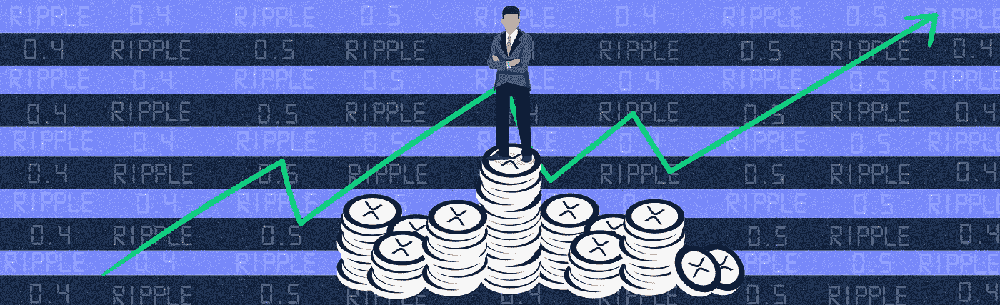

# 涟波矿业:一个城市传奇

> 原文：<https://medium.datadriveninvestor.com/ripple-mining-an-urban-legend-81865f0e90ae?source=collection_archive---------10----------------------->

如果您刚刚开始您的加密之旅，您可能听说过“挖掘”这个术语。地下世界的采矿不是指戴着安全帽、脸上沾满煤块的劳动者。相反，它指的是那些提供某种证据证明他们可以被信任在区块链总账上增加新交易的人。作为奖励，他们获得新“开采”的硬币，然后进入流通。

然而，重要的是要注意，不是所有的硬币都是这样的，也不是所有的硬币都是可开采的…

这就把我们带到了波纹网络。Ripple 的货币 XRP 最受批评的一点是它不可开采。

# 为什么 XRP 不能开采？

在深入探讨为什么 XRP 不能被开采之前，我们先来探讨一下比特币开采是如何进行的。从本质上说，一个“矿工”解决了一堆复杂的数学问题，以证明他们足够可信，可以在区块链产生新的区块。重要的部分是在计算机资源上的花费作为工作的证明，这允许网络的其余部分信任那个特定的用户。这个责任允许矿工赚取一些硬币作为交换。这些是新投入流通的硬币。因此，当整个网络达成共识，奖励特定的矿工时，新的比特币就会被释放进入流通。

另一方面，新 XRP 的发行并不依赖于网络，而是完全由它的创造者美国 Ripple Labs 公司控制。Ripple 声称有 1000 亿 XRP 可供使用，但目前只有 398 亿在流通。新 XRP 进入流通领域完全取决于 Ripple Labs 向市场释放资金。这使他们对市场价格有很大的控制权。

重要的是要认识到，XRP 仍然是通过区块链网络交易。这意味着它具有其他区块链货币的特征，包括强大的防黑客网络和易于搜索的透明交易信息。这个“**不可征服的**”网络和传统的区块链货币之间的唯一区别是，这个网络实际上是分等级的，Ripple Labs 负责大部分工作。

# 分散-什么？

可以说，加密货币最具革命性的特征是它是在点对点网络上进行交换的。这意味着没有中央机构来制定规则，每个人都必须遵守这些规则才能使用网络。这叫去中心化。为了让大家明白这一点，可以把现金或纸币想象成一个集中的网络。政府围绕这种法定货币的兑换制定规则。它决定了谁可以印更多的钱，哪些钞票是官方的，哪些不是，它还可以跟踪这些资金的交换以用于税收目的。

> 在对等网络上，双方可以直接交易，不需要第三方介入。你的信息是保密的，实际的交换是在区块链网络上进行的，所以所有的节点都必须同意这个交易的有效性，使它非常安全。

在这种背景下，XRP 缺乏矿业真的开始变得有争议。对于许多加密爱好者来说，由中央机构控制的加密货币是对区块链技术的滥用。区块链的全部意义在于允许建立民主共识，允许网络在不需要中间人的情况下运行。这就是为什么在许多人看来，Ripple Labs 并没有像加密货币的出现那样完全脱离传统的银行框架。

# 反论点

在像这样激烈的辩论中，考虑相反的观点是很重要的。毫无疑问，为了更快的交易速度、更低的费用和更多的授权控制，Ripple 已经放弃了其 XRP 网络的分散性。然而，让我们考虑一下“去中心化”原则实际上意味着什么。比特币网络上真的没有等级制度吗？

权力下放意味着没有中央权力机构，这是不完全可以实现的。当然，有了比特币这样的区块链网络，网络上的任何人都可以提供工作证明，这意味着任何人都可以获得采矿奖励。这使得它是分散的，因为节点之间不存在层次结构。然而，随着比特币价格继续上涨，采矿奖励也在上涨。这意味着，要赢得网络的信任，竞争会更加激烈。通常，当矿商之间的竞争加剧时，胜出的是那些拥有更好计算资源的矿商，比如更多存储空间和更好的处理器。

**现在重要的是问自己，这是真正的去中心化吗？**似乎拥有最多计算机资源的矿工往往是将新硬币引入流通的人。换句话说，这个网络也是分等级的。

# 外卖

*   **没有完美的加密货币。**在任何加密资产的三个主要特征之间总会有权衡，这三个特征是:去中心化、更快的交易和可伸缩性
*   Ripple 是一家为银行开发产品的公司。当你考虑到银行更有可能信任由一家值得关注的公司控制的产品时，这个网络的集中性质开始变得有意义。风险更小。
*   你仍然可以通过采矿获得新 XRP。只需开采另一种加密货币并将其兑换成 XRP，这是赚取 XRP 币的唯一方法。
*   不要相信提供 XRP 矿业的网站。只是重申一下，以防你错过，XRP 采矿是不可能的，所以任何提供你开采 XRP 的能力的人都可能是骗子。

最初发布于 [GetSmart Hub](https://getsmart.coinsmart.com/ripple-mining-an-urban-legend/?utm_source=gs&utm_medium=blog&utm_campaign=ripple_mining) 。