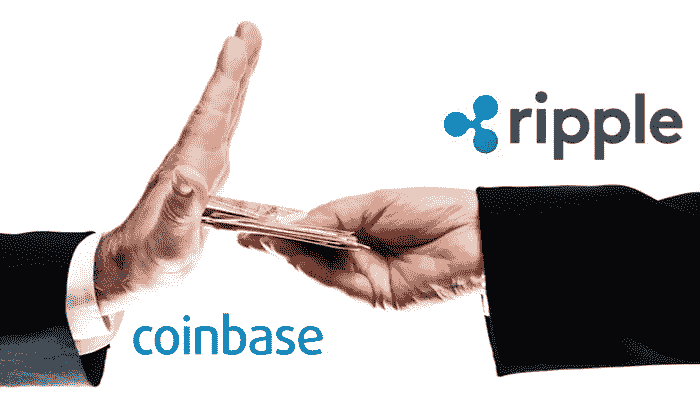
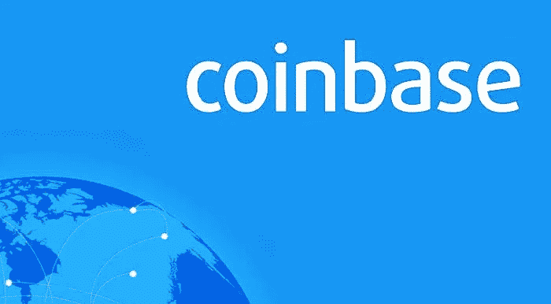
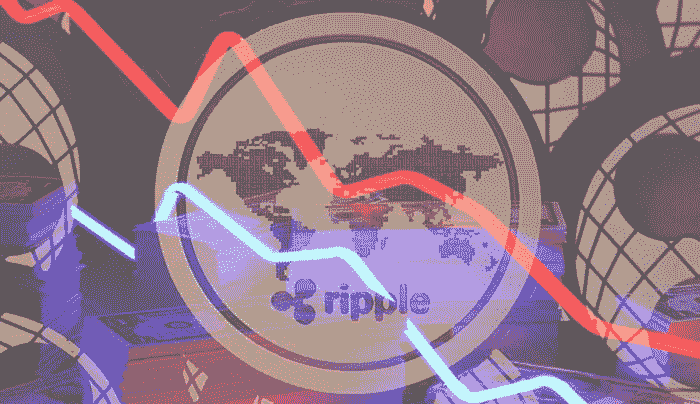

# 涟漪继续努力将自己收购到一个主要的交易所证明是徒劳的

> 原文：<https://medium.datadriveninvestor.com/ripples-continuing-efforts-to-buy-itself-onto-a-major-exchange-prove-to-be-futile-3e116f58d585?source=collection_archive---------4----------------------->

最近，投资加密货币是一个不断成为头条新闻的话题。对于早期投资比特币的人来说，这不是新闻，因为这些人今天有理由微笑。现在，越来越多的人投资于其他加密货币，希望数字货币的成本在短期内继续增长。被这种即将增长的信念所青睐的加密货币之一是 XRP，这是一种由初创公司 Ripple 运营的数字货币，被认为是继比特币和以太坊之后美国第三大加密货币。

XRP 的粉丝认为，它甚至可以发展到比比特币更大，但这种加密货币未能在比特币基地和双子星等热门交易所上市。与此同时，据报道，未能在这些主要交易所之一上市不能归咎于缺乏努力，因为 Ripple 已提出支付费用，以确保在顶级交易所获得一席之地。然而，尚不清楚这些细节是否属实，因为两家公司都尚未就此发表任何公开声明。

该公司无法在主要交易所上市，这让许多金融专家得出结论，虚拟货币的未来可能岌岌可危。此外，美国官员最近宣布警告未获得许可的交易所避免上市被视为证券的加密货币。

在同一时期，在比特币基地公开揭穿即将上市的谣言后，XRP 代币遭受了重大损失。其他报道称，Ripple 的高管向 Gemini 支付了 100 万美元现金，以说服该交易所将 XRP 列入其平台。还有传言称，该公司采取了一些策略，如提供成本补偿和回扣，以说服该交易所上市。

据报道，去年参与 Ripple 和比特币基地初步讨论的一位身份不明的人士透露，前者表示愿意借给 XRP 价值 1 亿美元的代币，以启动交换平台上的代币交换。然而，今年早些时候的更新显示，比特币基地和双子座都拒绝了 Ripple 的邀请，但没有公开说明原因。金融专家认为，加密货币公司为其令牌在交易所上市支付费用并不罕见。自主研究的最新数据显示，这项手术估计花费约 300 万美元。

此外，人们认为，如果 XRP 被归类为证券，那么该公司将更难在任何加密货币交易所上市。这是因为数字硬币将从被归类为加密货币变为股票，从而要求它满足监管类似资产的条件。据报道，这家金融公司打算为全球银行创建一个支付系统，许多个人已经将硬币用作证券，以及在不同大陆之间毫无困难地转移资金的替代方式。

每天都有大量的资金通过众多的银行网络在全球转移，从而导致资金分配缓慢甚至通货膨胀。自成立以来，这家总部位于旧金山的公司已经采取积极措施，通过使用所谓的价值互联网来改善现金循环系统，从而改变这些状况。

尽管 XRP 像业内其他代币一样遇到了一些挫折，但它在 2017 年的价值增长了 1300%，从而导致其许多高管在财务上取得了成功。人们认为银行是 XRP 的主要投资者。据报道，他们使用代币以较低的成本将现金从一个地方转移到另一个地方。相比之下，银行声称他们对使用 XRP 不感兴趣。

报告显示，全球七家银行的前任和现任高管表示，将客户资产委托给加密货币的可能性很小。重要的是要报告，要求匿名的高管们以前曾与该公司合作过。即使该公司经历了起起落落，其投资者也不会很快退出。坊间传言透露，Ripple 可能很快就能在美国获得其代币的清单。该公司的官方网站称，XRP 有 1000 亿个令牌，Ripple 持有整个资产的 800 亿美元。该公司还表示，自 2016 年以来，它已经出售了超过 1.85 亿美元的 XRP 代币。

Ripple 的首席执行官 Brad Garlinghouse 表示，这家科技公司目前正在与包括 Banco Santander SA 和渣打银行(Standard Chartered Plc)在内的 100 多家银行合作，以改变这些机构处理客户支付的方式。据报道，渣打银行(Standard Chartered Plc)的英国分部目前正在开发一款使用 Ripple 技术在全球范围内转移支付的移动应用程序。

加密货币爱好者认为，现在是投资 Ripple 的最佳时机，因为由于这种令牌的价格低于 1 美元，在不久的将来可能会录得更丰厚的利润。

该公司以其迅捷的交易速度为金融机构采用加密货币提供了更好的方式，已经有 100 多家金融机构采用了加密货币。作为加密货币令牌的 XRP 的价格也有很高的可能性，去年年初约为 0.006 美元，同年年底约为 15，000%。

这家科技公司可能会成为备受期待的催化剂，让虚拟货币变得更加主流。同样重要的是，专注于建立对数字货币的认识，并让感兴趣的买家可以像在菲亚特购买的其他加密货币一样使用它。加林豪斯还在另一次采访中表示，如果 Ripple 打算取得进展并实现其目标，它必须与监管机构密切合作。

了解为什么 CryptoInvestingInsider.com 比下一次加密热潮领先一步。获取免费的加密货币投资课程，并获取关于[立即购买的最佳加密货币的最新详细信息](https://cryptoinvestinginsider.com/)。