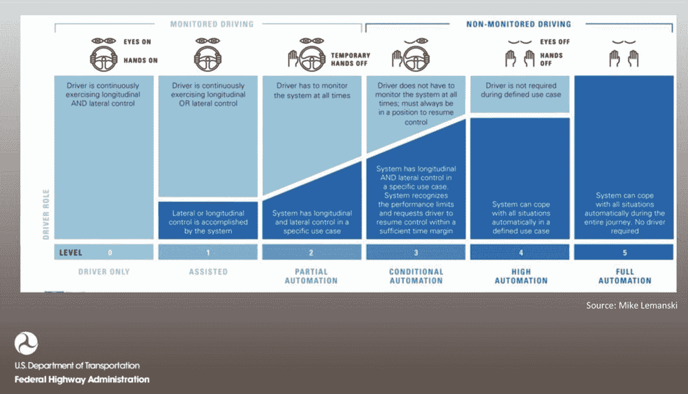
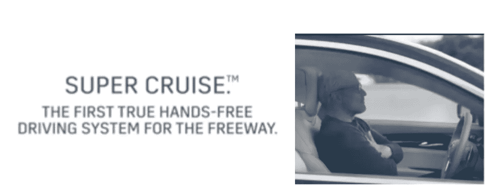
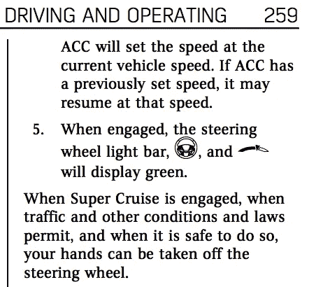
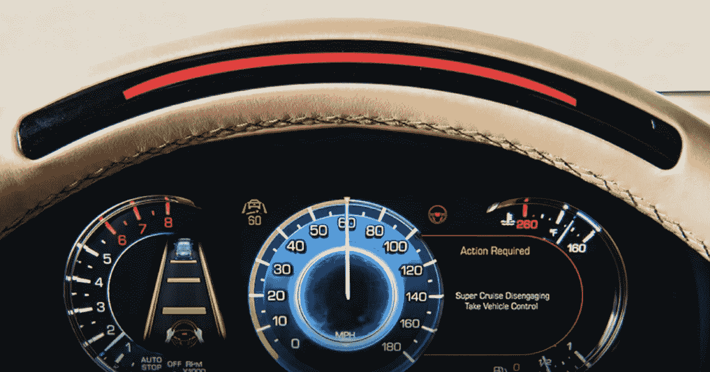
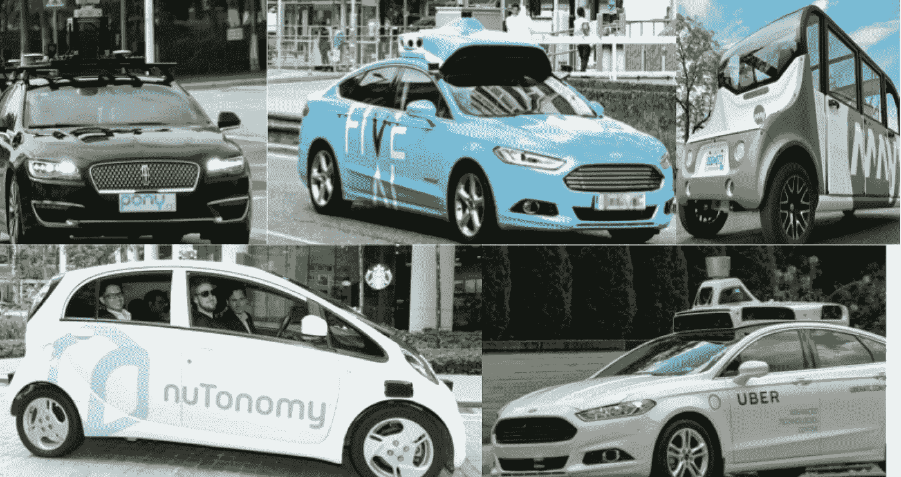
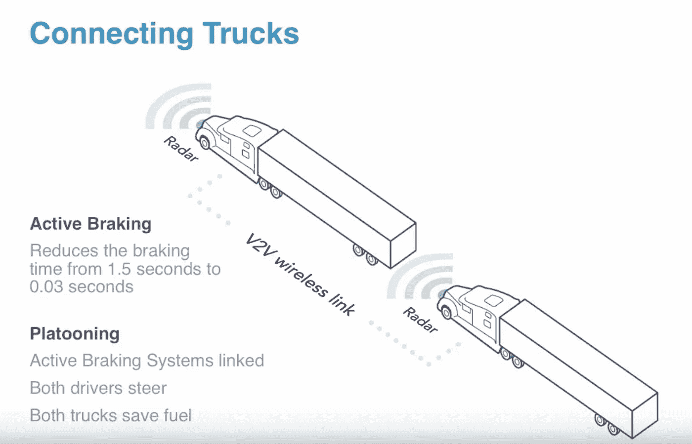
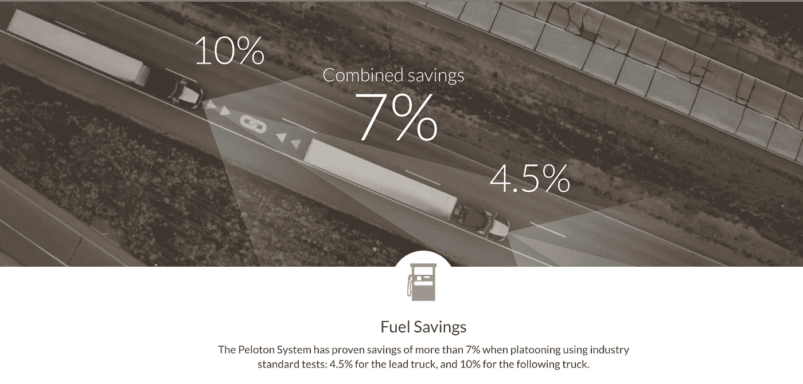

# 机器的崛起——自动驾驶汽车——炒作还是现实？

> 原文：<https://medium.datadriveninvestor.com/rise-of-machines-autonomous-vehicles-hype-or-reality-78e75d48fef0?source=collection_archive---------15----------------------->

当你想到下一代汽车时，你会想到什么？电动汽车？….特斯拉？

自动驾驶汽车怎么样？你认为它会很快成为现实吗？…在你有生之年？在你进一步阅读之前，请你[就你对自动驾驶汽车](https://goo.gl/forms/RP42APNRFP12pzJm2)的看法进行一次投票。

现在，我们来看看在自动驾驶汽车方面，我们的情况如何，我们正在做些什么。

让我们做一个水平集，了解一些事情:

1.  **悲惨事故**:无人驾驶汽车事故——优步特斯拉被报道，引发技术可行性质疑。但是我们还需要看看是软件故障还是坐在方向盘后面的司机忽略了软件给出的警告？实际上，是后者。其次，行驶了多少英里后，事故发生了？如果你[读过特斯拉](https://www.tesla.com/blog/update-last-week%E2%80%99s-accident)的博客，它分享了一些见解

*在美国，所有制造商生产的所有车辆每行驶 8600 万英里就有一起汽车事故。对于特斯拉来说，在配备自动驾驶硬件的车辆中，每 3.2 亿英里就有一起死亡事故，包括已知的行人死亡事故。如果你正在驾驶一辆配备自动驾驶硬件的特斯拉汽车，那么你卷入致命事故的可能性将降低 3.7 倍。*

*特斯拉 Autopilot 并不能防止所有事故——这样的标准是不可能的——但它大大降低了事故发生的可能性。它明确地让世界变得更加安全，对汽车乘客、行人和骑自行车的人都是如此。*

没有人知道没有发生的事故，只有发生了的事故。

**2。不同程度的自动化:**花几分钟时间看看驾驶中不同程度的自动化。

让我们看看特斯拉的自动化水平。

**二级:**特斯拉实际上是监控驾驶，会落在中途，在二级自动化之下。此外，凯迪拉克将降至 2 级以下。

[https://www.cadillac.com/world-of-cadillac/innovation/super-cruise](https://www.cadillac.com/world-of-cadillac/innovation/super-cruise)

如果你没有听说过凯迪拉克[新的超级巡航，它值得一试](https://www.cadillac.com/world-of-cadillac/innovation/super-cruise)。**与**不同，特斯拉，凯迪拉克新的超级巡航手册规定你可以不用手，但你必须看着路。

然而，如果你的眼睛离开路面超过 6 秒钟，由于眼球跟踪技术，汽车将会停车，闪光灯将会打开。所以你不能坐在驾驶座上看网飞。

**LEVEL 3:** 更上一层楼，奥迪是第一家推出 [Level 3](https://www.wired.com/2016/08/self-driving-car-levels-sae-nhtsa/) 的汽车制造商，适用于交通堵塞情况或时速低于 37 英里的情况。然而，由于法规原因，他们可能不会在美国市场推出这款产品。

**第 4 级:**继续第 4 级， [Waymo](https://waymo.com/) 在自动化水平方面是一个大玩家。他们正准备推出 Robotaxis(一辆**机器人出租车**，也被称为**机器人出租车**，一辆**自动驾驶出租车**或**无人驾驶出租车**是一辆[自动驾驶汽车](https://en.wikipedia.org/wiki/Autonomous_car) ( [SAE Level 4 或 5](https://en.wikipedia.org/wiki/Autonomous_car#Classification) )用于按需移动服务)。事实上，Waymo 订购了 20，000 辆捷豹，以实现推出 robotaxis 的目标。

([https://www . USA today . com/story/money/cars/2018/03/27/waymo-acquiring-20-000-电动-SUV-无人驾驶-乘车-打车-服务/461537002/](https://www.usatoday.com/story/money/cars/2018/03/27/waymo-acquiring-20-000-electric-suvs-driverless-ride-hailing-service/461537002/) )

其他汽车制造商也在这一领域积极努力。通用，宝马，日产，丰田…事实上，16 家汽车制造商中有 13 家正在竞相推出机器人轴

Robotaxi 空间中值得关注的一些初创公司包括优步、Waymo、FiveAI 和 Pony。AI，nutonomy，我们应该看到机器人轴心在 2020 年前在世界不同的地方以一定的规模推出——美国，中国，新加坡。

虽然汽车市场正被几乎所有的汽车制造商和新来者淹没，但当谈到购买自动驾驶汽车时，决策可能是基于个人的。

**商用车辆和卡车**

但是当涉及到汽车和卡车的商业用途时，它是由投资回报率驱动的。因此，自动驾驶卡车是另一个需要关注的领域。在卡车领域，我们既有传统制造商，也有初创企业。

虽然卡车领域的一种自动化方法是**无人驾驶**，你可以在这里观看 I-10 上的一次试运行

另一种方法是**卡车列队**。卡车队列由许多紧随其后的卡车组成。这与卡车形成一个排。

在美国，两辆卡车近期将被允许一起行驶。许多州已经通过了相关法规，相信在一年左右的时间里，我们会看到卡车在我们周围的高速公路上排成长龙。

这种方法的好处是节省成本，因为卡车以恒定的速度行驶。这意味着更低的油耗和更少的二氧化碳排放。

[https://peloton-tech.com/](https://peloton-tech.com/)

这不是无人驾驶技术，但它是一种智能技术，允许卡车安全地相互靠近，并在更短的时间内刹车(大约快 5 倍)。卡车通过 V2V 无线连接保持联系

据信这可以帮助节省大约 7%

花几分钟时间看看队列

希望你喜欢自动驾驶汽车之旅。

#机器的崛起…审判日不可避免。

在你离开之前，请在下面的评论中分享你对这个新兴行业的见解。

[LinkedIn](https://www.linkedin.com/in/vgrover1515/) [Twitter](https://twitter.com/blockchain_hash)