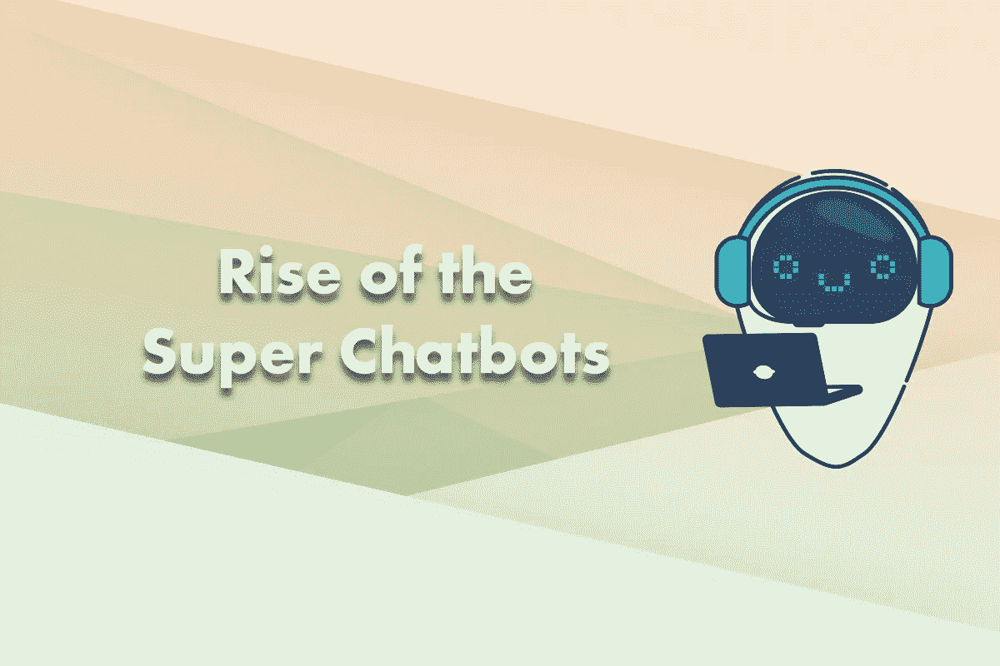

# 超级聊天机器人的崛起

> 原文：<https://medium.datadriveninvestor.com/rise-of-the-super-chatbots-bf4e1dccc2a6?source=collection_archive---------10----------------------->

他们几乎帮你做任何事情。

*订购鲜花，跟踪你的杂货交付状态，帮助你了解最新消息。*

我说的是谁？答案是聊天机器人。

企业正在使用[聊天机器人](https://articles.noodlefactory.ai/how-walter-an-ai-chatbot-helps-busy-executives-learn)来帮助、吸引和销售他们的客户。聊天机器人让用户在各行各业体验到更快、更方便和个性化的服务。人工智能正变得日益复杂，随着越来越多的人发现聊天机器人的好处，对它们的需求也在增长。除了简单的问答查询，聊天机器人的角色和功能也在不断发展，它们正在学习快速准确地处理多项任务！

 [## 挑战你对人工智能和社会的看法的 4 本书——数据驱动的投资者

### 深度学习、像人类一样思考的机器人、人工智能、神经网络——这些技术引发了…

go.datadriveninvestor.com](http://go.datadriveninvestor.com/4AI1) 

这里有一些很好的例子，可以让你看到超级聊天机器人的崛起:

**1。酒店**

聊天机器人在酒店行业越来越受欢迎，因为它们支持和扩大业务和销售团队，并增强客户体验。从研究房价到预订酒店、设施和特殊要求，聊天机器人为客人提供一站式无缝体验。想象一下，当你到达酒店的时候，在你的手机上启动一个聊天程序。你不必在酒店前台排队等着拿房间钥匙。聊天机器人可以为您办理入住手续，为您提供房间密码，并在几分钟内协调将您的行李送到您的房间。一旦你登记入住，聊天机器人还可以为你推荐餐厅和酒吧，预订水疗服务，当地的活动门票，或者要求客房服务或枕头或拖鞋等额外服务。聊天机器人可以同时处理来自不同客人的多个查询，并提供高效和即时的回答，而不是让客户打电话或根据他们的请求转移到各个部门。与聊天机器人的实时聊天还允许交易收据、确认和其他重要信息在单一平台(即客户的移动设备)上进行，消除了整理表格和查看电子邮件的麻烦。聊天机器人全天候为客人提供自助服务解决方案，而不必增加员工成本，同时改善客户体验并建立品牌忠诚度。

**2。健康**

有各种各样的健康聊天机器人，它们似乎把一个“医生”放在你的手掌里。他们可以提供与健康相关的信息，安排医疗预约并发送提醒，或者根据你的症状给你一个可能的诊断。

他们当然不能与人类医生相比，但他们提供了快速反应的好处。对于患有慢性疾病的患者，聊天机器人可以帮助他们更好地管理自己的健康状况。有许多不同的药物要服用，有许多约会要记住，有许多症状要记录。一个超级聊天机器人可以帮助确定剂量，提醒吃药，记录疼痛，记录疲劳或头晕等症状。然后，它可以向医疗从业者发送警报，并获得关于他们健康状况的建议，或者安排下一次看病的预约。一个增强的功能可能是，聊天机器人可以将患者与患有相同慢性病的其他人联系起来，并交流管理他们健康的最佳做法。

**3。教育**

除了辅导学生核心知识或协助老师给论文评分，聊天机器人还有可能增加学生的参与度。例如，在基于探究的学习中，学生可以与聊天机器人一起在模拟的环境或设置中解决问题。他们可以扮演各种角色，从聊天机器人那里获得暗示或线索，同时获得新知识。无论是破案还是解锁新的科学概念，聊天机器人都可以指导学生按照自己的节奏学习，让[学习](https://articles.noodlefactory.ai/why-your-next-learning-buddy-is-a-chatbot)变得有趣又好玩。聊天机器人还可以跟踪学生的进步，如果他们需要在薄弱领域进行更多练习，还可以推荐替代的学习途径。虽然教师不会被完全淘汰，但聊天机器人可以帮助识别个别学习者的问题领域，并提供详细的反馈，以帮助教师优化他们的学习方法。超级聊天机器人可以帮助减轻已经承担多方面角色的教育工作者的负担。

**4。陪伴**

当聊天机器人刚刚推出时，批评者很快强调它们没有感情，缺乏同情心。但是聊天机器人每天都在进步，它们现在更像我们的朋友，因为它们试图理解我们在询问什么。事实证明，聊天机器人在与老年人进行日常对话方面很有价值，是维护他们身心健康的伴侣。由于大多数家庭成员无法全职照顾老人，聊天机器人可以充当伴侣的角色，为老年人提供额外的交流来源。

此外，患有阿尔茨海默氏病的老年人在短期记忆方面存在困难。这种疾病对交谈的影响越来越大，因此聊天机器人可以通过鼓励他们谈论自己的记忆、兴趣来帮助他们，并让他们在日常生活中保持警惕。由于聊天机器人是基于云的应用程序，对话日志存储在网上，如果聊天机器人检测到任何语音异常或记忆失误，它们可以向家庭成员或卫生专业人员发送提示或警报。

这些只是聊天机器人创新和快速解决世界上真实问题的一些方式。人工智能的进步将继续以一种有意义的方式影响我们生活的许多方面，聊天机器人将扮演多种角色，并在解决我们日常生活中的各种需求方面非常出色。