# 风险厌恶:一个微观经济学解释

> 原文：<https://medium.datadriveninvestor.com/risk-aversion-a-microeconomic-explanation-5e083656f95e?source=collection_archive---------2----------------------->

从行为的角度来看，大多数时候，人类倾向于规避风险。这意味着我们不喜欢不确定性，我们会优先考虑某个特定的情况，而不是一个偶然的情况(我们稍后会看到它的具体含义)。

然而，由于风险和回报之间永无止境的正相关:

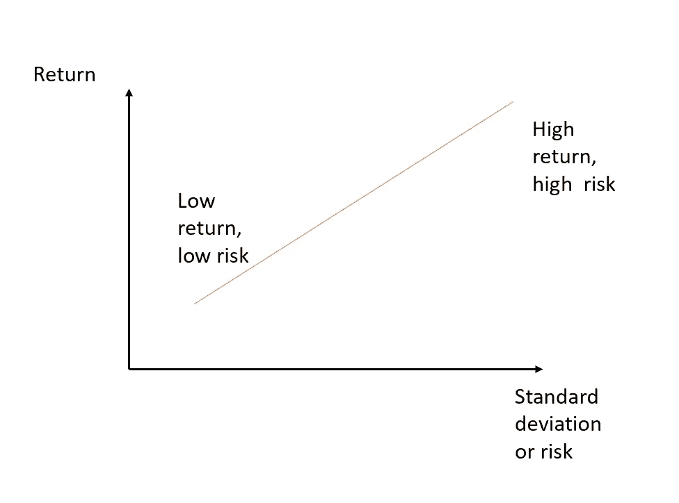

人们可能会被更高回报的承诺(不像)诱惑而生活在不确定之中。

 [## 危机管理乘“飞机”飞行真相|数据驱动的投资者

### 当埃塞俄比亚航空公司的一架 737 Max 飞机起飞后不久坠毁，整个国家陷入危机。最好的…

www.datadriveninvestor.com](https://www.datadriveninvestor.com/2019/03/26/crisis-management-flies-on-plane-truth/) 

从微观经济学的角度来看，可以用期望值、效用和确定性等价的概念来确定一个人对风险的态度。让我们解释一下是如何做到的。

随机变量的期望值可以定义为该变量的长期平均值:它是作为该变量可能具有的值的加权和来计算的，权重等于每个值出现的概率。即，考虑下面的彩票:

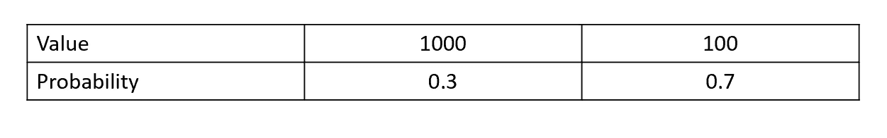

这里你可以以 0.3 的概率赢 1000，以 0.7 的概率赢 100。彩票的预期价值是:

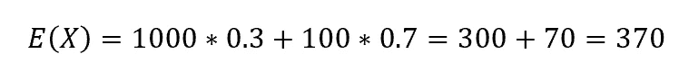

另一方面，效用代表了消费者在选择和消费产品或服务时获得的满足感。可以用所谓的效用函数来衡量，效用函数根据个人喜好假设不同的形状。

我提到了产品或服务，然而，这个概念也可以应用于彩票的收益。然而，由于它是随机的，不确定的，当我们将效用函数的概念应用于收益时，我们将讨论期望效用。

现在让我们再次检查一下上面的彩票的例子，假设你的效用函数是一个凹函数:

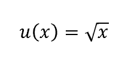

现在，您可以计算彩票的预期效用，如下所示:

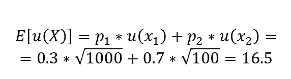

正如你所看到的，我们没有将收益发生的概率乘以收益本身，而是将每个收益的效用(即通过效用函数传递的收益)乘以各自的概率。获得的值是具有该效用函数的个人的彩票的预期效用。

现在，给定效用函数，我们怎么能说一个人是否厌恶风险呢？让我们再次考虑我们彩票的期望值。如果我们将效用函数应用于该值(即期望值的效用，它不同于期望效用)，我们将获得一个可能等于、小于或大于期望效用的值。

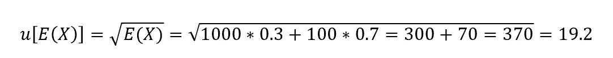

这个想法是，如果彩票的预期效用小于预期价值的效用，那么个人是厌恶风险的。这是因为，对于不喜欢冒险的人来说，获得相当于彩票预期价值的一定金额比参与彩票提供了更高的效用。

让我们形象地想象一下:

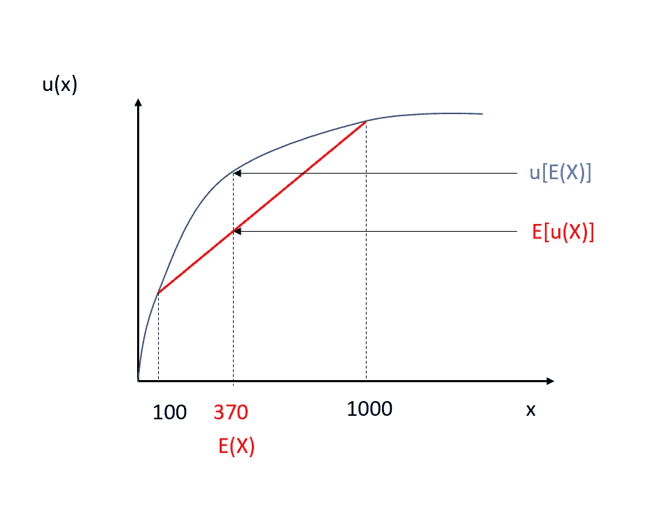

你可以在红色的直线上看到预期的效用。另一方面，在凹曲线上，你可以看到期望值的效用。如你所见，期望效用位于效用函数之下，因此位于期望值的效用之下。

这个推理适用于每个具有凹效用函数的人。此外，凹度越大，面临的逆境就越大。

另一种解释方式是通过确定性等价的概念。这个想法是，如果一个人是风险厌恶者，存在一笔钱，比彩票的预期价值要小，如果有把握，这笔钱给这个人提供了与参与彩票相同的效用。换句话说，为了避免不确定性，规避风险的个人愿意获得(确定的)少于彩票的潜在结果。

你可以在这里想象确定性等价:

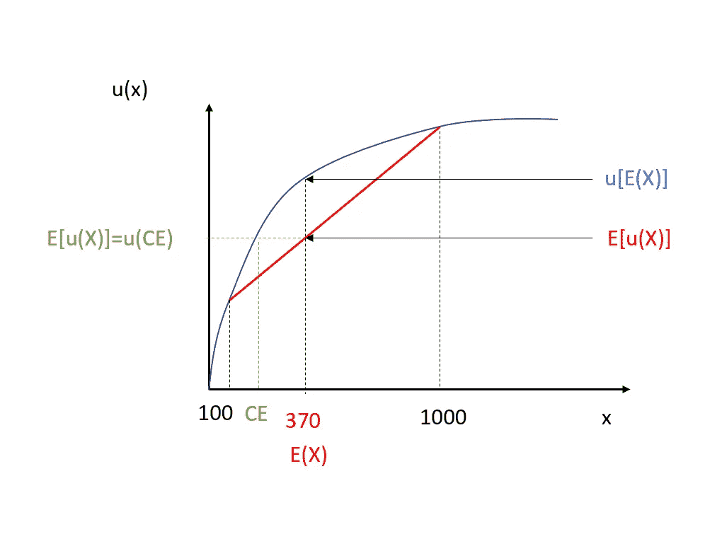

和计算如下:

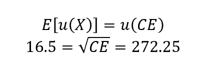

最后，我们还可以命名为第三种度量，它等于期望值和确定性等价之间的差。

这个数额被称为风险溢价:它代表了一个厌恶风险的个人参与彩票所要求的金额。它是积极的这一事实意味着它是个人将得到的东西，而不是付出的东西。

为了清楚起见，让我们对具有凸效用函数的个体重复同样的推理，即:

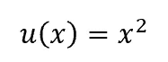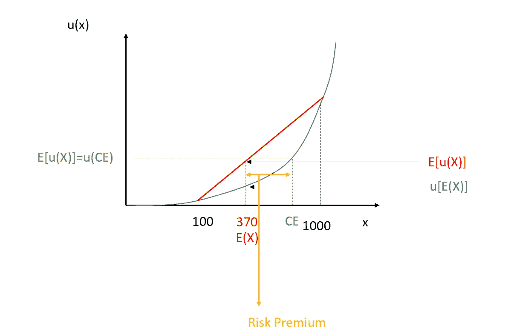

如你所见，现在彩票的预期效用大于预期价值的效用，因为个人是追求风险的。事实上，期望值和确定性等价之间的差异(即风险溢价)是负的:这是个人为了参与彩票而必须支付的价格，比如说彩票的价格。

那么一个具有线性效用函数，即 u(x)=x 的个体呢？

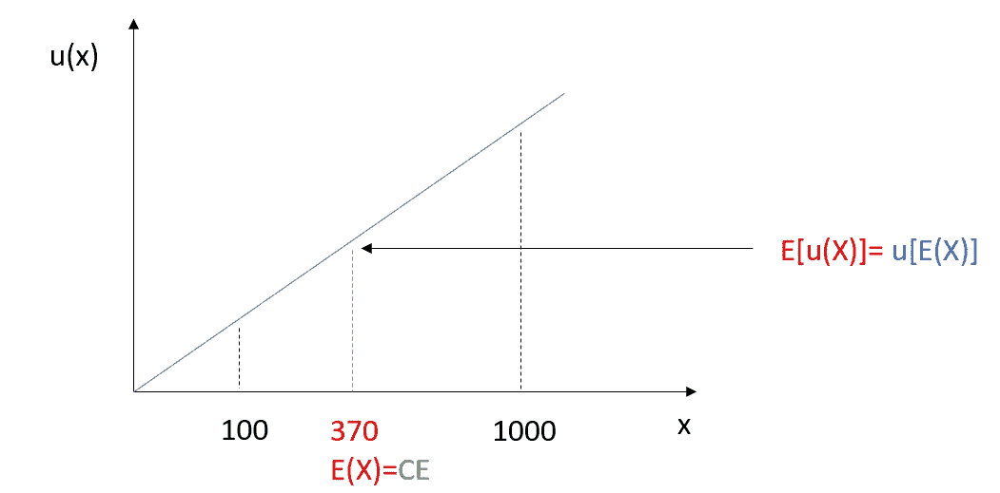

在这种情况下，我们会说这个人是风险中性的。的确，期望值的效用等于期望效用，确定性等价等于期望值，风险溢价为零。

总之，风险逆境是人类中最常见的情况(我们通常更喜欢确定性而不是不确定性)，可以借助于效用函数来检测，效用函数对每个人采取不同的形状。特别地，风险厌恶个体呈现凹效用函数，凹性越大，风险逆境越显著。