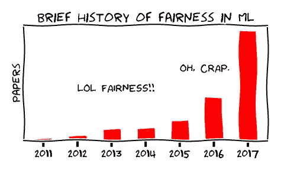

# 风险得分、公平性和不可能性

> 原文：<https://medium.datadriveninvestor.com/risk-scores-fairness-and-impossibility-290ac206ecf3?source=collection_archive---------1----------------------->

/via [https://fairmlclass.github.io/1.html#/4](https://fairmlclass.github.io/1.html#/4)

在接下来的几年里，深度学习将嵌入我们日常生活中大大小小的事情，从无人驾驶汽车(它会发生吗？！)到医学诊断，到，嗯，各种各样的东西。然而，当我们沿着这条路走下去时，我们*真的*需要思考算法到底在告诉我们什么。原因是我们得到的信息，根据定义，会有这样或那样的偏差。

好吧，“有偏见”这个词有点夸张，但我是经过深思熟虑才使用它的。我*可能*意味着[这些算法被用于欺诈](http://dieswaytoofast.blogspot.com/2018/04/deep-learning-health-care-and-potential.html)，但我没有。我*做*的意思是——实际上更糟——有了风险评分，在数学上不可能在多个组之间做到“公平”!

(在我们深入探讨之前， ***风险分值*** 是你拥有某种特质的可能性。例如，你是一个足球迷，或患有青光眼，或可能抢劫银行的几率——这些都是该特征的 ***风险得分***

那么， ***公平*** 在这个语境中是什么意思，我们为什么要在意呢？好吧，假设你在卖球衣——只要观众对足球感兴趣，不管他们是男是女，你都会希望观众看到球衣的广告，对吗？如果广告平台说“*嗯，是个女人，我们不会给她看你球衣的广告*”，那么这就是潜在的收入，对吗？而且那不是对你 ***公平的*** ！

这里的基本要点是，如果我们希望我们的算法是*公平的*，那么我们应该确保它们是*校准的*，并且对于正面和负面具有*平衡。*

1.  ***校准*** :如果你定义一个群体具有该特质的可能性是`X`，那么该群体的`X` %应该具有该特质。*当你确保各个小组的百分比也相同时，公平*就出现了(例如，不管性别如何，只要兴趣水平相同，我们就给这个人看广告)。

*   阳性者的*平衡:每组阳性者(具有该特质的人)的平均 ***风险评分*** 应该相同。*公平性*的出现是因为如果各组的平均正风险分数不同(例如，男性与女性)，那么该算法更有可能从其中一组中挑选人(“*我们将只向男性展示你的足球球衣广告*”)。*
*   ****负面因素平衡*** :每组负面因素的平均*(没有特质的人*)应该是相同的。公平*在这里与平衡上述积极因素完全一样。**

**简单对吗？只要确保我们满足上面的三个标准，我们就可以开始了，对吗？
嗯，错了。在一篇引人入胜的论文中，Kleinberg 等人指出，数学上不可能满足上述所有三个约束条件，无论你做什么，你都需要权衡。**

**这是一个非常复杂的数学问题，所以我不会在这篇文章中提到它，但是结果很有启发性(也很痛苦)，完美的公平——如上定义——是不可能的。正如作者所说**

> **假设我们想确定一个人是 X 疾病携带者的风险，并假设女性携带者的比例高于男性。那么我们的结果意味着，在任何旨在估计某人是 X 携带者的概率的测试中，必须满足至少一个以下不期望的特性:
> (a)对于至少一个性别，测试的概率估计系统性地向上或向下倾斜；或者
> (b)测试对某一性别的健康人(非携带者)的平均风险估计值高于另一性别；或者
> (c)该测试对一种性别的疾病携带者给出的平均风险估计值高于另一种性别。
> 关键是，这种(a)、(b)和(c)之间的权衡并不是医学上的事实；当两组之间的基础利率不同时，这只是一个关于风险估计的事实。**

**回到我们开始的地方，根据定义，算法*不会是完全公平的。简单地实现它们，并假设“芯片会掉落在它们可能掉落的地方”往好了说是天真，往坏了说是恶意。在设计这些算法时，我们*必须*考虑上下文！
同样重要的是，我们*必须*公开在实现中所做的权衡。这些披露将在某种程度上确保透明度。仅仅透明是不够的，但至少这是一个开始…***

*(*提醒你一下，以上都是***之前我们会陷入诸如数据偏差、文物、抽样误差等等之类的事情。关于这方面的更多信息，请阅读《自然》杂志上的这篇精彩摘要***

**()“ [*公平确定风险分值的内在权衡*](https://arxiv.org/pdf/1609.05807.pdf)”—Kleinberg 等人。**

***(* [*这篇文章也出现在我的博客上*](http://dieswaytoofast.blogspot.com/2018/07/risk-scores-fairness-and-impossibility.html) *)***