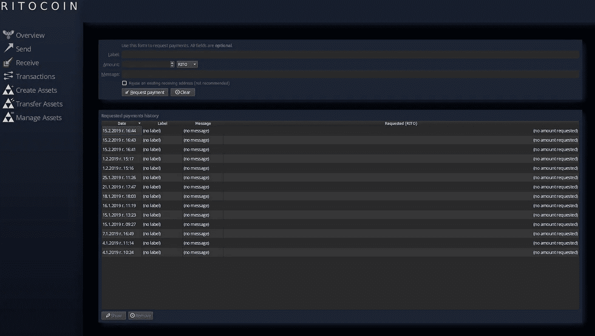
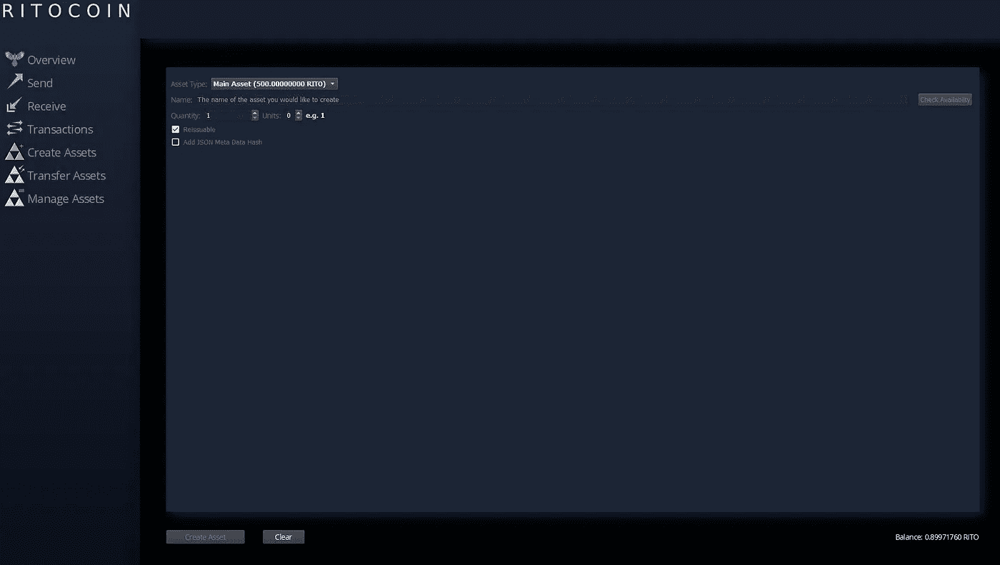

# Ritocoin 覆盖你的资产

> 原文：<https://medium.datadriveninvestor.com/ritocoin-covers-your-assets-c972ad32c63a?source=collection_archive---------7----------------------->

Ritocoin 资产层在 block 50，000 处上线。一旦激活，这一功能给任何人至少有 500 RITO 的能力，发行一个独特的令牌到区块链的 Ritocoin。

# 将 RITO 转移到您的钱包:

首先，你的桌面钱包里需要 500 RITO。从 Rito Core wallet 的左侧导航菜单中，选择*请求付款*按钮。您可以选择复制地址或保存带有您地址的 QR 码的文件。向您的地址发送 500 RITO，当交易完全确认后，您将能够创建一项资产。

# 创建资产:

一个强有力的证据表明，区块链“就像一个新的网络”。事实上，我们正处于一个激动人心的变革时代，许多商业和社会部门预计会经历某种程度的中断。

我们看到变化的一种方式是通过使用浏览器集成钱包和创建 ERC20 和 ERC721 令牌。在某种程度上，这些资产和 Ritocoin 资产代表着持有在线房地产或域名的下一步。

在 Ritocoin 区块链网络中注册的任何名称都必须是唯一的。您将无法创建具有相同名称的资产。资产的长度不能超过 31 个字符。实际限制是 32 个字符，但是特殊的 admin 标记有一个额外的字符(感叹号)。常规资产限于 31 个字符，因此带有额外字符的令牌可用于管理。

有效字符包括:

A-Z

0–9

_ .

选择一个唯一的名称后，您将设置数量(最大 210 亿)，以及您想要达到第 8 位小数的数量(1.00000000)。您可以选择您的资产是否可以再发行。如果您出售所有权令牌，新的所有者可以选择重新发行资产。

新所有者也可以选择增加构成资产的单位数量。一旦发放了更多的单元，就不可能减少单元。

如您所见，创建资产简单、有趣且容易上瘾。一旦你有了好主意，这些名字就会潮水般涌来。一旦你理解了一个公司、团体或个体经营者如何以一种新的动态方式与他们的利益相关者互动，你就会对这个项目产生和我们一样的兴奋和热情。

任何人只要点击几下就可以创建一个。资产的用例有很多。我想到的第一件事是使用一个独特的资产来集成一个公平的投票系统。

想象一下，为了在某个话题上达成共识，需要 100 个人投票。一家公司想向员工提供免费的运动收藏品。有两种非常受欢迎的收藏品，公司希望员工投票决定购买哪一种。

将创建两个地址。

1.收藏 A—b 5n 3 xw 9y 7j 37 wtbydzsnvvbzf 5 rvujpml

2.收藏 B—bkmb 8 C4 u 69k 5 afwydpk 8 qgl 4 AgX 2 HDL df

出于投票的目的，应该创建一个新的主要资产，我们将其命名为 TEST。我们已经以 0 单位发行了 100 个代币。

每个员工都会收到一份测试资产。如果以后的审计需要，这种投票的公平分配将保存在区块链中。现在，每个人都可以通过将他们的测试令牌发送到其中一个地址，在项目 A 或 B 之间进行选择。在钱包终端中可以按地址列出资产，按余额列出资产等。这种可见性意味着发送的令牌的分布和每个投票的交易使得这种类型的投票公平和透明。

资产的用例是无限的。随着移动钱包在未来支持资产，加上令牌持有者消息功能的最终激活，新的发展前景已经准备好被探索。

凭借去中心化的权力和开放的分布式账本、资源的公平分配以及 Ritocoin 的无信任、透明性质，资产可以体现出从加密货币和令牌化资产等加密技术中获益的新方式。

这里有一个简短的、远非详尽的清单，列出了未来可以看到资产的地方。

商品

财产

运动卡

比赛

命令

农业

审计

软件

活力

长期定货(standing order)

契约

另一个选择是为您的主资产创建一个子资产。只有主要资产所有者可以创建子资产。创建一个子资产需要花费 100 RITO。示例:

主要资产:酒店

子资产 1:酒店/接待处

子资产 2:酒店/水疗中心

令牌化所有的东西！

让我们听到你对这个话题的想法:[https://discord.gg/upEFagK](https://discord.gg/upEFagK)

如果您想进一步了解我们的项目:【https://ritocoin.org/ 