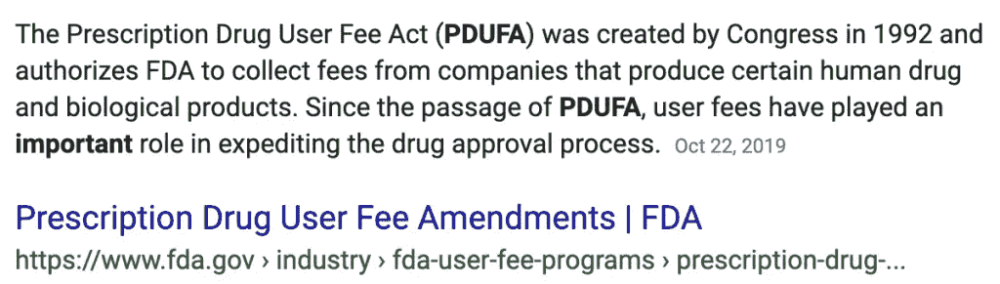
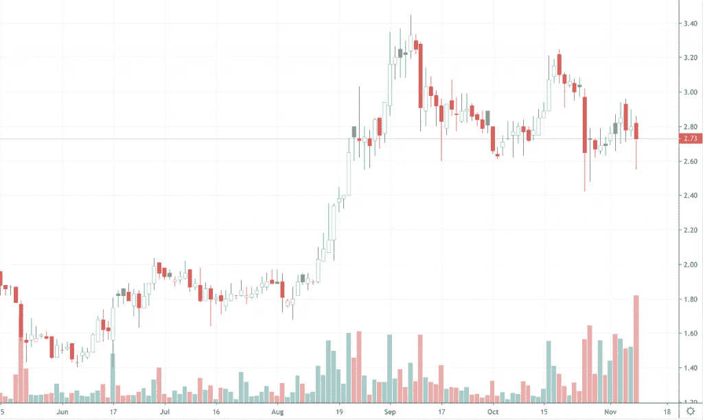
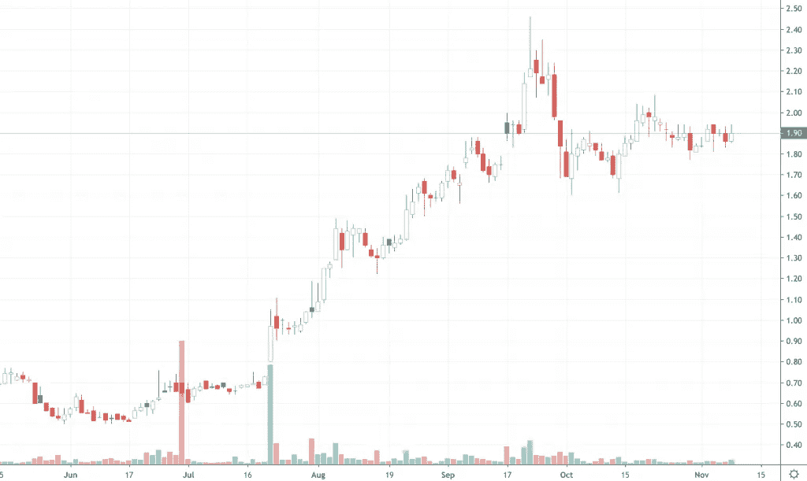
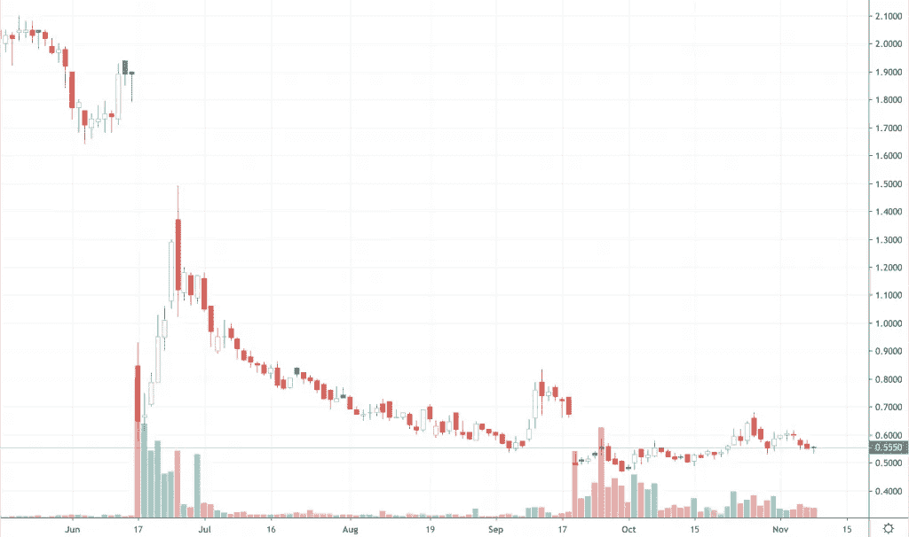
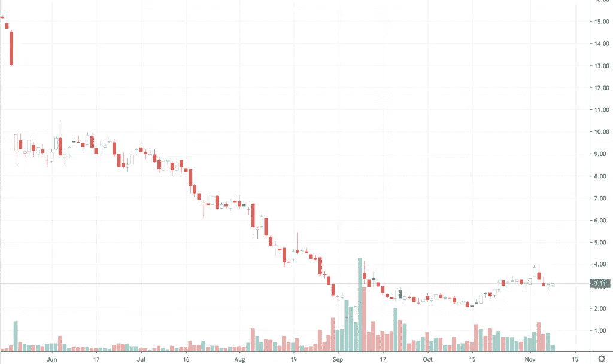
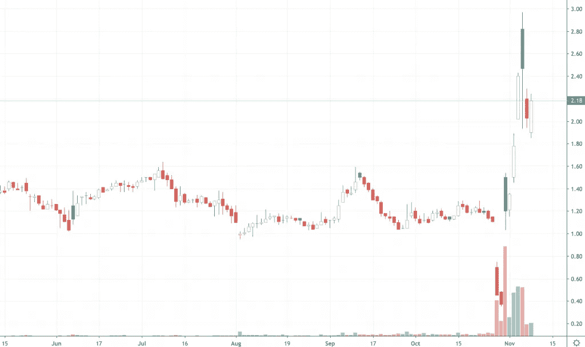

# 本周值得关注的廉价股票

> 原文：<https://medium.datadriveninvestor.com/robinhood-penny-stocks-to-watch-this-week-2a30248ca652?source=collection_archive---------8----------------------->

当你和某人谈论细价股时，你通常会看到两种截然不同的反应。通常对于那些不熟悉这些低价股或过去亏损过的人来说，他们会认为**低价股** &骗局是一回事。

然而，事实并非如此。有数百只廉价股票在众多市场交易，它们拥有有效的商业模式，但不幸的是，它们的价值远低于世界上的[Facebook](https://www.facebook.com/realpennystocks/)、[Twitter](https://twitter.com/1pennystocks)，甚至[Pinterest](https://www.pinterest.com/realpennystocks/)。

最能体现这一点的产业之一已经成为生物技术产业。这些公司总是致力于下一件大事，即治疗疾病或提高生活质量。然而，它们需要经过阶段试验和支持数据的检验。

 [## 算法交易的机器学习|数据驱动的投资者

### 当你的一个朋友在脸书上传你的新海滩照，平台建议给你的脸加上标签，这是…

www.datadriveninvestor.com](https://www.datadriveninvestor.com/2019/01/30/machine-learning-for-stock-market-investing/) 

**【阅读更多】**[2019 年 11 月值得关注的罗宾汉十大仙股](https://pennystocks.com/featured/2019/11/03/top-10-penny-stocks-on-robinhood-to-watch-for-november-2019/)

现在，多亏了罗宾汉，低价股变得越来越容易买到。有人可能会说，这个平台彻底改变了整个交易空间。我们已经亲眼目睹了一些最知名的在线经纪商如何开始为新用户提供免费服务。

# 本周罗宾汉值得关注的低价股

正因为如此，越来越多的人开始交易低价股。但是仅仅因为这种情况，并不意味着罗宾汉减少了。这个平台一直是年轻交易者中比较受欢迎的平台之一。此外，因为罗宾汉的低价股仅限于纳斯达克和纽约证券交易所的发行者，所以有更多的信息。

这是与场外交易细价股相比。不管怎样，我们正在寻找一些公司，他们将报告最近项目的数据。他们中的一些人周末报道，另一些人这周报道。根据结果，这些数据可能会成为有趣的看跌或看涨催化剂。

# 值得关注的第五只股票:Lipocine Inc

*已更新*

Robinhood 的这份[细价股](https://pennystocks.com/list-of-penny-stocks/)名单上的第一家公司是 Lipocine Inc. ( [LPCN 股票报告](https://pennystocks.com/featured/2019/11/10/penny-stocks-on-robinhood-to-watch-this-week-november-2019/#m1))。这家临床阶段的公司将注意力集中在内分泌失调上。Lipocine 有几种疗法在进行中，使其相对多样化。其中包括 LPCN 1148、LPCN 1107、LPCN 1144、TLANDO 和 TLANDO XR。现在，在文章的这一点上，这些可能看起来没有什么意义，所以让我们来分解一些东西。

本周，该公司设定了处方药使用费法案日期或“PDUFA 日期”如果你不熟悉这个术语，没关系；让我们再深入一点。据 FDA 称，这在加速药物批准过程中起着重要作用:

**阅读更多**

这是之前在 5 月份宣布的关于该公司的 TLANDO 疗法。这是一种针对内源性睾酮缺乏的男性的睾酮替代疗法。此外，这是捎带了该公司以前提交和接受的新药申请(NDA)。

如果这一切都是积极的从美国食品和药物管理局，这可能是一个看涨的催化剂，该公司。另一方面，如果反应是负面的，那么熊可能会出来玩。无论如何，我们将会看到会发生什么，因为这个日期是在周末，周一通常会是我们第一次看到结果的迹象。

*更新*截至 2019 年 11 月 11 日，Lipocine 股份确认了上段后半部分所说的内容。FDA 拒绝了该公司的特兰多 NDA。FDA 解释说，该试验没有达到“最大睾酮浓度”的几个终点。

# 值得关注的低价股#4:杜蕾特公司(DURECT Corporation)

我们过去讨论过几次的细价股之一是杜蕾特公司( [DRRX 股票报告](https://pennystocks.com/featured/2019/11/10/penny-stocks-on-robinhood-to-watch-this-week-november-2019/#m1))。事实上，自从我们第一篇关于 **DRRX 股票** ( [点击此处](https://pennystocks.com/featured/2019/08/26/3-penny-stocks-to-watch-and-3-to-ignore/))的文章以来，我们已经看到股票从不到 1.70 美元飙升到超过 2.40 美元。但为什么 DRRX 本周又回到了聚光灯下？

正如之前在 10 月份宣布的那样，DURECT 本周在 2019 年肝脏会议上提交了数据。11 月 12 日，公司将进行口头报告，这是 11 月 10 日海报报告的后续。研究结果实际上被选入“最佳肝脏会议”幻灯片演示中。最近完成的 2a 期研究是针对 DUR-928 的，DUR-928 是针对酒精性肝炎患者的。

“这些令人信服的数据为持续发展提供了强有力的理由，我们计划明年启动针对这种难以治疗和威胁生命的疾病的 2b 期研究，”DURECT 总裁兼首席执行官詹姆斯·e·布朗在一份新闻稿中说。

# 值得关注的第三只低价股:VBI 疫苗公司

本周早些时候，VBI 疫苗公司( [VBIV 股票报告](https://pennystocks.com/featured/2019/11/10/penny-stocks-on-robinhood-to-watch-this-week-november-2019/#m1))是另一个有可能成为罗宾汉关注的低价股之一的候选公司。在过去几个季度艰难触底后，长期投资者可能会从该公司寻找一些积极的迹象。

作为一家商业阶段的公司，VBI 瞄准传染病和免疫肿瘤疫苗。简而言之，该公司被选为本周肝脏会议上的“迟到者”海报展示。

周一标志着三期研究数据的发布。这将展示 VBI PROTECT 研究的双盲 3 期结果。具体来说，它检查了 1600 多名接受 Sci-B-Vac 公司剂量的患者与 Engerix-B 公司剂量的患者的结果。这可能是引发 **VBIV 股票**向好的方向移动的事情，还是下一张幻灯片即将到来？在我们的社交媒体上加入对话。

# 值得关注的第二只股票:Mallinckrodt plc

自 10 月中旬以来，另一只值得关注的[低价股是 Mallinckrodt plc。然而，进入新的一周，值得关注的不仅仅是 MNK 股票本身。本周，该公司将在肝脏会议上展示其 3 期确认研究的数据。该公司的特利加压素在 300 名患有肝肾综合征 1 型的成人身上进行了测试。这种疾病会影响某些人的肾功能。](https://pennystocks.com/featured/2019/10/18/penny-stocks-to-buy-or-sell-next-week-october-2019/)

当进入第三阶段时，这些数据集代表了最终寻求将药物商业化的公司的一个潜在转折点。还要记住，基于已经进行的试验，Mallinckrodt 计划在“2020 年初”向 FDA 提交其新药申请。

这可能是他们预计将在本周会议上展示的内容的前兆吗？针对这一点，多伦多总医院肝病学家、多伦多大学医学教授、医学学士、医学博士、FRACP、FRCPC 提出作者 Florence Wong 有一些话要说。

“特利加压素的确认试验结果令我深受鼓舞，如果获得批准，可能会对这种难以治疗的患者群体产生影响，我期待在[肝脏会议]上首次分享这些结果。”

# 值得关注的低价股#1:敏捷治疗公司(Agile Therapeutics Inc .)

最后，Agile Therapeutics Inc. ( [AGRX 股票报告](https://pennystocks.com/featured/2019/11/10/penny-stocks-on-robinhood-to-watch-this-week-november-2019/#m1))列出了罗宾汉交易员本周可能关注的低价股名单。去年 11 月，我们在 PennyStocks.com 跟踪了这家公司，从那时起，它就变得非常火爆。事实上，本月我们第一次这样做时，股价位于 0.40 美元以下的 52 周低点。

这家医疗保健公司专注于女性的医疗需求。最初，在报道其 Twirla 避孕贴片获得 FDA 咨询委员会会议的有利结果后，它成为了最值得关注的低价股之一。

为什么 **AGRX 股票**本周上榜？FDA 指定 PDUFA 的目标日期为 11 月 16 日。虽然这是在本周晚些时候，这可能是足够的理由，使其成为值得关注的仙股。这一事件是为了完成 FDA 对 Twirla 新药申请的审查。

> *“我们很高兴布鲁达克投票支持水袖乐队。我们期待着继续与 FDA 就今天提交的重要数据进行对话，并努力争取 Twirla 的潜在批准。”*
> 
> *Al Altomari，敏捷公司董事长兼首席执行官*

该公司的股票经历了近几个月来最不稳定的时期之一。即使在 11 月初触及 52 周低点后，那些关注这只股票的人也看到它飙升至每股近 3.00 美元的高点。基于市场的性质，AGRX 会再次给出理由将其加入本周的[细价股观察名单](https://pennystocks.com/featured/2019/10/30/5-penny-stocks-to-buy-before-next-month/)吗？

*原载于 2019 年 11 月 11 日*[*https://pennystocks.com*](https://pennystocks.com/featured/2019/11/10/penny-stocks-on-robinhood-to-watch-this-week-november-2019/)*。*