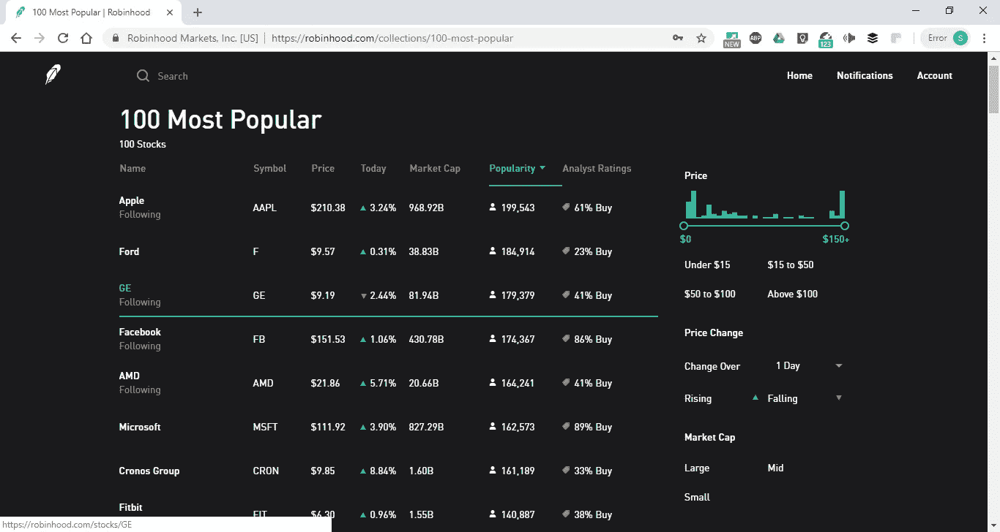

# 罗宾汉的“100 个最受欢迎的”是一个伟大的愚蠢的金钱共识

> 原文：<https://medium.datadriveninvestor.com/robinhoods-100-most-popular-is-a-great-dumb-money-consensus-900528ae1ea?source=collection_archive---------10----------------------->

我讨厌爆料，但是大多数罗宾汉用户没有经验，不是逻辑驱动的交易者。年轻且以技术为导向的用户群的性质，加上类似于冲动购买的快速交易的性质，进一步支持了这一观点。许多人可能仅仅因为股票受欢迎就动摇选择股票。考虑到那些愿意为他们的交易流支付罗宾汉的名字，我怀疑我不是第一个发现这一点的人。

由于 Robinhood 显示的是用户量，而不是份额量，这使得共识数据更能说明问题。由于他们不支持退休账户，这也表明这些资金更具投机性。你会发现一长串的名字，它们都是广泛使用的服务，也是上一个周期中表现出色的服务。吸引热追逐新手的所有诱饵。

该应用程序还侧重于非常短期的业绩和收益，而不是数据和分析。再次表明关注最近的发展势头，以及服务和报价器上的新闻/消息。假设不考虑应用程序分析，这至少意味着基本面在很大程度上被抛到了九霄云外。

你还会在硅谷找到与他们的用户群接近的名字。该组织认为大量的用户吸引他们购买他们所知道的股票。由于人性的蔑视，这种复合群体思维很容易让人忽略对该行业灾难性下行风险的思考。因此，识别公司，tickers，与非理性狂热的追随者隐藏在明显的地方。