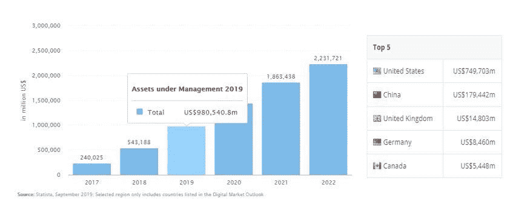
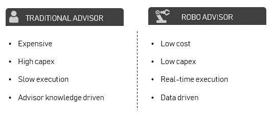
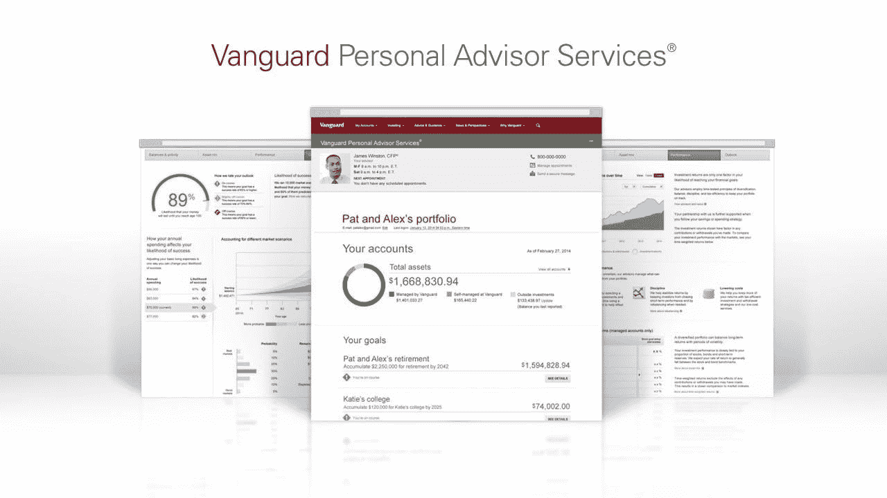
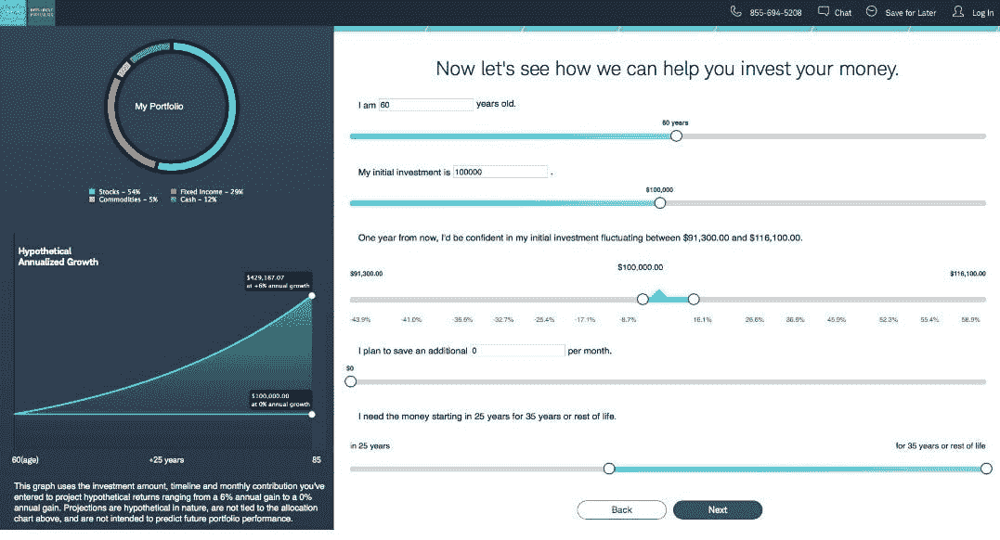
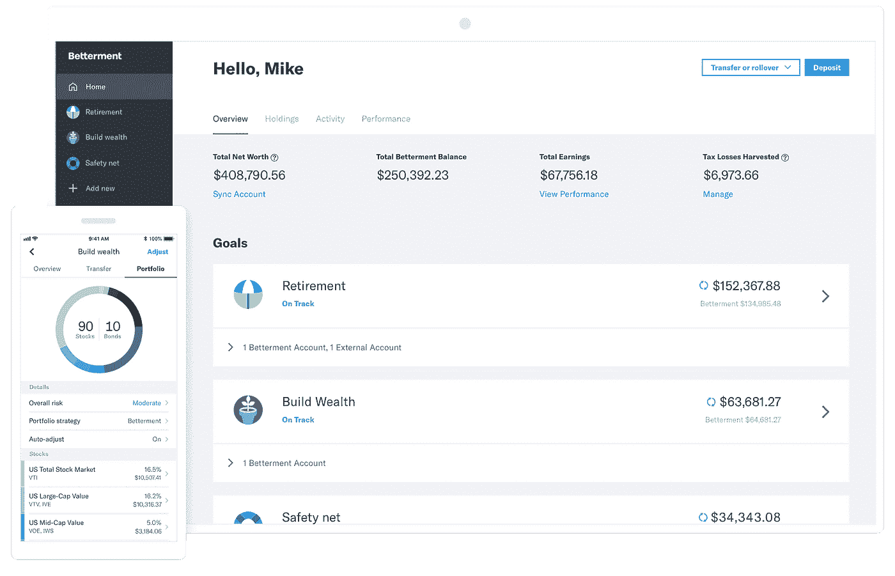
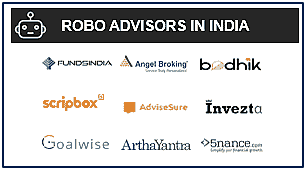
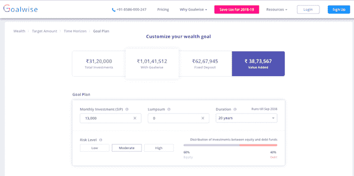
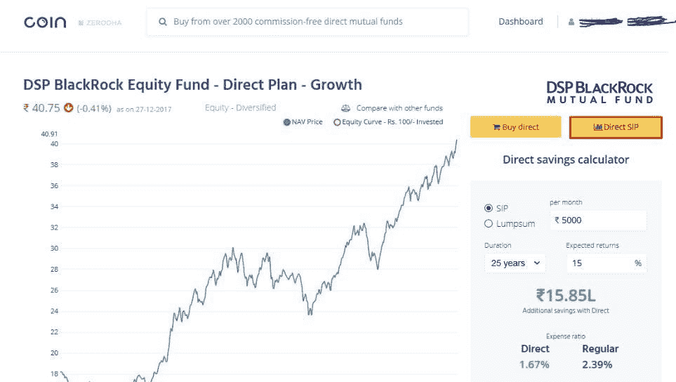

# Robo Advisors:印度财富管理的颠覆？

> 原文：<https://medium.datadriveninvestor.com/robo-advisors-a-disruption-in-indian-wealth-management-70d2392a03a8?source=collection_archive---------1----------------------->

过去十年，Robo Advisors 席卷了全球财富管理市场。在技术的推动下，他们易于使用，高度个性化，不同于传统的财富顾问，他们是大众负担得起的。仅在美国，Robo Advisors 的资产规模就超过 7490 亿美元，欧洲为 590 亿美元，亚洲为 1900 亿美元。

添加描述

据估计，到 2022 年，Robo Advisors 将管理大约 2.2 万亿美元的全球财富！

那么，机器人顾问到底是什么？

 [## 算法交易的机器学习|数据驱动的投资者

### 当你的一个朋友在脸书上传你的新海滩照，平台建议给你的脸加上标签，这是…

www.datadriveninvestor.com](https://www.datadriveninvestor.com/2019/01/30/machine-learning-for-stock-market-investing/) 

简单地说，它们是算法驱动的(可能是也可能不是智能的)应用程序，根据用户的输入推荐个性化的投资组合。

典型的机器人顾问通过在线调查从客户那里收集信息，然后使用这些数据提供建议和/或自动投资客户资产。新用户的投资周期始于填写在线调查->创建交易账户->根据 Robo 推荐选择投资组合->最后，跟踪投资组合的表现。

添加描述

图:雪绒花的机器人顾问

Robo advisors 的复杂性各不相同，从使用非常少的数据点推荐投资组合的简单算法(如上图所示的 edelweiss Robo)到使用几个数据点(包括社交媒体数据)为投资者推荐高度个性化的投资组合的复杂的人工智能驱动的应用程序。

用户和金融公司很快接受了机器人顾问，主要是因为它比传统的财富顾问更有优势

添加描述

1.用户喜欢机器人-

*   个性化的
*   完全数字化
*   负担得起的
*   没有最低余额
*   完全控制投资组合和投资选择

2.公司喜欢机器人-

*   运营成本低
*   易于扩展
*   最大限度减少错误和欺诈
*   新的收入来源
*   轻松适应任何运营模式

2008 年全球金融危机后，当更严格的监管导致技术驱动的金融创业公司兴起时，Robo advisors 变得越来越受欢迎。尽管 Robo Advisors 起源于金融科技初创公司的形式，但近年来它们越来越受欢迎，特别是随着查尔斯·施瓦布、贝莱德、富国银行和美银等大型全球金融机构将自己的 Robo 咨询服务带入市场。

现在的市场由初创公司的创新驱动，但由大公司主导。让我们来看看世界上排名前三的机器人顾问

排名第一的 Vanguard 个人顾问服务- Vanguard 运营着世界上最大的机器人顾问公司，管理的资产超过 1400 亿美元！

添加描述

虽然大部分服务是自动完成的，但它仍然有一个人员顾问的元素。对于最低 50，000 美元的账户余额和 0.30%的额外费用，投资者可以获得机器人顾问加人类顾问的自动化，以联系超出非人类“顾问”能力的问题。

这是市场上最便宜的混合服务之一。

#2 Schwab Intelligent Portfolios:它是世界上最著名的 Robo Advisors 之一，管理着超过 410 亿美元的资产。

添加描述

像大多数 Robo 顾问一样，Schwab 有三个主要特点:

1.  第一步是由客户投资者完成一份调查问卷，评估投资者的风险承受能力和投资时间范围。如上图所示的问卷。
2.  嘉信理财构建交易所交易基金投资组合
3.  日常监控和必要时的重新平衡

最低初始投资为 5000 美元，费用为 0 美元。

#3 改善—它是行业的先锋，也是第三大 Robo 顾问公司，拥有超过 200 亿美元的 AuM。WealthFront 和 TD Ameritrade Essential & Selective Portfolios 是另外两家公司，管理资产规模约为 200 亿美元。

添加描述

Betterment 提供的服务可以被认为是先锋和嘉信理财的结合。改善收费 0.25%，但没有最低初始投资额。

如果用户希望除了自动服务之外还能获得人工顾问，他们可以通过 Betterment Plus 和 Betterment Premium 来实现。

Plus 服务每年收取 0.40%的费用，投资者每年可以收到无限量的电子邮件和一个私人电话。只需支付 0.50%的费用，投资者就可以获得每年无限发送电子邮件和无限拨打电话的高级服务。

印度发生了什么？

虽然印度是 Robo Advisors 的缓慢采用者之一，但它已经有超过 40 名球员在市场上管理 rs。30 亿卢比(约 4000 万美元)的资产。

添加描述

印度的许多公司针对不同的用户群采用了不同的模式

1.自选篮子——这些是最简单的投资平台，提供一套特定的“套餐”。在这一领域最受欢迎的玩家之一是 Scripbox，它针对首次投资者的三种资金——股票、固定收益和节税。

2.基于目标的顾问——这些在线平台根据用户的目标提供建议

添加描述

Goalwise 是一个受欢迎的基于目标的机器人顾问，它接受目标、风险水平和达到目标的时间等输入。基于输入，它会建议用户可以投资的目标 SIP 金额和工具。基于目标的平台的一个重要特征是资产重新平衡，以抵消更接近目标的风险。

3.全方位服务的机器人顾问——这些平台接受详细的问卷调查，评估风险偏好、财务目标、储蓄和支出模式，以建议非常个性化的投资组合。Wixifi、ArthaYantra 和 Aditya Birla MyUniverse 是这一领域中一些受欢迎的平台。

Wixifi 为共同基金和普通股提供推荐+执行服务。他们提供超过 3，000 个共同基金和 12，000 个共同基金份额类别的研究工具和研究数据。

添加描述

图:Zerodha 的硬币截图

随着 Paytm 推出 Paytm Money(一个购买/出售共同基金的在线平台)和 Zerodha 推出 Coin(一个购买免佣金直接共同基金的平台)等大型金融科技公司的进入，在线共同基金市场正在迅速发展。Groww 是另一个受欢迎的平台，允许用户在线购买共同基金和 ETF。这三个平台中的每一个都有超过 100 万的用户，他们产品路线图的下一步将是引入 Robo Advisors，建议他们的用户在哪里投资。

Robo Advisors 在印度的增长将受到这些公司注入的大量资金的推动，以及互联网和智能手机普及率不断增长、中产阶级不断壮大(约 7000 万家庭收入超过 5 英镑)、有利的人口结构(65%的印度人口年龄在 35 岁以下)和财力雄厚的支付公司改变消费者行为等因素的影响。

尽管市场相对较小，但鉴于其巨大的增长潜力和有利的外部因素，印度的 Robo Advisors 在未来一定会蓬勃发展。

声明:这是一个个人帖子，不代表我工作的公司的观点。

作者:维沙克·艾扬格
领英:[https://www.linkedin.com/in/vyshakiyengar/](https://www.linkedin.com/in/vyshakiyengar/)

参考:

[https://savart.in/blog/robo-investing/](https://savart.in/blog/robo-investing/)

[https://www2 . Deloitte . com/content/dam/Deloitte/SG/Documents/financial-services/sea-FSI-robo-advisers-Asia-Pacific . pdf](https://www2.deloitte.com/content/dam/Deloitte/sg/Documents/financial-services/sea-fsi-robo-advisers-asia-pacific.pdf)

[https://www.edelweiss.in/gps](https://www.edelweiss.in/gps)

[https://www.wealthpedia.in/robo-advisor/](https://www.wealthpedia.in/robo-advisor/)

[https://www . the balance . com/top-robo-advisor-services-4143359](https://www.thebalance.com/top-robo-advisor-services-4143359)

[https://www . investopedia . com/robo-advisors-2019-where-have-all-the-assets-gone-4767826](https://www.investopedia.com/robo-advisors-2019-where-have-all-the-assets-gone-4767826)

 [## 这位博士辍学生如何建立一个机器人咨询平台，根据您的风险管理您的财务…

### 随着技术改变个人生活的各个领域，财务管理也不远了。不见了…

yourstory.com](https://yourstory.com/2016/07/wixifi)