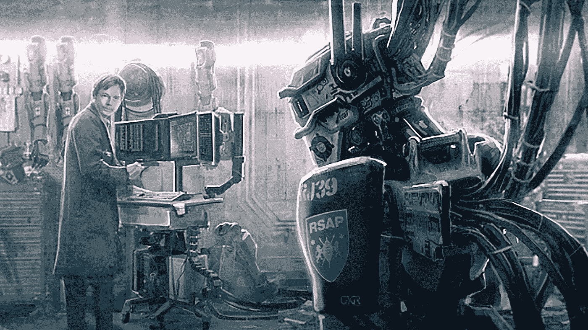
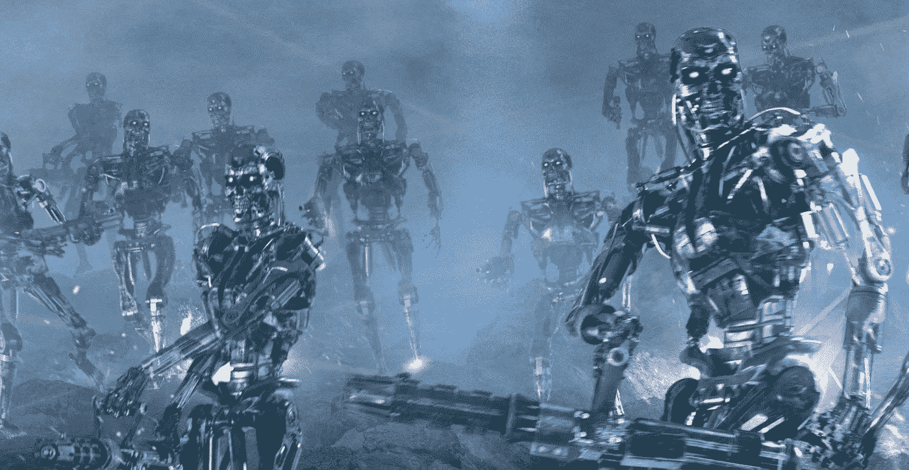
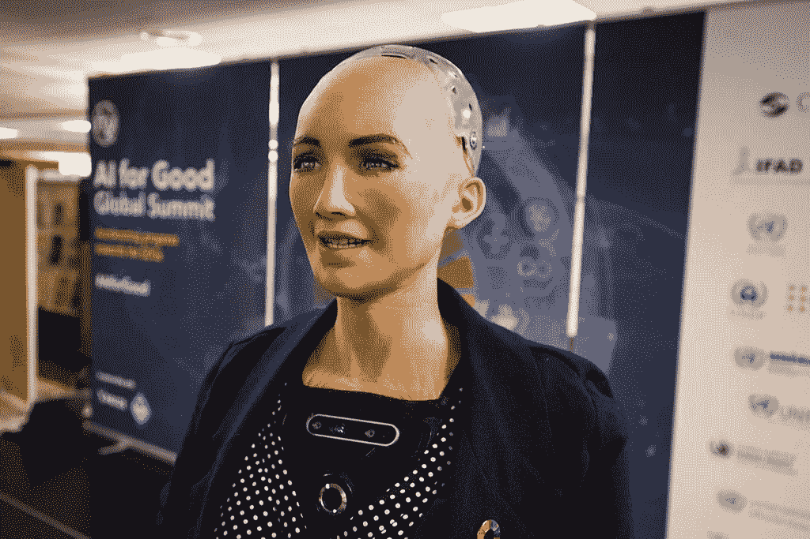

# 机器人公民和人工意识

> 原文：<https://medium.datadriveninvestor.com/robot-citizenship-and-artificial-consciousness-672c34f2e2fe?source=collection_archive---------2----------------------->

Titan Book (2015) Chappie — Deon working on his AI robot

人工智能(AI)一直存在于流行文化中；人类可怕的人工制品摧残他们的概念是媒体永恒的主题。一部轰动一时的电影《终结者》和一本受欢迎的小说《弗兰肯斯坦》只是其中的几个例子。媒体对这类故事的描述在我们对人工智能的假设中扮演了重要角色。通常寻找吸引眼球和制造新闻的故事的记者们，已经在人工智能中找到了一个令人兴奋的丰富来源。此外，人工智能研究人员，尤其是那些有机会上头版的人，很少会不提供这些信息。

Terminator 3 (2003) Rise of the machines

最近，我最喜欢的情景喜剧《硅谷》描绘了人工智能机器人菲奥娜，它能够在情感上和人产生共鸣。这显然是在暗示人工智能机器人索菲亚，一个沙特阿拉伯的“公民”。索菲亚于 2017 年获得了沙特阿拉伯的公民身份，这一极具争议的决定最终是为了一次科技峰会( [Hatmaker，2017](https://techcrunch.com/2017/10/26/saudi-arabia-robot-citizen-sophia/) )的宣传。我同意，如今抓住公众的注意力就像找到母鸡的牙齿一样，但结果是，人类的尊贵地位现在面临着生存风险( [Abbas，2017](https://newsroom.unsw.edu.au/news/science-tech/ai-professor-explains-three-concerns-about-granting-citizenship-robot-sophia) )。一些专家认为，这种宣传对公众认识人工智能和公民社会的价值都是有害的和破坏性的( [Vincent，2017](https://www.theverge.com/2017/10/30/16552006/robot-rights-citizenship-saudi-arabia-sophia) )。

[ITU Pictures (2018) Sophia, First Robot Citizen at the AI for Good Global Summit, Geneva Switzerland](https://commons.wikimedia.org/wiki/File:Sophia_at_the_AI_for_Good_Global_Summit_2018_(27254369347).jpg)

这真的给了我一些思考，应该给人类*物品*什么样的规定和权利。当然，早产的机器人被授予公民身份是愚蠢的，但我们离真正的困境还有多远，我们应该为机器人考虑公民身份吗？

首先，为了考虑机器人/机器的*人类*身份，它们至少应该真正*有意识*和有一些人类特征，这意味着它们必须比索菲亚高级得多。研究人员表示，有意识的机器不仅仅是运行程序，还具有*感情*、*品质*，并且*有自我意识*(海科宁、 [2007](https://www.ingentaconnect.com/content/imp/jcs/2007/00000014/00000007/art00005) 、 [2009](https://www.worldscientific.com/doi/10.1142/S1793843009000207) )。此外，它应该自己探索世界。为了澄清，我们需要理解机器中的*自我意识*、*感知*和*个性*。

意识的一个常见含义是自我意识。Alphabet 的[无人驾驶汽车](https://waymo.com/tech/)可能是自我感知软件的一个例子；*我是一个机器人车辆，在明确的规则下与其他移动物体一起在地形中导航*。尽管自我意识无疑是有意识存在的一个重要方面，但它不是唯一的条件。

根据 Rothblatt ( [2014](https://www.goodreads.com/book/show/19286666-virtually-human) )的说法，“大多数人要求精神主观性包括情感，也就是感知，以便有资格成为意识，因为认识到我们的感受是人类意识不可或缺的一部分，也是人类状况的一部分。”感觉是一种感知或主观体验的能力。例如，有些人喜欢狗胜过喜欢猫。有感知能力的计算机有时被称为人工通用智能(AGI)机器，它概括知识以执行人类水平的智力任务。许多科学家认为 AGI 是可行的( [Pennachin et al .，2007](https://link.springer.com/chapter/10.1007/978-3-540-68677-4_1#citeas)；[富兰克林，2007](https://pdfs.semanticscholar.org/ccda/bcf81bab920e16e84163ba92507eb7cb7bf9.pdf) 。尽管如此，感知并没有让我们在特定的意识中达到我们想要的地方，因为我们预期有意识的存在是自由的思想者和感受者( [Rothblatt，2014](https://www.goodreads.com/book/show/19286666-virtually-human) )。

那么什么是自由和个人的呢？Grau ( [2006](https://dl.acm.org/citation.cfm?id=1159009) )指出，可能的相关标准可包括自治能力、认识和应对原因的能力以及自由和负责任选择的能力。他还补充说，个人主义肯定应该得到更多的关注。甚至一些研究人员认为，意识只能在个体的物理系统中实现，因为一些意识行为依赖于物理结构( [Bickle，2003](https://www.springer.com/gp/book/9781402073946) )。在这种情况下，从定义上讲，AGI 不是一个人。虽然我们给人工智能编程不会伤害人类，但我们不能同时说人工智能的行为是真正个体的。

Westworld (2016) Dolores dashboard on a tablet, HBO

关于机器人公民身份，必须在技术和哲学上做许多研究。研究人员必须处理所有的伦理难题，以及关于投票、繁殖、结婚和雇用机器人的规定。对我来说，获得公民身份的代价仅仅是引起公众的注意，这似乎太便宜和被低估了。我们崇拜一切，不重视任何东西。