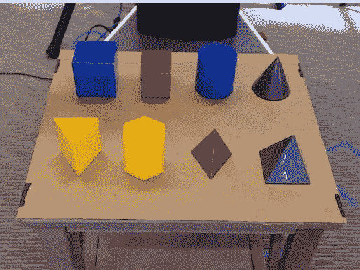
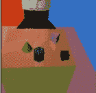
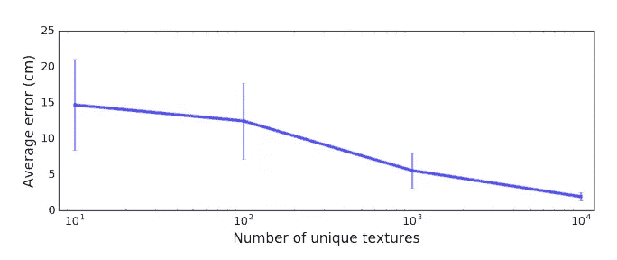

# 具有模拟数据的机器人抓取

> 原文：<https://medium.datadriveninvestor.com/robotic-grasping-with-simulated-data-c2bc8744506f?source=collection_archive---------11----------------------->

在之前的一篇文章中，我展示了苹果研究人员的 SimGAN 模型。他们展示了如何从 Unity 图形引擎获取模拟的眼睛图像，并使用 GAN 使模拟数据更加真实。在本文中，我将介绍从模拟数据中学习的另一种思路。与 SimGAN 模型相反，Tobin 等人的目标是在他们的模拟数据集中实现风格多样性。

下面是本文讨论的论文“将深度神经网络从模拟转移到现实世界的域随机化”的链接:

 [## 用于将深度神经网络从模拟转移到真实世界的域随机化

### 弥合模拟机器人与硬件实验之间的“现实差距”可以加速机器人技术的发展

arxiv.org](https://arxiv.org/abs/1703.06907) 

The task is to detect the center of mass, (x,y,z) coordinates, of the object of interest. These coordinates are used as input to a pre-trained motion planning and grasping algorithm.

如上图所示，任务是检测放在桌子上的几何对象的质心。现在，让我们考虑一下为这项任务构建训练数据集的难度。通过改变图像中的许多细节来改进训练数据集，例如桌子上其他物体的数量、桌子上物体的位置、桌子上物体的纹理/颜色、桌子的纹理以及照明等等。

想象一下手动迭代数据集中的参数组合；重复地将另一个物体放在桌子上，抓拍一张照片，并在照片上标注质心。构建一个包含数万张图像的真实世界图像数据集来完成这项任务将需要数周时间！

因此，使用模拟数据的吸引力显而易见。

这项实验中的研究人员使用 MuJoCo 物理引擎渲染图像(如下图)。

Training Image derived from Simulator

在这些图像上训练深度神经网络将遭遇一个被称为“现实差距”的问题。前面讨论的 SimGAN 模型试图通过使用 GAN 使模拟数据尽可能真实来弥合现实差距。本文通过在模拟数据集中创建大规模的多样性来弥合现实差距。这种多样性体现在图像的颜色、照明、桌子的颜色以及其他与场景外观相关的各种细节上。作者实验了随机 RGB 值、RGB 值之间的梯度以及随机 RGB 值之间的颜色变化的棋盘图案。

假设是，如果他们在训练期间向神经网络呈现足够广泛的一组风格，那么现实世界将表现为另一种风格。

Plot depicting that performance increases as the diversity of styles in the simulated dataset increases

上面的图显示，随着他们增加纳入训练数据的随机样式的数量，他们的模型的性能显著提高。唯一纹理的最终数量表示使用了 10，000 种不同对象位置、分散注意力的对象和纹理/光照变化的组合来训练模型。

为了评估该模型，研究人员构建了一个真实的数据集，包含 3 种不同场景下 8 个几何对象的 60 幅图像，对象单独在桌子上，对象在桌子上还有一个或多个分散注意力的对象，以及对象被另一个对象部分遮挡(部分遮挡)。

在一个立方体物体上测试，该模型在只有立方体的图像中精确到 1.3 厘米，在有干扰物的图像中精确到 1.5 厘米，在有部分遮挡的图像中精确到 1.4 厘米。

总之，这是一种考虑使用模拟数据训练神经网络的有趣方式。一般直觉可能会认为，让模拟数据尽可能真实是最好的方法。然而，这项研究表明，训练集中的多样性也同样有效。看看在计算机视觉和自动驾驶汽车等模拟数据的应用中，哪种思路使用得更多，将是一件有趣的事情。感谢阅读！