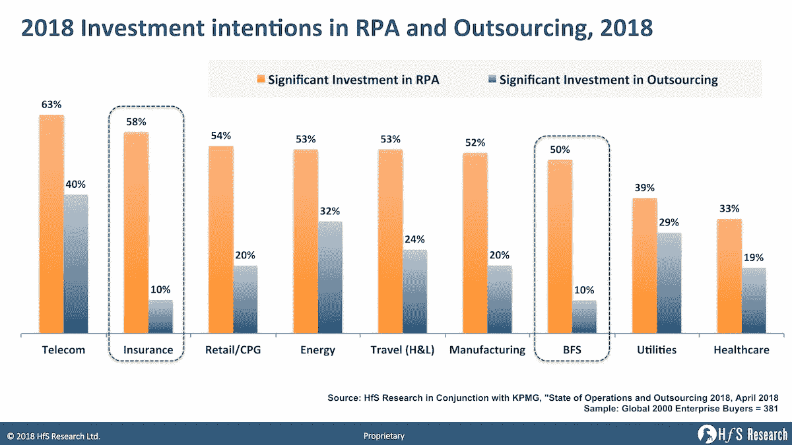

# 机器人过程自动化:新时代的外包

> 原文：<https://medium.datadriveninvestor.com/robotic-process-automation-new-age-outsourcing-fb49bf5b71e3?source=collection_archive---------20----------------------->

你认为传统的业务流程外包已经死了吗？或许，有报道称，到 2024 年，你可能会看到传统外包流程的稳步下降。Harvey Nash 报告指出，三分之一的亚太区首席信息官(33%)和 31%的全球首席信息官正在投资利用新时代技术来提高效率和准确性。随着客户期望的不断提高和技术的不断突破，在过去几年中，每个组织都非常重视采用新技术。

 [## 为你的职业生涯提供机器人保护——数据驱动型投资者

### 随着生产率的提高和巨大的利润，企业转向自动化来简化他们的…

www.datadriveninvestor.com](https://www.datadriveninvestor.com/2018/11/20/robot-proofing-your-career/) 

一去不复返了，我们过去常常参与做一些重复性的工作，在分类账和分录簿前一起花几个小时来管理账目。但是，随着技术的快速发展，很少有自动化工具出现在市场上来避免基于规则的单调任务。自动化是各行各业接管一些日常业务的新趋势。随着全球市场趋势的持续发展，10 家 IT 技术巨头中有 7 家投资于技术再造，以丰富员工和用户体验。

Blackline

一段时间以来，机器人已经成为我们日常生活中不可或缺的一部分。特别是，在业务流程自动化中，机器人在满足行业需求方面发挥着重要作用。机器人流程自动化(RPA)是新时代的技术，旨在自动执行重复性任务以获得有效结果。因此，您可以更加关注工作质量，而不是手动记录和不必要的人为干预。

**RPA 如何影响外包？**

外包是将一项任务移交给另一个机构，而不是拥有一个昂贵的内部团队的过程。这将为您节省前期投资和维护挑战。外包机构是虚拟的白领劳动力，在全球任何地方为你提供支持。通常，您可能会遇到在满足业务需求方面缺乏准确性和质量的情况。特别是在客户支持服务方面，我们可以看到在全天候提供相关信息方面存在相当大的差距。

在这种情况下，机器人过程自动化被定位为创新的推动者。随着机器人的巨大增长和无与伦比的优势，BPO 和其他以客户为中心的部门正在率先采用 RPA。这将确保您在获得客户满意和长寿的业务。

IT 行业是外包的最佳领域之一，近年来发展迅猛。亚洲和欧洲的许多组织正在加大投资，利用最新的技术发展来建立 IT 基础设施，从而以最高的质量来丰富用户体验。

最重要的是，RPA 将削减与劳动力套利相关的成本。随着 RPA 的发展，主要的外包公司正在改造自己，使其后台运营的大部分实现自动化。已经有 RPA 产生可观投资回报的案例得到了证实。此外，专家预测，到 2024 年，RPA 市场价值将迅猛增长，达到 50 亿美元。RPA 引擎加载了高度特定的流程知识，以增强业务流程。

HFS 研究指出，RPA 对外包行业有重大影响，可将投资削减 10%。保险和银行部门在外包方面的投资非常低，只有 10%。很可能，这可以归结为一个数字(<10%) in the coming years. Whereas, the outsourcing industry can have significant soar in Telecom and Energy segments with 40% & 32% of investments respectively. Merely, the traditional outsourcing segment is not exciting the C-level executives and investors as it is hitting hard to have an annual growth rate of 1- 4% further.

**为什么 RPA 已成为一项强制措施？**

传统外包涉及无数方面和挑战，导致交付延迟和无效沟通。RPA 在灵活性、成本、敏捷性和无可挑剔的参与度方面具有竞争优势。根据报告，超过 70%的 ITES 公司选择 RPA 来提供服务质量。最重要的是，RPA 能够实现竞争优势，加速组织内的新机会。

***RPA 替代人工干预的未来:***

我们可以在许多实时场景中体验机器人和自动化应用。当你访问任何网站或任何其他应用程序时，会弹出一个自动聊天框，询问“我能为你做些什么”。这是许多组织部署聊天机器人与他们的客户长期互动的动力。它会给你一些经济上的放松，而不是让一组客户服务主管来做重复性的工作。

但是，不要以为 RPA 会杀了你的饭碗。这是一项变革性的技术，为千禧一代创造了一条可持续的道路。它探索提高技能的新途径，并应对当前的市场趋势。尽管 RPA 的采用正处于快速发展阶段，但在文档数字化和流程监督方面仍需要人工干预。

更多更新# [点击 ongadget](https://twitter.com/ClickonGadget)