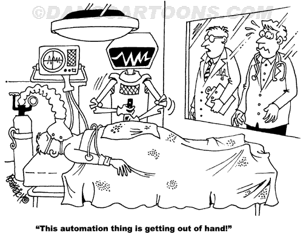

# 机器人过程自动化:揭秘。

> 原文：<https://medium.datadriveninvestor.com/robotic-process-automation-the-demystification-81c2802c4e11?source=collection_archive---------8----------------------->

> 机器又快又准又笨。人类是缓慢的，不准确的和聪明的，他们在一起是强大的。

几个月前，我们开始了流程自动化运动，并开始研究机器人流程自动化(RPA)。当时，我从未听说过 RPA，到目前为止，每次我向别人提起它，他们总会问我，“那是什么？”。作为一个相当新的概念，RPA 还没有像人工智能和机器学习一样立即出名。然而，那些投资 it 的组织正在收获巨大的收益，任何行业的任何公司都有机会从中受益。在过去的几个月里，我围绕自动化进行了广泛的培训和学习，我决定通过一系列关于 RPA 是什么、它做什么以及如何做的文章来分享我在 RPA 上学到的东西。在这篇介绍性文章中，我将重点解释 RPA 是什么，并揭开围绕它的所有神秘面纱。

到目前为止，我发现的最简单的 RPA 定义来自 AIIM，他将 RPA 定义为“…一个用于部分或完全自动化人工的、基于规则的、重复的人类活动的软件工具的术语”，这些工具通过在软件应用程序上模仿人类行为来工作。你基本上告诉机器人一系列的步骤来完成一项任务，它会一遍又一遍地重复这些步骤，让人类去做更有成就感的工作。如果您对 RPA 不熟悉，那么描绘 RPA 的最佳方式是想象一个真实的物理机器人坐在椅子上，按下与人类相同的按键来完成任务。这是一样的，只是在这种情况下，你有一个软件应用程序来告诉你点击哪里，什么时候，打什么，等等，而不是一个物理机器人。该机器人可以登录和退出应用程序，它可以复制和粘贴数据，它可以打开，阅读和发送电子邮件，它可以填写和提交表格。我们本质上只是在创造虚拟机器人，使业务流程中大量、重复和规则驱动的人类行为自动化。

RPA 的定义功能(可能也是最大的优势之一)是，除了自动化软件本身，现有系统和基础架构没有任何变化。您只需使用 RPA 工具，利用您现有的基础架构来自动化您现有的流程。没有必要担心与遗留系统的集成，或者开发 API，或者现有系统是否与某些自动化工具兼容。您选择的任何 RPA 工具都可以与您已经拥有的任何系统配合使用。

这是对 RPA 的一种过于简化的看法，因为为了充分实现其优势，您需要意识到许多因素。我现在总结一下，然后在后面的文章中更详细地介绍。您需要确保您已经/正在:

1.  自动化正确的流程。
2.  在整个组织中教育和传达你的目标

3.整个组织的参与和 EXCO 的支持。

4.严格的训练

5.一流的变革管理流程。

自动化正确的流程有两个部分。第一个是选择正确的自动化候选者，第二个是选择是否在其当前状态下自动化流程，或者首先进行一点重新工程。选择 RPA 候选的一个好标准是遵循以下清单:

结构化流程(一致且常规)

清晰的决策逻辑(如果这个，那么那个)

使用多种应用程序或工具

没有情绪或主观性(仅限于要求一个人做出决定)

容易出现人为错误

不称心的

高容量/中低复杂度

自动化那些在所有或大部分项目上勾选“是”的任务。

> 如果数字化转型做得好，就像毛毛虫变成蝴蝶，但如果做得不好，你得到的只是一只非常快的毛毛虫。

在您选择了一个自动化候选对象之后，花时间决定是否应该在流程的当前状态下对其进行自动化，或者是否应该在您开始实现之前首先对其进行重新设计。业务流程再造(BPR)不一定是 RPA 的一部分，但是使用 RPA 来提高业务流程的效率而不仅仅是速度，这从来都不是一个坏主意。瞄准蝴蝶，而不是快速的毛毛虫。

如果操作得当，RPA 会带来许多优势。

1.技术壁垒低。实施 RPA 几乎不需要编程技能。这意味着即使非技术人员也可以接受培训，使用 process designer 来设置机器人。

2.精确度提高。机器人不会犯人类容易犯的错误，如打字错误、跳过步骤等。

3.提高生产力。在执行同样的任务时，机器人比人快得多。

4.不中断工作。机器人可以全天候自主工作。他们不需要休息或监督。

5.法规遵从性。机器人不会偏离指令，并提供详细的审计线索，在某些情况下，可以回放他们过去的行动。

6.提高员工士气。RPA 通常被描述为“…将机器人从人类中分离出来。”它让员工有机会做更吸引人和有趣的工作。

随着 RPA 的成熟，BPM 和 AI & ML 等更高级的认知功能将会进入自动化流程，从而产生更智能、更高效的机器人。

因此，作为一名首席执行官/首席信息官，考虑为业务流程(如工资单、数据迁移、发票处理、应收账款/应付账款、报告创建、库存管理等)实施 RPA 绝对符合您的最佳利益。为了取得最大的成功，将 RPA 作为组织的战略目标，从 EXCO 购买，而不是作为技术/IT 计划。此外，要了解自动化的潜在陷阱。我将在另一篇文章中讨论这些，但是不能不提的是，糟糕的设计和变更管理会给你的组织带来巨大的破坏。害怕被机器人抢饭碗的员工会强烈抵制 RPA。无知是你最大的敌人。教育所有利益相关者你想要达到的目标，整个组织必须作为一个有凝聚力的单位前进。向他们保证没有人会因为 RPA 而被解雇，并且当单调的部分被删除时，每个人都会更加享受他们的工作。永远把人民放在首位。

请注意第 2 章，我们将在其中了解 RPA 实施战略。

