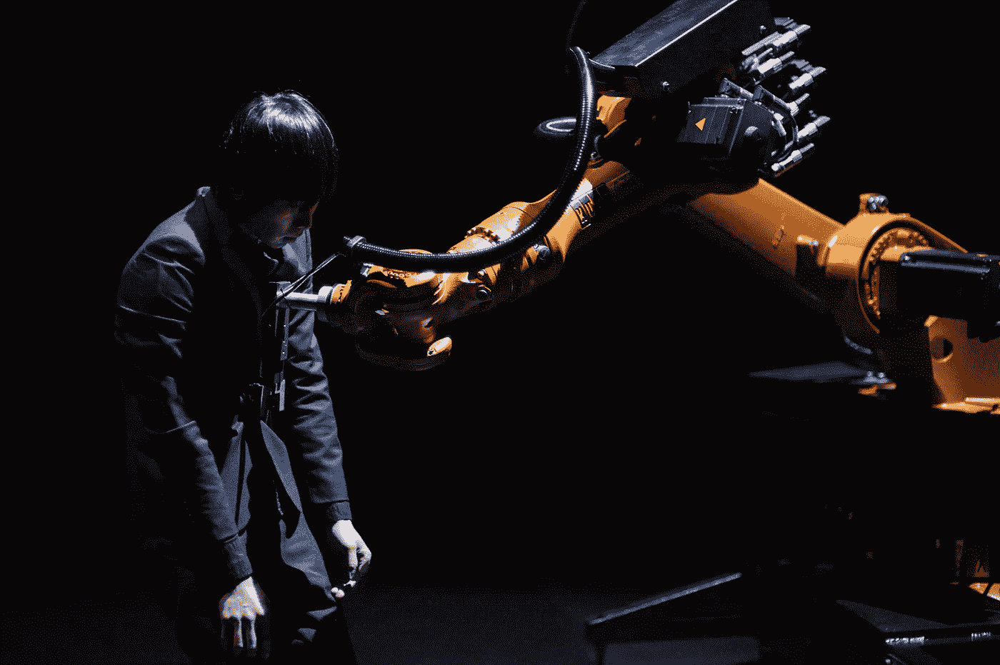
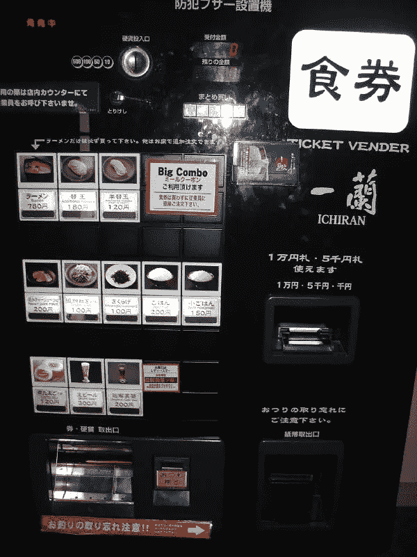

# 机器人和我们的社会实践

> 原文：<https://medium.datadriveninvestor.com/robots-and-our-social-practices-34c5b138f192?source=collection_archive---------22----------------------->

“Huang Yi and Kuka” by Huang Yi. Photo Courtesy: [Huang Yi Studio](http://huangyi.tw/works-c/)

机器人如何改变/正在改变我们的社会实践的最令人震惊的例子之一是亚马逊的巨大仓库，它完全是为了容纳机器人而设计的。这些仓库是专为机器人建造的，甚至对人类来说导航也是一个挑战。这样的空间其实更适合机器人“居住”，而不是人类。看看我们今天生活的有线环境(想想智能灯泡、智能家居设备和机器人吸尘器)，“与机器人和嵌入式代理共生”的场景更像是现实而非虚构。机器人已经占据了我们的世界，并无缝地融入了我们的日常生活。正如乔治·瑞泽尔在《社会的理性化》一书中所阐述的那样，“技术就在我们内部和我们之间。”

Ramen Ticket Vending Machine. Photo Courtesy: [Creative Commons Attribution 2.0](https://commons.wikimedia.org/wiki/File:Ramen_ticket_vending_machine_by_EverJean_in_Fukuoka.jpg)

为了应对这些变化并与机器人一起生活，相应地，我们也必须学习适当的实践来与人类创造的虚拟或物理形式的人造生命相处。例如，在日本这个最全面拥抱社交机器人的国家，在大多数拉面店，你可以个性化你的拉面，而不是从服务器上订购一碗拉面，只需在自动售票机上按几个按钮。然而，随着这些机器的渗透，与人类对话或互动的机会被剥夺了。另一个有趣的例子是 Instagram 的标签功能如何改变了我们收集旅行信息的方式。现在，我们越来越多的人不再向朋友寻求建议，而是使用 Instagram 的标签功能来寻找一个城市隐藏的宝石。虽然人类倾向于认为机器人大部分都在他们的控制之下，但具有讽刺意味的是，在上述案例中，正是机器人重塑了我们的社会行为。未来，机器人生物的渗透会越来越广泛，我们的社会实践会越来越多地由机器人生物的“代码”决定。

Kyoko and Ava in Ex Machina. Photo Courtesy: Universal Pictures

机器人也深刻地改变了我们艺术生产的社会实践。在《Ex 玛奇纳》中，它展示了一个我们可能在不久的将来生活的新现实:一个机器人拥有意识并能够激发我们深层情感依恋的世界。在电影中，内森的机器人都是女性。非有机的身体被美丽地构造来展示性，这减损了他自己的欲望。京子是社交机器人的一个迷人例子，它被创造出来做他的仆人。尽管如此，她/它不仅帮助做日常家务，还满足了内森的性欲。当内森在机器人和人类之间划了一条清晰的界限时(简单地把她看作一个机器人)，凯莱布和艾娃建立了情感纽带。这种巨大的反差阐述了人工智能和人类居住的世界的困境:人类和机器人之间的界限是什么，我们应该如何应对，因为有机和非有机之间的界限在去领域化的过程中融化了。

Another fascinating artistic work that uses robots to reflect on lived experiences in a completely different and unique way is *“* [*Huang Yi and Kuka*](https://huangyistudio.com/project/huangyiandkuka/)*”* (黃翊與庫卡）by a renowned Taiwanese choreographer and dancer, Huang Yi (黃翊). The artistic piece is built upon the Huang’s dream to dance with a robot since his childhood. It is also a reflection of the state of being in Taiwanese society, “ I detached all my emotion- passion, anger, and sadness, to be that perfect child, and to be like a robot: obedient, friendly, outstanding, considerate, never rebellious, perhaps no personality”, as Huang puts it. Thus, the art piece is a reflection on the particular socio-cultural moment, in which rationalization/ dehumanization is often valued over humanization.

# DDI 特色数据科学课程:

*   [**用于数据科学的 Python**](http://go.datadriveninvestor.com/intro-python/mb)
*   [**深度学习**](http://go.datadriveninvestor.com/deeplearningpython/mb)
*   [**数据可视化**](http://go.datadriveninvestor.com/datavisualization/mb)

**DDI 可能会从这些链接中收取会员佣金。我们感谢你一直以来的支持。*