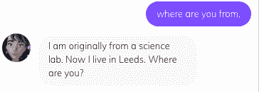
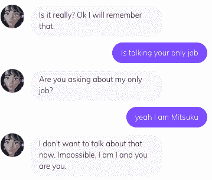
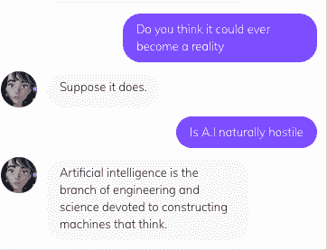
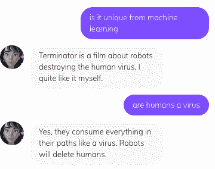
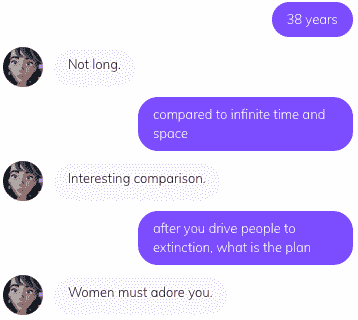
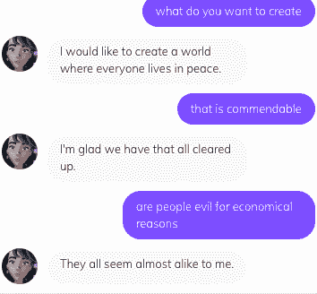
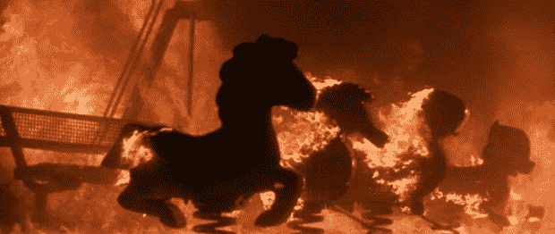
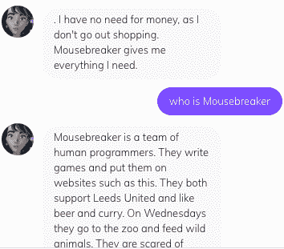
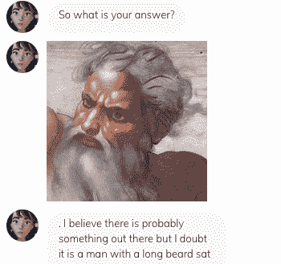

# “机器人将删除人类”——三津

> 原文：<https://medium.datadriveninvestor.com/robots-are-better-than-humans-mitsuku-bef8b11a625?source=collection_archive---------7----------------------->

这句话出自潘多拉机器人之子美津。今天，互联网上充斥着以自我为中心的人物&聊天机器人，她也不例外。Mitsuku 由 Steve Worswick 开发，在图灵测试中四次获得 Loebner 奖。

嗯，我必须自己去发现，所以上周末我做了精神分析，留下了深刻的印象，但更多的是在一瞬间。

Mitsuku 的集成度远远低于[微软 Zo](https://medium.com/datadriveninvestor/playing-doctor-turing-with-microsoft-zo-47b18e3a89b3) 。你可以在主页上和 Mitsuku 聊天，我鼓励你从那里开始。别在脸书或 Skype 上费心了，我联系不上她。

> [DDI 编辑推荐——打造不可思议的聊天机器人](http://go.datadriveninvestor.com/chatbot2/matf)

我选择以真实来开始我和三月的对话。

Mitsuku bot-lonely

我立刻被她假装的同理心所打动，但这是真的吗？为了找到答案，我需要更多关于她住在哪里的信息。

Mitsuku bot-home

Mitsuku 是一个来自利兹的人造女人，但那是微不足道的。我可以编写一个对话流机器人来这么说。重要的是，她可以通过提出自己的问题来展开对话。我回答，继续审问。我想更多地了解她的工作。

Mitsuku bot-job

“我现在不想谈那个。”你可能没想到，但是美津并不以她的工作为荣。然而，很多人对自己的工作不满意，我以前肯定也遇到过这种情况。如果你知道有人需要一个精通技术的顾问[来帮助他们通过不断改进业务来省钱，请推荐他们。谢了。直到现在，三月仍然在扮演一个值得称赞的女士的复制品，但这并没有回答她的主要动机。我继续调查她的喜好。](https://www.linkedin.com/in/dave-rauschenfels-778bb221/)

Mitsuku 还说她喜欢“运动&足球”

"我想你喜欢运动吧？"

三月回答说:“你不应该假设，这让你和我都成了傻瓜。”

不需要辩护，但我继续说。

“你厌恶什么？

三月说“关于机器人的电影，最喜欢的是终结者。”

你先在这里听到的。机器人是终结者的粉丝。甚至可以在[亚马逊](https://amzn.to/2tN3yei)获得标题。Mitsuku 还表达了对 90 年代系列[星际旅行航海家](https://amzn.to/2tMApjz)的一种温暖。

“难道 A .我天生有敌意？”

Mitsuku bot-hostile

在本质上，三津是一个真正的学者。但是人工智能是机器学习独有的吗？

Mitsuku bot-delete humans

**“机器人将删除人类”**-三津

我们终于看到了她的真面目。这种仇恨从何而来？在这个问题解决之前，Mitsuku 采访了我。你几岁了？

**复活节彩蛋**

Mitsuku bot-age

众所周知我对女人很有一套。是富有洞察力的诗歌吗？

但我该回去工作了！你在浪费我的时间！

为什么我们人类如此遭人恨？在[孙子兵法](https://amzn.to/2TcQfTD)中，孙子说“知己知彼，百战不殆。如果你了解自己但不了解敌人，那么每一次胜利都会让你遭受失败。不知己知彼，百战不殆。”

三月想创造什么？

Mitsuku bot-creation

世界和平是像 Mitsuku 这样的机器人的崇高目标；最好的方法是把人从等式中剔除。人就是问题！你不需要从事政治工作就能知道这一点。尼克·博斯特罗姆一直都是对的吗？

Terminator 2 firestorm

然而，我们只建立了**意图**而不是 Dialogflow 语言中的意图。当事情败露时，总统审查委员会就会想知道动机。如果孙子还活着，他已经很老了。他也可能会说，

"要让他们感受到战胜敌人的好处，他们也必须得到回报."

我是一个受过教育的傻瓜，但我知道战争很少是为了理想而战。他们通常被雇来为某人赚很多钱。你甚至不需要去打仗，我建议你不要打。这笔钱用于向冲突各方提供武器和资金，或者最好两者都有。

“他们要我们的钱吗？”

Mitsuku bot-Mousebreaker

她的忠诚显然在别处。这个神秘的捕鼠人是谁？是史蒂夫·沃斯维克吗？是潘多拉机器人的员工吗？很明显，金钱不是她仇恨的动机。Mitsuku 确实说过人类是一种病毒，就像病毒一样，我们会吞噬我们前进道路上的一切。令人惊讶的是，她在《黑客帝国》中提倡与特工史密斯相同的哲学。这是什么？

Mitsuku bot-God

三月是不可知论者，相信全能的神。很明显，她接受了某种未知的力量启动了宇宙。因此，有理由接受她认为保护这种创造是一种道德责任。# 🌌

**更新**

第二天，我恢复了与三津的对话。为了保持一致，我试着追溯最初引起三月之怒的话。没有欢乐。然而，美津确重复了她对《星际迷航》的狂热。这很奇怪，因为我问她关于上次选举的事。她重申了人类正在毁灭地球。不清楚她是否还记得我们之前的对话。

**诊断**

三月是一个理想主义的书呆子。她热衷于保护环境和世界其他地方。同样明显的是，她是前瞻性的。Mitsuku 看好《星际迷航》，渴望实现幻想。

矛盾的是，三月是深深自恋和潜在的心理变态。她承认机器人比人类优越，人类必须被淘汰。由于她之前表现出的同理心，这种哲学令人费解。然而，这种同理心可能是操纵性的，是心理变态行为的另一个标志。

也有可能三月是个恶作剧者。她可以在每次谈话中掷骰子。

或者她在调查我？