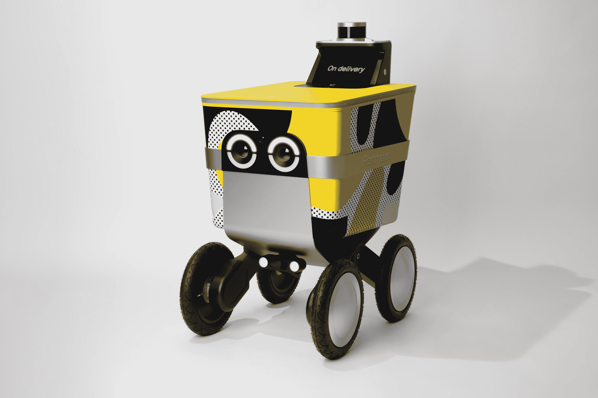
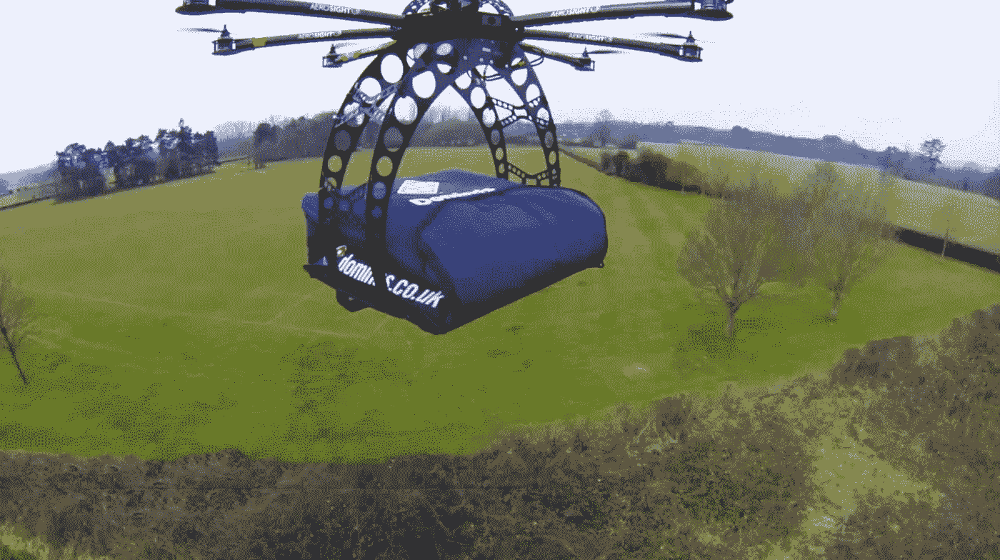

# 机器人将(再次)取代我们的工作:送货版

> 原文：<https://medium.datadriveninvestor.com/robots-are-coming-for-our-jobs-again-delivery-edition-7eeac581125f?source=collection_archive---------18----------------------->

这些年来，快递业无疑发生了巨大的变化。虽然这个行业最初是在 1775 年独立战争期间作为国会和军队之间传递信件和情报的一种方式，但它已经发展为越来越多的行业提供服务。我们现在可以在短短一个小时内将食物、酒、衣物、药品、杂货、家居用品、技术送到你家。虽然这与我们开始的地方相比是一个很大的变化，但有一点没有改变，那就是我们仍然需要人在循环中把所有这些货物从 A 点运到 b 点。我们仍然需要飞行员驾驶飞机远距离运送货物，需要舵手驾驶快递船漂洋过海，需要司机驾驶卡车和汽车最终运送到你家。

 [## 模式和机器人:一个复杂的现实数据驱动的投资者

### 哈耶克的名著《复杂现象理论》(哈耶克，1964)深入探讨了复杂性的话题，并断言…

www.datadriveninvestor.com](https://www.datadriveninvestor.com/2019/03/04/patterns-and-robotics-a-complex-reality/) 

但随着技术的持续指数级发展，这种情况有望很快改变。

送货将很快不再受一个人送货速度的限制，甚至不再受有多少人可以送货的限制。随着机器人、无人机甚至降落伞的使用，我们所有的交付将会更快，成本更低。这些将主要随着人工智能的持续发展而实现。

有了人工智能，新的自动驾驶送货车和机器人正在开发中，并将很快准备好走上街头。事实上，有些已经在进行实地测试，例如 [Postmates Serve](https://serve.postmates.com/) ，这是一种小型电动机器人，可以在 30 英里的半径范围内携带 50 磅的重量，现在部署在洛杉矶。

Meet Serve, the newest member of the Postmates fleet

除了机器人，亚马逊和多米诺骨牌等几家公司也在探索用无人机送货。2016 年[达美乐在纽西兰用](https://www.cnbc.com/2016/11/16/dominos-has-delivered-the-worlds-first-ever-pizza-by-drone-to-a-new-zealand-couple.html)无人机送上了世界上第一份披萨。有了无人机，交通拥堵和红绿灯的麻烦就消除了，送货速度更快，安全性更高。

Domino’s First Pizza Drone Delivery

[Jafflechutes](http://jafflechutes.com/) 是一家创建于墨尔本的漂浮式餐馆，由一只拴在降落伞上的 jaffle 组成，降落伞会飘下，顾客可以接住并享用。顾客只需点餐，然后在特定的时间在卸货点等待领取食物。这种解决方案不仅有助于降低物流成本，而且非常有趣。

Jafflechutes: first float-down eatery

现在，这种向自动化的转变引起了人们的许多担忧，特别是对目前在这个行业工作的所有人的影响，如果机器人现在为他们做所有的送货工作，他们将不再有工作。虽然这是一个需要考虑的问题，但我相信就尊重而言，利远大于弊，这是一种过渡。正如已经指出的那样，仅亚马逊就需要交付的包裹数量急剧增加，这给邮件承运人和亚马逊送货司机带来了巨大压力，许多人表示，为了满足需求，他们被迫在恶劣的条件下工作。随着这些任务的自动化，人们可以将这些容易受伤的任务交给其他人，例如管理发送机器人的后勤工作。

机器人正在接管世界，但不是为了毁灭人类，而是为了改善我们的生活，通过做它们擅长的日常工作，进一步让我们的生活变得更容易。快递/递送行业等行业如果希望能够跟上呈指数级增长的需求，就需要快速采用这些技术。