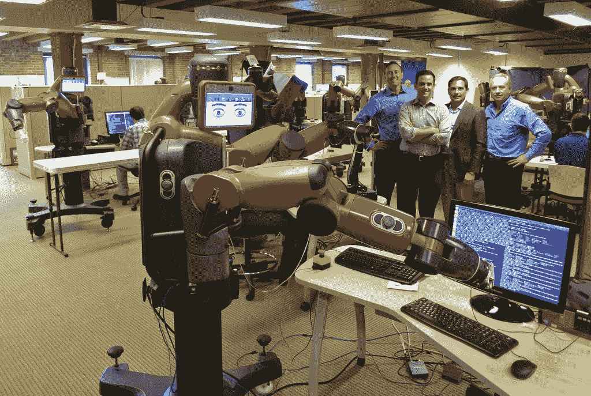

# 机器人正在取代我们

> 原文：<https://medium.datadriveninvestor.com/robots-are-replacing-us-699da6172e13?source=collection_archive---------10----------------------->

[Image](https://www.flickr.com/photos/jurvetson/9690512888) by [Steve Jurvetson](https://www.flickr.com/photos/jurvetson/)

如果我们跟随我们当前时代的叙述，你会情不自禁地注意到一些不断重复的关键术语。其中一些词与人工智能、自动化、机器人、数字货币等有关。使用这些词的上下文各不相同，但是人们不禁会想，这一切将如何影响我个人。我说的个人，是指定义我们所有人的东西，那就是工作。

这就提出了一个问题；五年后我还会做同样的工作吗？十个呢？工作的未来是什么样子的？在自动化和不断变化的背景下，我该如何为未来做准备？

虽然许多人设想未来的工作将由偷走他们工作的机器人来管理，但其他人正在想象一个混合的人机环境，在这个环境中，工业自动化将使我们能够充分发挥潜力。

最近有一些研究表明，自动化和数字技术可以消除或改变美国 47%的工作岗位。这是一个非常高的比例，对于发展中国家来说，这个比例要大得多，像中国这样的国家将达到 77%。

那么自动化能在多大程度上取代劳动力中的人类呢？我们将来会有什么样的工作？已经有机器人[咖啡师](https://www.businesswire.com/news/home/20180227005633/en/Cafe-Technologies-Launches-Robotic-Coffeebar-2.0)、[汉堡店](https://sf.eater.com/2018/6/21/17489084/creator-robot-burgers-san-francisco)和[酒店](https://www.theguardian.com/world/2015/jul/16/japans-robot-hotel-a-dinosaur-at-reception-a-machine-for-room-service)。无人机送货已经过测试，并且已经在一些国家开始实施。长期以来，运输行业一直要求自动驾驶汽车取代人类司机，以至于现在；甚至自动飞行的[直升机出租车](https://www.engadget.com/2018/10/24/volocopter-air-taxi-test-singapore-autonomous-drone-helicopter/)也加入了这个场景。

如今，在工业界，越来越多的公司正朝着配送中心完全自动化的方向发展。他们正在努力将这些无人仓库与智能工厂结合起来，使公司越来越接近实现完全自动化的供应链，在这个过程中，从供应商到客户的产品没有任何人工参与。

在中国，阿里巴巴已经减少了他们的人工劳动，因为机器人完成了他们仓库中 70%的工作，而他们的竞争对手 JD.com 则宣称他们拥有世界上第一个全自动的 T2 分拣中心，配备了金木研发的机器人控制器。英国在线超市 Ocado 已经实现了其在英国所有配送仓库的自动化。一个这样的[购物中心](https://www.youtube.com/watch?v=XJqsdprXF5c)有 35 公里长的传送带，算法完成所有的工作，甚至使机器自动分拣出每个购物袋中的物品！他们最新的仓库更令人印象深刻。他们配备了由空中交通控制系统控制的机器人，沿着网格系统无缝移动，以挑选和包装食品。

尽管这些仓库目前看起来没有人，但并不是所有的仓库都处于相同的自动化水平。仍然有成千上万的人在配送中心工作，这些员工通常负责监控机器或可以自动化但尚未自动化的任务。人们仍然在工作，并且在很大程度上参与物品的装载、拣选和包装过程。一些公司因其员工所承受的工作条件而一再受到抨击，但是如果他们的仓库完全自动化，这些问题就会得到解决。机器人可以在需要的时候工作，毫不费力地举起和移动重物。字面上。那么他们为什么没有呢？

嗯，实现机器人和开发可以自动化的系统需要时间和金钱。最重要的是，这项技术还不完善，仍然有许多必要的改进，以尽量减少故障，提高机器人操作的成功率。在仓库地板上工作，或者作为一名拣货员或打包员不一定需要高水平的技能，这些工作的劳动力储备很大。对企业来说，这意味着廉价劳动力的供应，直到技术进步能够提供更廉价、更高效的工人。

如果我们回顾一下工业革命，它对人们的影响是巨大的，围绕手工艺、手工流程、耕作和农业的传统工作最终不一定会被取代，但在机器和自动化的帮助下会显著增强。一些工作被摧毁了，但是技术带来了一系列全新的工作。然而，新工作显著提高了每个人的生活质量，这是有争议的。当然，虽然发达国家的大多数中产阶级可以开始买得起汽车、电器、更便宜的食品和衣服，但谁会喜欢在装配线上朝八晚五地工作呢？这就把我们带到了我的下一个问题。是工作定义了我们，还是我们定义了工作？

随着自动化的发展，对专业技能的需求持续增长，需要有人来填补，但是那些不想或没有能力提升技能的人怎么办？总的来说，来自社会经济背景较低的人，没有与他们更有特权的同龄人一样的平等机会，去接受特定领域的进一步教育或培训。套用我们的一位[播客](https://soundcloud.com/odcuriocity/curiocity-automation-malaga)演讲者埃米尔·哈提卜的话，并不是每个卡车司机都有能力或兴趣成为数据科学家或机器学习专家。而且不仅仅是大家认为的低技能工作有危险。例如，会计师和审计师被赋予了**[**94%**](https://willrobotstakemyjob.com/13-2011-accountants-and-auditors)**的自动化概率，相比之下，软件开发者只有 [**4%**](https://willrobotstakemyjob.com/15-1132-software-developers-applications) 的自动化概率。****

****在更个人的层面上，每个人都想知道他/她如何能为此做更好的准备，唯一可以肯定的是，无论我们喜欢与否，变化都会发生。随着各行各业的失业，这些人的工作前景将会如何？如果或何时，人们失去了工作机会，他们的自动化同行，下一步是什么？没有工作，人类将如何养活自己，以赚取在社会中生活所需的钱？对于这种可能的困境，有没有解决的办法？****

****当这些工作被机器人取代时，如果有一天我们可以在很少或没有人类投入的情况下实现并提供商品和服务，我们作为一个社会是否有责任为每个公民提供体面的生活水平？所有人都能获得普遍的基本收入吗？普遍基本收入，或 UBI，是指政府每周或每月向所有公民支付固定金额的钱或基本收入，无论他们是失业还是已经赚钱。UBI 将覆盖他们的生活成本，使人们能够追求商业理念而不必担心失去他们唯一的收入来源，或者尝试新的爱好和从事他们通常认为不划算的工作。全球许多国家和城市的政府已经在试验 UBI，以研究如果引入 UBI 将会产生的影响。****

****2017 年 1 月，芬兰开始了他们的[基本收入实验](https://www.kela.fi/web/en/basic-income-experiment-2017-2018)，该实验将于 2018 年 12 月结束。在这项试验中，他们随机选择了 2000 人组成的小组，每个月的基本收入为 560€。一旦实验结束，芬兰的社会保险机构 Kela 将分析参与者的数据，以了解接受 UBI 如何影响他们的收入和就业状况，以及调查它对他们总体福祉的影响。尽管 UBI 的想法很棒，但仍有许多[的怀疑和争论围绕着应该提供多少收入。如果在市中心外租一套一居室的公寓每月花费同样多的钱，生活在芬兰的人真的能靠每月 560€维持生活吗？](https://www.bloomberg.com/opinion/articles/2018-04-26/finland-s-basic-income-experiment-was-doomed-from-the-start)****

****教育是否会被迫适应，以使后代能够与机器竞争？****

> ******“我们教的东西都应该和机器不一样。”******

****阿里巴巴集团执行主席马云在 2018 年世界经济论坛[会见领袖](https://www.youtube.com/watch?v=4zzVjonyHcQ)会议上这样说道。人类无法在所有方面与机器竞争，这就是为什么我们必须专注于培养我们独特的人类特征。机器人无法达到人类所拥有的真正创造力的水平。除非我们给机器编程，否则它无法想象或感受情感。我们，人类，是控制我们创造的这些机器人的人，至于终结者式的未来发生的可能性，那只会发生在我们允许的情况下。****

****自动化是自主技术和人工智能的基础，随着它的发展，它将破坏劳动力、管理和资本的力量。最终由我们来决定，通过在重要的地方实现自动化，并释放我们对更多创造力、可持续性和更有意义的生活的渴望，我们可以在多大程度上改善我们的生活。
当你可以用机器人来帮助你的时候，为什么要和机器人打架呢？****

****参考资料:****

****[https://www . Oxford Martin . ox . AC . uk/downloads/academic/The _ Future _ of _ employment . pdf](https://www.oxfordmartin.ox.ac.uk/downloads/academic/The_Future_of_Employment.pdf)
[http://documents . world bank . org/curated/en/896971468194972881/pdf/102725-PUB-Replacement-public . pdf](http://documents.worldbank.org/curated/en/896971468194972881/pdf/102725-PUB-Replacement-PUBLIC.pdf)****

******作者:卡门·陈和乔治·麦克维******

*****表达的所有观点和意见仅代表我个人，不代表任何公司。****