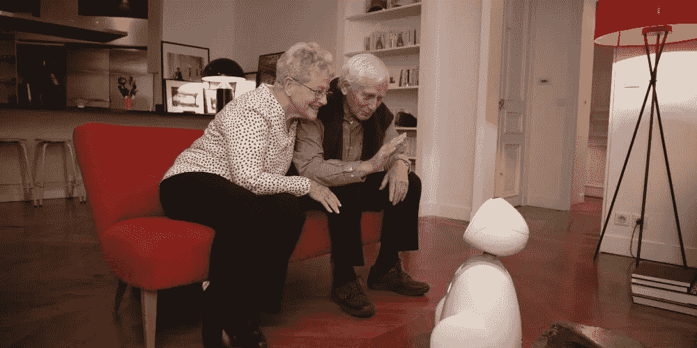

# 机器人是老年人护理的未来

> 原文：<https://medium.datadriveninvestor.com/robots-are-the-future-of-elder-care-50607f0fd87a?source=collection_archive---------17----------------------->

Buddy Your Emotional Robot

世界老龄化人口继续扩大，使得老年人护理的供需问题越来越明显。这一人口问题在日本等国家已经非常现实，预计到 2025 年将有 100 万护理员短缺。美国正面临类似的困境——预计到 2050 年，65 岁及以上人口的比例将升至约 26%。

技术在解决这一挑战中发挥着重要作用。据消费者技术协会(Consumer Technology Association)称，在长寿经济中，帮助老年人的技术市场预计将在未来几年增长到近 300 亿美元。

 [## 模式和机器人:复杂的现实|数据驱动的投资者

### 哈耶克的名著《复杂现象理论》(哈耶克，1964)深入探讨了复杂性的话题，并断言…

www.datadriveninvestor.com](https://www.datadriveninvestor.com/2019/03/04/patterns-and-robotics-a-complex-reality/) 

如果机器人不能取代人类，它们可以对老年人护理的未来产生积极影响。像巴迪这样友好和乐于助人的机器人提供了动力、移动性和监控能力，为老龄人口提供了幸福、安全和独立。

在巴迪的帮助下更好地衰老:更长久地享受更健康、更高质量的日常生活。

*“巴迪识别我的声音，问我并回答问题，充当第二记忆记住我的日程”*约翰，80 岁。

巴迪的护理能力帮助老年人和/或他们的护理人员完成日常任务，帮助监控他们的行为和健康，并提供陪伴。

Buddy 是为那些喜欢尽可能长时间呆在自己家舒适熟悉的环境中，以保持独立和尊严的老年人而设的。

正如欧洲老年人护理和支持服务领导者 Korian 的首席开发官 Fabrice Flottes de Pouzol 所说*“我们相信 Buddy 及其专用于老年人援助的情感、互动和可扩展机器人技术将使我们能够提供满足用户、护理人员和专业人士需求的独特服务”。*

无论是在他们自己的家里，护理院或医院，巴迪的护理能力可以改善老年人的福祉。他提供广泛的服务，如监测健康状况、提醒服药、通过视频聊天和引人入胜的谈话帮助与家人、朋友和医疗保健提供者保持联系、帮助保持健康、保持运动、提高记忆力、提供各种信息等。

得益于他的 app 平台，可以开发各种定制化的护理服务。

## Buddy 为老年人带来了独立和改善福祉的希望，同时在他们自己的家中或护理机构中保持高水平的护理。一言以蔽之:完美的老年伴侣。