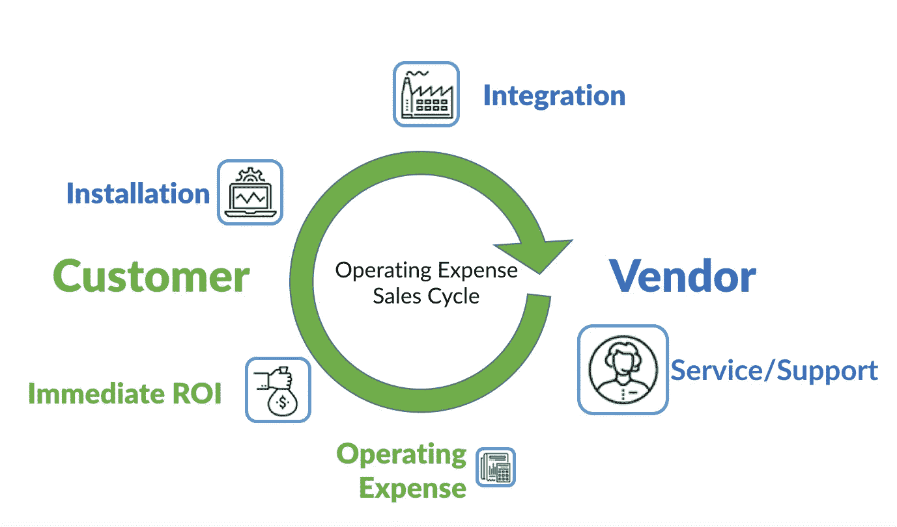

# 机器人即服务是自动化的未来

> 原文：<https://medium.datadriveninvestor.com/robots-as-a-service-is-the-future-of-automation-7a0099b3943d?source=collection_archive---------3----------------------->

# 导言

买卖工业设备的商业模式正在迅速发展。基于云的 IT 基础设施解决方案的融合以及软件即服务(SaaS)企业软件许可的成功，正在影响自主移动机器人公司销售其解决方案的方式。inVia Robotics、Savioke、Cobalt Robotics 和 Knightscope 等自主移动机器人公司已经证明了其在交付解决方案方面的成功，这些解决方案的商业模式使客户能够以订阅或基于指标的融资模式按需付费。让我们看看您应该如何评估潜在机器人供应商提供的机器人即服务(RaaS)产品。

# 行动纲要

本文介绍了将基于机器人的解决方案部署为服务或订阅模式的业务模型。对于自主移动机器人(AMR)解决方案的购买者，本白皮书将概述基于订购的定价和服务交付概念与传统的资本设备销售和支持模式有何不同。这将帮助您做好准备，以实施有根据的提案流程，并获得满足您自动化需求的正确解决方案。
30 多年来，机器人市场一直按照“经典”的资本设备产品设计和销售商业模式运行。在这种销售策略下，开发新产品以满足市场需求，然后作为资本资产购买向目标客户进行营销和销售。作为客户，您拥有设备，在设备的使用寿命内将其作为资本资产进行折旧，并在设备的使用寿命内负责设备的维护和维修。在产品生命周期结束时，您负责处理过时的设备。RaaS 改变了这一切。
在“机器人即服务”合同中，您只需为您使用的服务付费，所有部署、集成、支持和设备维护成本都包含在服务水平合同中。与任何订阅业务模式一样，通过与 RaaS 供应商签订长期合同，您将获得更优惠的价格。

# 资本资产审批周期

资本资产购买周期的年度性质要求购买周期从 3 个月到 18 个月不等。根据您所在的组织，您可能会受到年度预算流程的约束，在该流程中，您需要在预计您的设施可能需要设备时提前几个月提交资本预算请求。为昂贵的固定资产和资本设备构建业务案例通常需要多层管理批准。

像机器人即服务这样的订购模式改变了整个购买流程，通常会简化和缩短购买流程。借助 RaaS 合同，您可以从运营预算中支付自动化费用，这是一项您可以控制的预算，而无需在您的组织内寻求资本批准。

最后，为了管理一些业务领域(如电子商务)的创新和高速增长，您可能会面临预测自动化需求的短期规划。准确预测未来 12 到 18 个月的仓库吞吐量需求是不可能的。RaaS 的承诺是，它提供了更好地利用您的资本的机会，同时缩短了获取和部署满足您需求的自动化解决方案所需的时间。

# 为你消费的东西付钱

随着自动化需求的变化，RaaS 模式允许您扩大和缩小消费规模。你购买的是一个完整的端到端的服务，而不是一件商品，就像你可能会卖掉你的割草机，外包你的草坪护理一样:在旺季订购每周两次的服务，在隆冬季节取消服务。并非所有自动化应用都适合 RaaS。机器人即服务的目标应用程序将具有与草坪护理示例相似的特征。寻找这样的应用，在这些应用中，您可以在高峰期利用额外的机器人使用，在淡季闲置或暂停服务，并根据消耗量支付可变的费用。机器人即服务就像为你的机器人劳动力雇佣一个临时机构。

# 更亲密的供应商关系

当您评估 RaaS 对您的企业的可行性时，第一步是了解 RaaS 业务模式对您的供应商带来的组织变化。一些供应商致力于 100%的 RaaS 业务模式，而其他供应商提供的 RaaS 只是您获得其解决方案的方式之一。让我们看一下 RaaS 供应商关系中的一些不同元素。

## 供应商拥有的设备

首先，供应商将继续拥有设备。因此，供应商将期望并能够远程监控生产中的解决方案。这将需要通过您的公司网络远程访问设备。对您组织的好处是，您不需要培训和维护内部机器人专家。该供应商还将承担 24/7 全天候支持的负担。如果一个机器人坏了，供应商可能会在你之前通过远程监控系统知道。供应商很可能能够远程排除设备故障并安排现场维修，通常不需要您的任何参与。

## 包括更新

第二，因为供应商拥有设备，他们将能够根据需要更新设备，以保持设备处于最佳运行状态。事实上，供应商有充分的动机去设计、构建和维护最好的软件和硬件，因为他们是为长期运行和可支持性而设计的。随着需求的增加，供应商甚至可以在多个客户之间重新部署机器人设备。这种财务激励有助于供应商优化他们的投资。仅提供 RaaS 模式解决方案的供应商可能比被动提供 RaaS 作为资本设备购买选项的供应商拥有更高质量的设备和服务。

## 租赁不是机器人即服务！

解决融资问题的一个简单办法似乎是利用租赁代理作为客户的融资中介。但是，租赁合同本身并不是 RaaS 解决方案，您应该警惕供应商试图伪装成 RaaS 解决方案来销售租赁选项。虽然利用租赁合同购买一台资本设备可能是一个值得考虑的选项，但不要被这种 RaaS 业务关系所迷惑。

# RaaS 解决方案的三个要求

要使基于 RaaS 的解决方案可行，必须满足特定的应用程序要求。让我们来看看其中的一些。

## 1.自动化问题必须是可伸缩的

你的问题必须可以通过一些关键性能指标(KPI)来衡量。正所谓“不可测度，不可管理”。要使 RaaS 解决方案可行，必须有某种不变的方法来衡量 KPI 和消耗率。该 KPI 测量结果必须由供应商有效报告并开具发票。例如，一个简单的衡量标准就是工作时间。在这种情况下，您需要为 AMR 运行(即未关闭或充电)的每个小时付费。另一个衡量标准可能是“每次挑选”。在本例中，您可能需要为通过该设施的每个包裹付费。

# 2.可计入营业费用

RaaS 解决方案的第二个要求是，相关运营必须由运营费用(OpEx)提供资金，因为硬件不会被资本化。运营支出通常由采购经理自行决定，无需寻求高层批准。在资本支出购买过程中，管理层的批准可能会成为交易杀手。因此，如果您有运营支出预算用于自动化，RaaS 可能是完美的解决方案。

# 3.保证吞吐量

每个生产经理关心的两个关键指标是:生产吞吐量和生产质量。制造过程中使用的自动化工具是根据这一要求来衡量的。生产高峰是不可避免的，让您的生产团队平滑生产高峰有利于您的生产指标。
在服务机器人应用中，解决方案在应用中更多的是任务或需求驱动，而不是以制造过程为中心的需求。在这种情况下，机器人可能会闲置一段时间，等待下一个请求或任务的到来。同样，在服务应用程序中，可能会有过度消耗的时期，或者有比机器人更多的任务要做的时期。RaaS 可以帮助解决应用程序中的消耗瓶颈，因为随着生产需求的增加，您将能够安排额外的容量。InVia Robotics 是一家 RaaS 供应商，它通过在高峰期向您的工厂交付额外的机器人，为客户提供扩大吞吐量的能力，对于电子商务供应商来说，这可能是在假日季节。

# 在考虑 RaaS 解决方案时，应该问供应商什么:

1.  您是否在生产中提供对解决方案的远程监控？如果是，您的 IT 安全考虑因素和认证是什么？
2.  您如何衡量 RaaS 解决方案的吞吐量，我将如何为该服务付费？我可以每天查看我的消费报告吗？每月/每季度是否有最低使用费用？
3.  在合同期间，我可以增加或减少在我的工厂中部署的自主移动机器人的数量吗？
4.  在我的设施中集成解决方案是否需要预付费用？
5.  我可以根据自己的独特需求定制自主移动机器人的有效载荷吗？