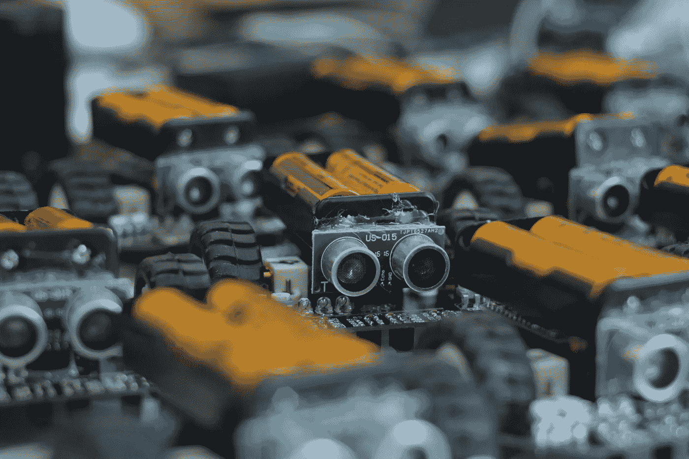
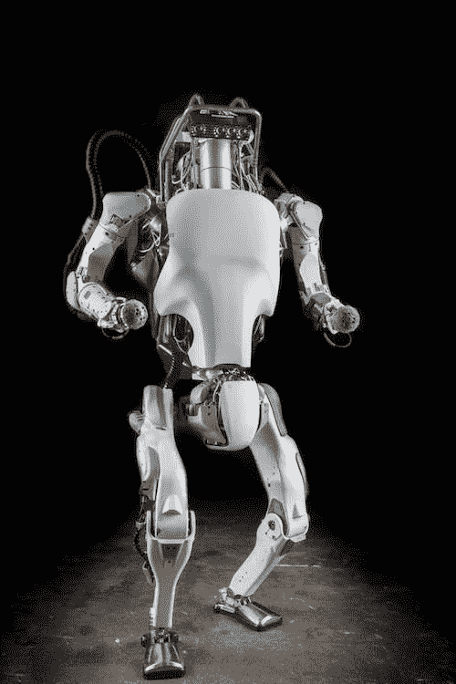
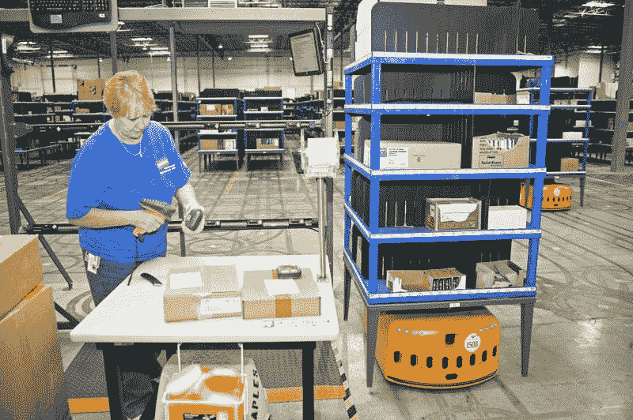
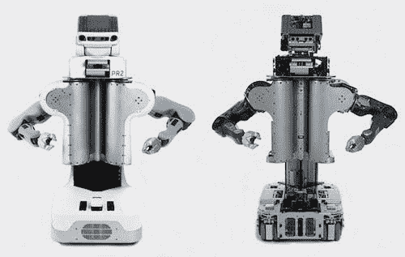

# 工业中的机器人

> 原文：<https://medium.datadriveninvestor.com/robots-in-the-industry-9f69cfe52f40?source=collection_archive---------6----------------------->

## 从 Kiva 系统到 PR2

> “大师首先创造了人类作为最低级的类型，最容易形成。渐渐地，他用机器人取代了他们，这是更高的一步，最后他创造了我来取代最后的人类。”
> 
> ——艾萨克·阿西莫夫，*我，机器人*

当人们谈论人工智能时，他们会想到机器人四处走动。但在计算机科学中，人工智能领域不仅专注于开发这种机器人的大脑，还专注于开发想要实现某些目标的计算机。这些机器人没有使用我们之前谈到的任何深度学习模型。相反，他们有编码的手写软件。

# **波士顿动力**

在佛罗里达州，几个人观看机器人之间达成特定目标的比赛，以决定哪一个更快更精确地达成不同的目标。一个机器人用它的传感器——摄像机和激光——观察一扇门，以决定下一步该怎么开门。利用它的机械臂，它慢慢推门，走到另一边。该团队负责机器人完成其中一项任务时的欢呼。

这个故事听起来可能像科幻小说或来自遥远的未来，但美国国防高级研究计划局(DARPA)在 2013 年 12 月组织了这场比赛，即 DARPA 机器人挑战赛(DRC)。波士顿动力公司创造了开门的机器人 Atlas，但许多其他机器人尝试了这些任务。对于每一个机器人，为它们编程的开发团队都热切地关注着。DRC 的目标是让机器人在对人类危险的情况下完成独立的工作，比如核电站故障。比赛测试了机器人的灵活性、感知和操纵能力。乍一看，这项工作似乎很简单，就像在地形上行走和开门，但机器人很难实现。最具挑战性的任务是在不平坦的表面上行走，因为机器人很难保持平衡。比赛中的大多数机器人都失败了，因为故障或工作太难，没有完成许多任务。阿特拉斯成就最大。

DARPA 项目经理吉尔·普拉特(Gill Pratt)谈到原型时说，“一个 1 岁的孩子几乎不会走路，一个 1 岁的孩子经常摔倒，这就是我们现在的情况。”波士顿动力公司于 2013 年 7 月 11 日披露了 Atlas。在第一次公开亮相时，《纽约时报》称，“这是计算机开始在物理世界中长出腿并四处移动的一个惊人例子”，并将机器人描述为“朝着人们期待已久的人形机器人时代迈出的巨大一步——尽管有些摇晃。”

波士顿动力公司有一个大胆的目标，那就是制造在机动性、灵活性和感知能力方面优于动物的机器人。通过制造具有动态运动和平衡的机器，他们的机器人可以去几乎任何地方，在地球上的任何地形上。他们还希望他们的机器人能够操纵物体，保持稳定，并在走动时不会掉落。随着时间的推移，他们正在接近自己的目标。Atlas 随着更轻的硬件、更多的功能和改进的软件而不断改进。

Figure 20.1 — The second version of Atlas

阿特拉斯比 20 世纪 60 年代的第一批机器人先进得多，比如斯坦福的 Shakey。但是波士顿动力公司想要改进它，所以他们设计了第二个版本——Atlas，下一代。2016 年 2 月，他们首次在 YouTube 上发布了它在雪地上行走的视频。随后的视频显示，阿特拉斯做了一个后空翻，跳过了躺在草丛中的一只狗。

为了建造这个更新版本，波士顿动力公司使用 3D 打印技术使机器人的部分看起来更像动物。例如，它的大腿上有液压通道、致动器和过滤器，这些都是作为一个整体嵌入和打印的。这在 3D 打印之前是不可能的。他们利用 Atlas 负载和行为的知识设计了这种结构，这些知识基于原始 Atlas 机器人之前的交互及其与环境的交互的数据。他们还增加了软件模拟。通过 3D 打印技术，波士顿动力公司将曾经重约 375 磅的庞大、笨重、缓慢的机器人改造成了 165 磅的苗条版本。

波士顿动力公司不仅专注于制造人形机器人，而且还在开发不同外观的电子人。他们有两只机器狗，Spot 和 SpotMini。像阿特拉斯一样，这些狗可以进入对人类不安全的区域来清理空间。利用摄像机，这些狗观察地形，评估地板的高度，并找出它们可以踩在哪里，以及爬到另一个区域需要什么。这些机器人机器不断改进，更加灵活，不那么笨重。最新版本随着布鲁诺·马斯的热门歌曲“Uptown Funk”起舞我相信这只是机器人革命的开始。Spot 和其他机器人可能会出现在我们的日常生活中。

# **Kiva 系统**

像亚马逊这样的巨头一直在研究机器人，以提高他们公司的生产率。在亚马逊的一个仓库，小型机器人正在帮助这家在线零售巨头的包装工乔·科特勒。这些自动化机器在仓库地板上巡视，将装满商品的货架交付给人类，然后人类只需采取几个步骤就可以挑选、包装和运输商品。

A Kiva robot in an Amazon warehouse

这种自动化对亚马逊来说是一个相当大的变化，过去人类只能在传送带和叉车的帮助下自己选择和包装商品。随着 Kiva Systems 引入机器人，亚马逊仓库流程完全改变了。现在，人类站在设定的位置，机器人在仓库里四处移动，缓解了大部分的体力劳动。

这种变化发生在 2012 年亚马逊以 7.75 亿美元收购 Mick Mountz 的 Kiva Systems 时。在现已倒闭的电子商务初创公司 Webvan 的业务流程部门工作多年后，Mick 意识到倒闭的原因之一是订单履行的高成本。该公司在 2001 年互联网泡沫破裂时申请破产，后来成为亚马逊的一部分。米克找到了一种更好的方式来处理仓库内的订单，并在机器人专家的帮助下创建了 Kiva 系统。

在一个典型的仓库里，人们通过在一排排货架间徘徊来完成订单，通常携带便携式射频扫描仪来定位产品。计算机系统和传送带加快了事情的速度，但只是在一定程度上。然而，在机器人的帮助下，亚马逊的员工处理商品的速度提高了三倍，并且不需要搜索产品。当订单到达 Amazon.com 时，一个机器人会绕着货架网格行驶，找到正确的货架，把它举到背后，然后把它送到一名工人手里。然后，这个人通过提取订单、打包、然后发货来完成这个过程。人类没有得到太多的休息。为了避免人为错误，红色激光会在物品上闪烁，这样人们就知道该拿什么了。然后，机器人把架子放回格子里。机器人一拿走架子，另一个就来了，这样人类就一直在工作。

# **机器人操作系统**

为了发挥功能，机器人需要一个能够将高级指令提取到硬件的操作系统。这一要求与标准计算机相同，如与硬盘和显示器通信。机器人需要将信息传递给它的部件，如手臂、相机和轮子。2007 年，曾与拉里·佩奇和谢尔盖·布林共事的早期谷歌工程师斯科特·汉森(Scott Hansan)创办了 Willow Garage，以推进机器人技术。该团队为自己的机器人开发了机器人操作系统(ROS)，其中一个是个人机器人 2 (PR2)。最终，他们与其他公司共享了开源操作系统。

PR2 有两个强壮的手臂，可以完成像翻书这样的精细任务。它包含手臂上的压力传感器以及立体摄像机、光探测和测距(LIDAR)传感器、惯性测量传感器。这些传感器为机器人在复杂环境中导航提供数据。Willow Garage 开发了 ROS 来理解来自这些传感器的信号并控制它们。

Personal Robot 2

ROS 包括一个中间层，它是开发者编写的软件和硬件之间的通信，以及用于对象识别和许多其他任务的软件。它为不同的硬件编程提供了一个标准平台，并为机器人提供了越来越多的新功能。它包括视觉、导航和操纵等方面的库和算法。

ROS 使爱好者和研究人员能够更容易地在硬件上开发应用程序。通过 ROS，机器人可以演奏乐器，控制高空飞行的杂技机器，行走，以及叠衣服。目前，ROS 正在由其他硬件业务开发，如自动驾驶汽车公司。该软件的最新版本 ROS 2.0 具有许多新功能，例如，允许该软件控制多个机器人并允许实时控制。随着这些系统的改进，我们最终可能会让机器人来做家务。