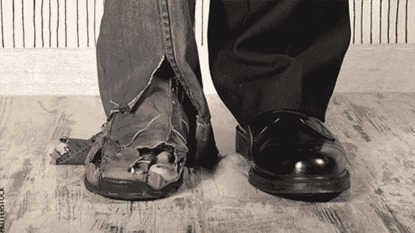

# 罗恩:区分富人和穷人的 3 个金钱习惯

> 原文：<https://medium.datadriveninvestor.com/rohn-3-money-habits-that-separate-the-rich-from-the-poor-4824665852e2?source=collection_archive---------26----------------------->

在教练博客——世界领先的领导力和教练博客之一，我们经常发布主要作者和权威的文章——今天我们很高兴发布一篇来自吉米·罗恩的文章。

这是一个激动人心的想法！为什么不全职工作，兼职赚钱呢？当你可以诚实地说，“我正在努力变得富有”时，你会有什么样的感觉。我不仅仅是为了支付账单而工作。”当你有一个财富计划时，你会很有动力，以至于晚上很难入睡。

所以，如果你允许的话，我想分享一个简单的[创造财富](http://www.success.com/article/a-peek-at-to-do-lists-of-the-wealthy)的公式。这是我对如何分配资金的想法。

# 70/30 法则

在你支付了合理份额的税款后，学会用税后收入的 70%来生活。这些是你花钱买的必需品和奢侈品。然后，重要的是看你如何分配你剩下的 30%。我们按以下方式分配吧:

# 慈善

没有花掉的 30%中，三分之一应该捐给慈善机构。慈善是回馈社会和帮助那些需要帮助的人的行为。我相信贡献你税后收入的 10%是一个值得努力的目标。

给予的[行为](http://www.success.com/blog/what-do-you-get-from-giving-3-things-actually)应该在数量较少的时候就开始教授。从一美元中取出一角硬币相当容易。但是从 100 万美元中拿出 10 万美元却很难。你说，“哦，如果我有 100 万美元，我会毫不犹豫地捐出 10 万美元。”我不太确定。十万美元是一大笔钱。早点开始，这样你就能在赚大钱之前养成习惯。

# 资金总额

用你税后收入的下 10%，你将创造财富。这是你用来购买、修理、制造或销售的钱。关键是要搞商业，哪怕只是兼职。

那么，你如何着手创造财富呢？有很多方法。让你的想象力自由遨游。仔细看看你在工作中或通过你的爱好发展的那些技能；你也许能把这些转变成一个有利可图的企业。

*相关:* [**5 个问题帮你把激情变成利润**](http://www.success.com/article/5-questions-to-help-turn-your-passion-into-profit)

此外，你还可以学习批发购买一种产品，然后零售销售。或者你可以购买一处房产并对其进行改善。用这 10%来购买你的设备、产品或资产——然后开始吧。很难说你内心有什么天才在等待着被机会的火花唤醒。

# 储蓄

最后的 10%应该存起来。我认为这是你财富计划中最令人兴奋的部分之一，因为它可以让你为人生的“冬天”做好准备，从而让你内心平静。让我给你定义一下“富人”和“穷人”:穷人花掉他们的钱，把剩下的存起来。[有钱人](http://www.success.com/article/stuff-rich-people-do-10-things-youre-probably-not-doing-right-now)把钱存起来，把剩下的花掉。

20 年前，两个人每个月挣 1000 澳元，他们每个人多年来挣的钱都一样多。一个人的哲学是花钱，省下剩余的钱；另一个人的哲学是先存钱，然后花掉剩下的钱。今天，如果你两样都知道，你会说一个是穷人，另一个是富人。

所以，请记住，给予、投资和储蓄，就像任何形式的纪律一样，有着微妙的影响。在一天、一周、一个月结束的时候，结果几乎不明显。但是，让五年过去了，差异变得明显。10 年后，差别是巨大的。

这一切都是从同样的钱开始的——只是理念不同。

–更多信息请访问:[http://www . success . com/article/rohn-3-money-habits-that district of the rich-from the-poor](http://www.success.com/article/rohn-3-money-habits-that-separate-the-rich-from-the-poor?trk_msg=A1U3UUBJRM7K124K1HDLU0QP04&trk_contact=IGLC7GPLNKPCJO3D02VCRIBIPK&Source=gerard%40noble-manhattan.com&Content=gerard%40noble-manhattan.com&utm_source=Listrak&utm_medium=Email&utm_term=http%3a%2f%2fwww.success.com%2farticle%2frohn-3-money-habits-that-separate-the-rich-from-the-poor&utm_campaign=3+Money+Habits+That+Separate+the+Rich+From+the+Poor&utm_content=gerard%40noble-manhattan.com#sthash.A1jnwwsJ.dpuf)

在这里阅读更多内容，不要忘记订阅我的教练博客网站，获得免费的教练报告:[https://www . coaching-blog . com/rohn-3-money-habits-that-separate-the-rich-from-the-poor-2/](https://www.coaching-blog.com/rohn-3-money-habits-that-separate-the-rich-from-the-poor-2/)

请访问我们的网站，订阅免费的教练杂志:[http://www.international-coaching-news.net/](https://vk.com/away.php?to=http://www.international-coaching-news.net/&cc_key=)