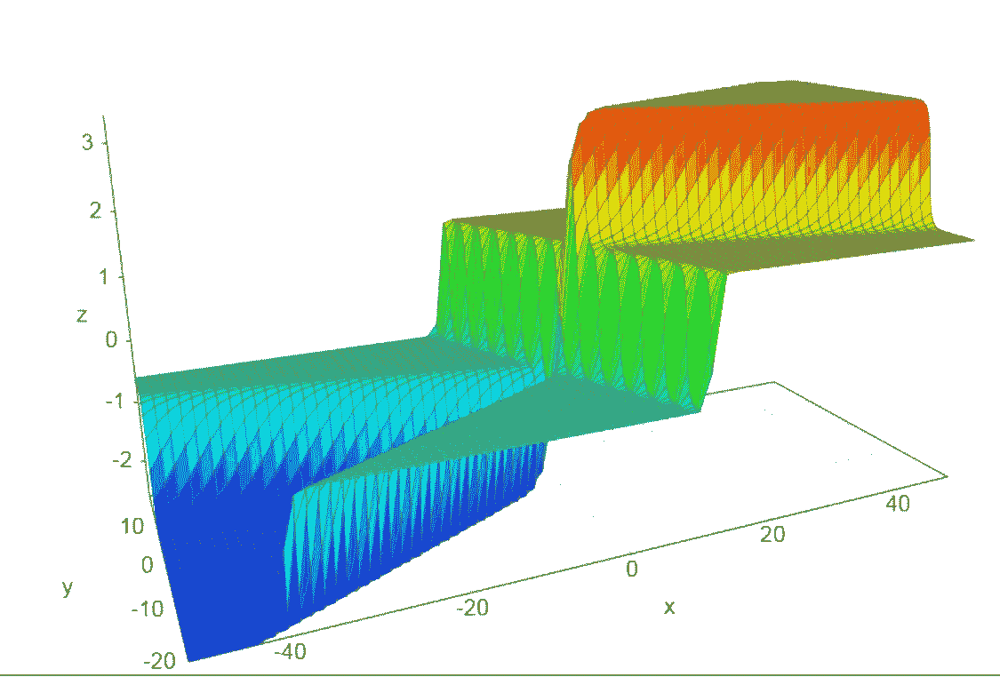
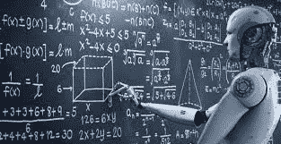
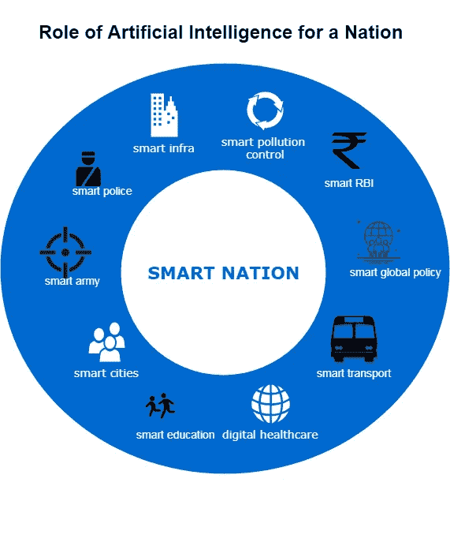

# 人工智能对一个国家的作用

> 原文：<https://medium.datadriveninvestor.com/role-of-artificial-intelligence-for-a-nation-fe94e76a79da?source=collection_archive---------7----------------------->

> **从社会政治角度定义人工智能**

人工智能可以定义为机器实现目标的能力，尤其是在复杂、不确定的环境中。机器有能力执行认知任务，如思考、感知学习、解决问题和决策(NITI 讨论文件)。这是一个非常开放的领域，可以用于从机器人到自动驾驶汽车的任何领域。1956 年，约翰·麦卡锡提议举办一个为期两个月的研讨会，讨论人工智能这一新创意。这个现在很有名的会议鼓励了分别在上世纪 70 年代和 80 年代导致自动化系统和专家系统的研究——前者涉及数学和统计问题的简单机器自动化，包括解决逻辑证明。专家系统被设计成通过对来自给定领域的专家知识进行编程来解决这些限制。

然而，这个专家系统是不相关的，因为每次专家知识改变时，所有的编程、训练和实现都必须重复。重要的突破来自人工智能的一段时间对“深度学习”的研究，深度学习通过将更小的模块抽象在一起来模拟更高层次的处理。随着数据收集、处理和计算能力的惊人进步，智能系统可以完成各种任务并提高生产率。人工智能能力的扩展扩大了它在不同领域的效用。

 [## 挑战你对人工智能和社会看法的 4 本书|数据驱动的投资者

### 深度学习、像人类一样思考的机器人、人工智能、神经网络——这些技术引发了…

www.datadriveninvestor.com](https://www.datadriveninvestor.com/2019/02/28/4-books-on-ai/) 

从事“深度学习”的机器学习系统是受生物启发的，尽管其“专业知识”要窄得多，也不太灵活。他们的“神经”结构还设计有嵌套的、分层的模式识别器，可以适应新的环境，学习新的技能和策略。

人工智能正在成为全球政治的新浪潮，并将在国家间的权力动态中发挥关键作用。许多国家正在大力投资这项技术的发展，它已经成为经济、国防和外交政策的一个重要方面。中国和美国之间对人工智能霸权的追求是包括印度在内的其他国家的主要担忧。本文试图分析人工智能在全球政治中的优势，以及它如何给印度的经济和安全带来许多机遇和挑战。尽管私营部门在人工智能方面取得了进步，但印度在适当的政府政策方面仍然落后，这可能会阻碍该领域的创新、投资和研究。

人工智能(AI)已经成为世界的一场革命。随着从事“深度学习”的机器学习的突破和计算机系统的进步，人工智能变得更加先进和可及。AI 的使用不仅限于信息技术(IT)；它已经超越了 it，扩展到健康、教育、国防、艺术和社会部门。

人工智能可以改变国家建设的进程。我们可以实现社会经济变革的目标，让每个人都能过上最充实的生活。NITI Aayog 也在尝试使用人工智能来创建有洞察力的政策制定过程，但还有很长的路要走。我在这里分享我们可以改进系统的地方

基于任何系统(医疗保健、教育、警察等)的过去趋势和记录。)，我们可以开发数据驱动的智能，使系统比以往任何时候都更加高效、自动化、透明和快速。迪拜、阿姆斯特丹和其他城市正在努力改善人们的生活。他们为每个项目投资数十亿美元。印度做得够吗？最有可能的是，不。如果人工智能可以为人们提供更好的生活，节省浪费，使治理更快更有效，为什么我们会落后于别人？我们在印度有最好的人才，但唯一缺少的是如何利用他们实现伟大的目标。

许多国家，如美国、中国、以色列、加拿大、欧盟成员国和日本，都在推动人工智能，并使其成为经济、安全和国防部门不可或缺的一部分。印度也不例外。然而，它进入不同部门的机会有限。在印度，人工智能主要被工业和企业(如亚马逊、Flipkart、SymphonyAI 等)使用。)，而 AI 的专业知识主要掌握在少数人手里(主要是技术官僚)。人工智能的最新进展和全球大国之间的人工智能霸权竞赛给印度的政策制定者敲响了警钟。我更担心人工智能在帮助和促进印度经济增长和安全方面的负面影响(如裁员)。

> 希望 NITI AAyog 在听。

— Divya Rani(国际关系专家和人工智能爱好者)

以及纳文·马纳维(人工智能专家)