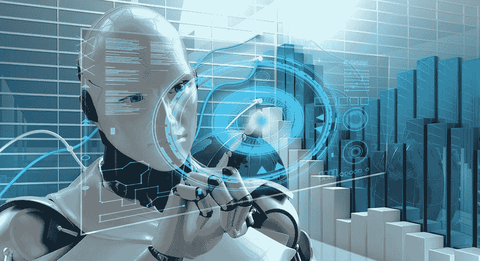
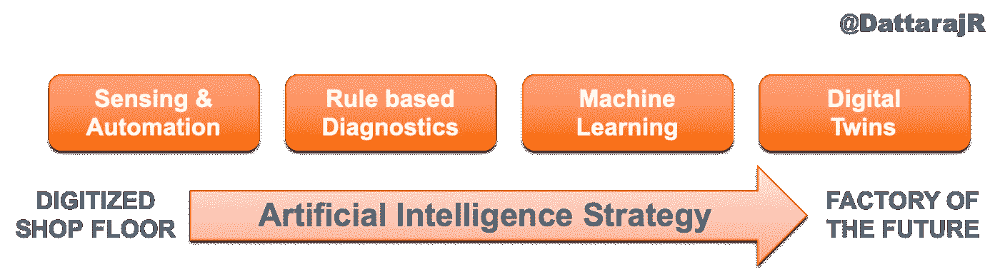
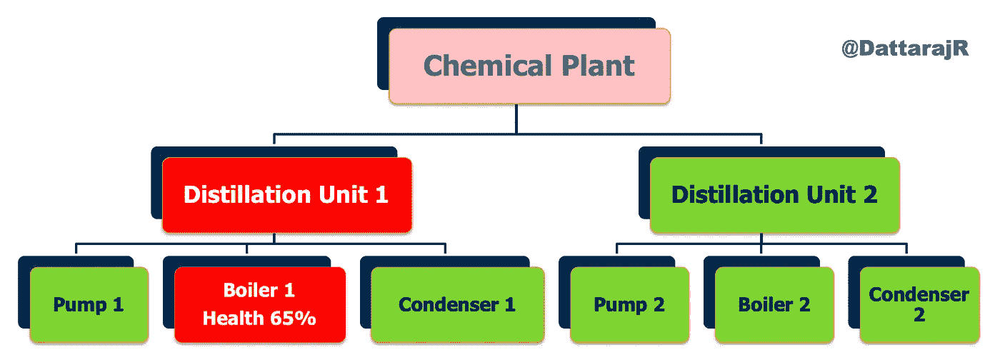

# 人工智能在印度制造业环境中的作用

> 原文：<https://medium.datadriveninvestor.com/role-of-artificial-intelligence-in-the-indian-manufacturing-environment-ed786dc58168?source=collection_archive---------4----------------------->

Image source: [maxpixel.net](https://www.maxpixel.net/Artificial-Intelligence-Technology-Futuristic-3262753)

*这个故事出现在《机械师》杂志 2019 年 5 月刊上。*

制造领域的人工智能(AI)相当于 10-15 年前的数字化。很少有人积极地用它做任何事情，很少有人把它放在演示幻灯片上，大多数人想用它，但不知道从哪里开始。这不仅是印度的故事，也是全球的故事。随着制造公司开始看到数字化的价值，人工智能带来了成倍增加这一价值的前景。根据 ***NITI Aayog*** 起草的国家人工智能战略，制造业有望成为基于人工智能的解决方案的最大受益者之一，从而实现 ***“未来的工厂*** ”。

 [## 值得购买的 4 大人工智能股票及其原因——数据驱动型投资者

### 人工智能(AI)在 2019 年继续进入大众意识。通过应用程序…

www.datadriveninvestor.com](https://www.datadriveninvestor.com/2019/03/06/top-4-artificial-intelligence-stocks-to-buy-and-why/) 

在我看来，数字化只是通过自动化获得基本投资回报的第一步。人工智能是工厂的真正价值所在，这些工厂有潜力彻底改变他们从库存管理、运营、维护、质量和物流的端到端流程。在美国和中国，由于他们积极的人工智能战略，包括制造业在内的许多行业已经开始看到生产力和效率的巨大提升。简而言之，没有人工智能，你的数字化之旅是不完整的，现在是起草你的人工智能战略的最佳时机。

我们大多数人都听说过关于人工智能和一些很酷的应用的故事，但很难将其应用到我们的领域。近年来，人工智能应用一直在增加，宣传它的新闻故事也在增加。从语音助手到自动驾驶汽车，再到自动照片标记，再到面部识别解锁手机，人工智能似乎成了头条新闻。也有一些关于人工智能的不可思议结果的新闻——比如写诗或画画的人工智能——事实上在佳士得以 42 万美元的价格拍卖。也有一些对人工智能的负面报道，担心失业，以及像人工智能将接管世界并伤害人类这样的故事。我相信这让每个人都非常好奇 AI 能做什么，不能做什么。让我们试着梳理一下事实，谈谈 AI 在专门针对印度的制造业中的作用。

AI 基本上是一种让计算机像人类一样思考和推理的技术。人工智能有几个子领域，如机器人技术、计算机视觉、自然语言处理、基于知识的工程——但最终目标是让计算机用数据思考。这是人工智能的关键区别——我们不会明确告诉计算机做什么——它会使用从“经验”中学到的东西来自行决定。由于数字化浪潮，我们的工厂正在收集大量的数据——各种不同的数据，如传感器读数、文本输入、摄像机的视频输入、声学和红外等高级传感器。我们收集千兆字节和兆兆字节的数据，这些数据通常原封不动地保存在我们的数据库或数据湖中。许多组织不知道如何处理所有这些数据，以及如何将这些数据转化为可操作的见解。他们知道这些数据很有价值，但没有工具从中提取有用的见解——这正是人工智能试图为你解决的问题。下图显示了一个可靠的人工智能策略如何帮助你从数字化走向未来工厂。核心数字化和基于规则的分析将让您从车间获得更好的洞察力。然而，使用机器学习和数字双胞胎，你将能够从数据中提取这些见解，并对你的工厂有所预见。这种远见将帮助您更好地计划操作和维护，并提高工厂资产的整体效率。让我们看看怎么做。

Figure 1: From Digitization to Artificial Intelligence

大多数人认为人工智能是商店地板上的一排排工业机器人。机器人无疑是人工智能的一个主要类别，这里正在进行大量的工作。工业机器人可以自动完成需要高精度的耗时任务。此外，某些对人类不安全的操作应该转移到机器人身上。根据国际机器人联合会(IFR)的数据，印度的机器人数量稳步增长，其中汽车行业贡献了超过 50%的数量。然而，与中国和日本等亚洲国家相比，印度工厂中的相对机器人数量相当低——每 10，000 名员工中有 3 个机器人，而中国为 68 个。(来源:[https://IFR . org/IFR-press-releases/news/robot-density-rises-globally](https://ifr.org/ifr-press-releases/news/robot-density-rises-globally))。

人工智能远远超越了机器人技术。人工智能可以在几个领域极大地帮助制造业。人工智能的优势在于一套丰富的专门算法，可以发现数据中的独特模式，即使使用最好的图表工具，人类也很难看到这些模式。在这一领域已经显示出巨大好处的关键人工智能技术之一被称为机器学习(ML)。ML 可以查看大量数据，并提取可操作的见解。数据可以是传感器读数(时间序列)、文本条目、音频样本、图像或视频流的形式，ML 可用于从中提取有价值的知识。

使用 ML 工厂经理可以使用 ***需求预测*** 根据预期订单有效地计划生产。像神经网络和模糊逻辑这样的技术对操作历史、使用模式和天气数据等几个数据源进行工作，以预测需求，甚至允许假设情景来评估多个选项。同样，ML 可以帮助拥有 ***库存管理*** 的工厂计划他们的供应和交付周期。许多全球 ***物流*** 公司正在积极使用人工智能进行路线规划以及一些有趣的实验，如基于无人机的供应交付。ML 可以帮助工厂从常规和预防性维护转向可靠的 ***预测性维护*** 策略。使用来自关键设备的传感器数据，可以预测资产健康状况和剩余使用寿命。我们可以使用这些信息来计划我们的预定维护周期，以便我们可以最大限度地利用这些资产。AI 可以给工厂车间很大帮助的另一个领域是 ***目测*** 。随着工业摄像机变得越来越便宜，我们可以使用这些实时视频来检测工厂中的火灾等事件。我们可以使用相机和人工智能算法来检查零件并提高质量。此外，使用特殊类型的传感器，如声学和振动探头，我们可以监控设备的振动。我们可以使用人工智能算法在设备实际发生故障之前识别故障特征，让我们有足够的时间进行检查和修复。

在机器学习之后，你的人工智能策略的下一个成熟级别是为工厂资产委托 ***数字双胞胎*** 。数字双胞胎是特定于单个资产的数据驱动模型，它不断从新数据中学习并自我更新。他们可以提供您资产的最新状态。如下图 2 所示，基于 twin 的数字化工厂层级可以帮助工厂经理快速识别和解决问题。在这里，健康是一个双指标，由人工智能根据新的传感器数据不断计算。我们还可以向这对双胞胎提出具体问题，通过并行运行许多假设情景并选择最佳情景来帮助我们更好地规划运营。

Figure 2: A simplistic view of how a Digital Twin hierarchy helps plan maintenance

许多人欣赏人工智能的价值，但不知道如何开始人工智能之旅。我的建议是从小处着手，定义一个有限的概念验证，并取得重大成果。理想情况下，这应该在您已经拥有重要历史数据的领域，并让数据科学团队(内部或外部)开始对此进行分析。关键是要清楚地定义人工智能解决方案的预期结果或目标，并有一些真实的数据来验证这一点。希望像视觉检测这样的快速解决方案能帮助你理解和推动工厂车间的人工智能策略。