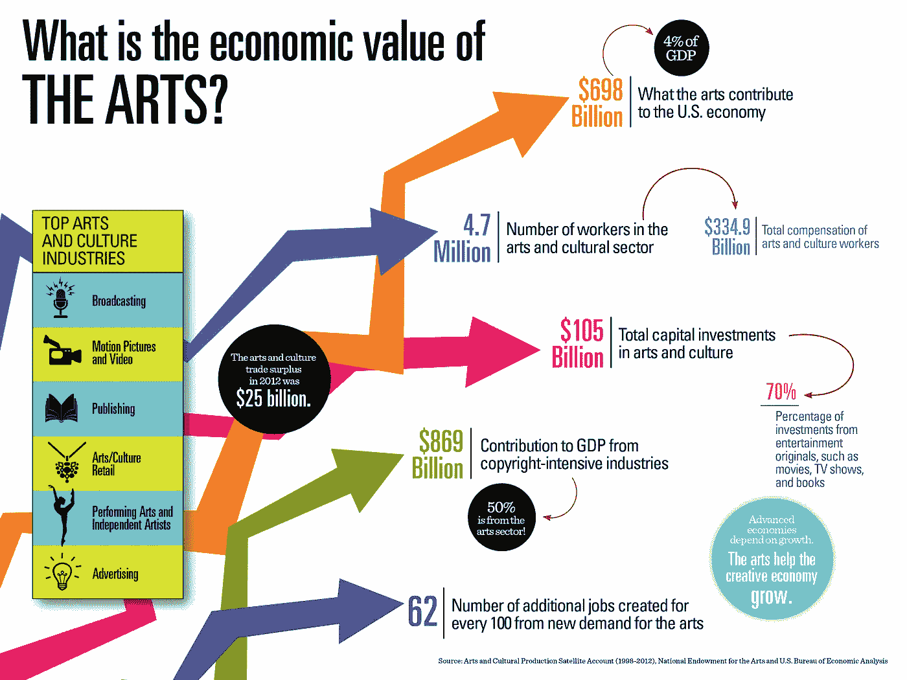
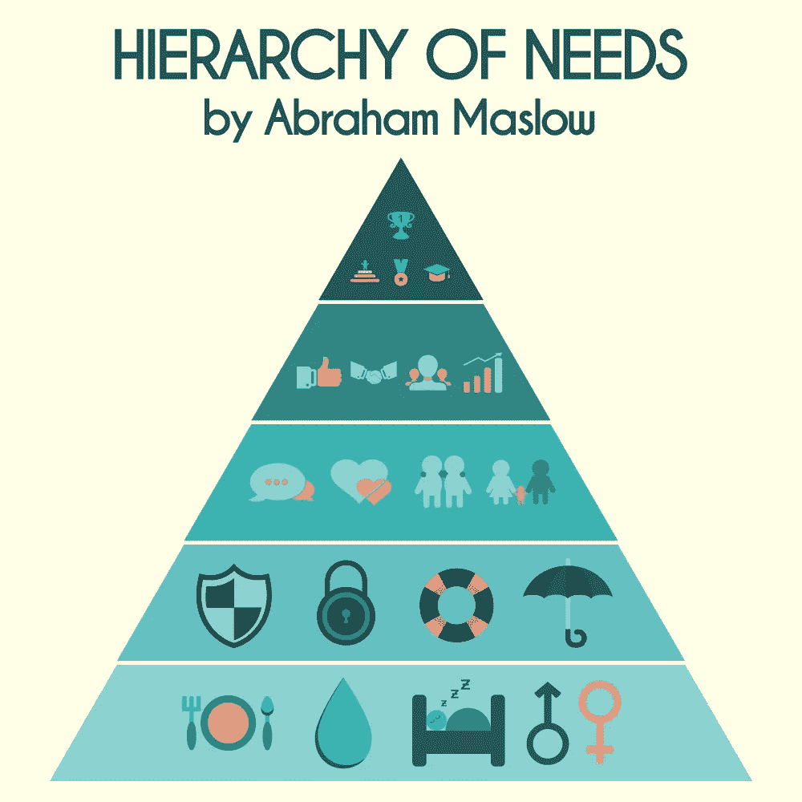
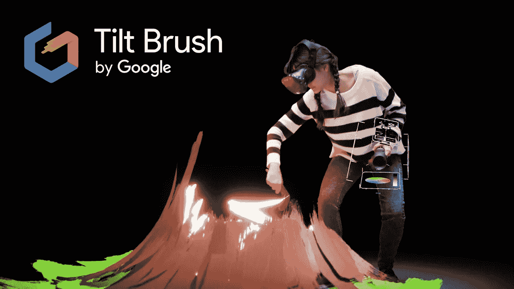
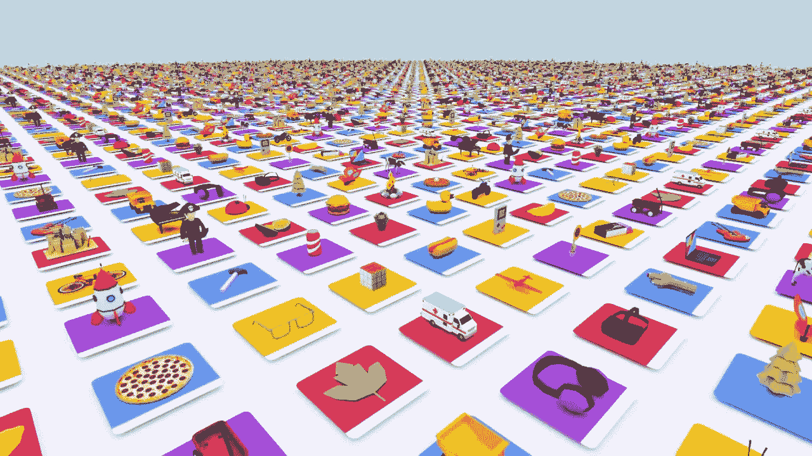
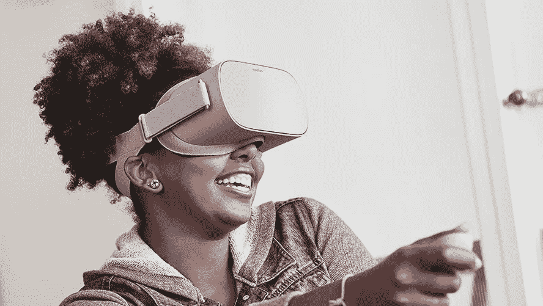

# 沉浸式技术在创意经济中的作用

> 原文：<https://medium.datadriveninvestor.com/role-of-immersive-technologies-in-creative-economy-801a2055f17e?source=collection_archive---------14----------------------->

虚拟和增强现实技术为我们提供了一种在创作和消费时以身临其境的方式表达自我的媒介。

From 2015 article : [https://www.mpaa.org/press/nea/](https://www.mpaa.org/press/nea/)

创造力一直被认为是休闲的工作，是马斯洛金字塔顶端的东西。最近，它发现它是一种在增加收入或降低业务成本的过程中产生真正影响的手段。这里我指的是创造性的作品，而不是方式。

Creativity as a means/need of earning

> 然而，创作的方式很大程度上受到创作过程的影响，无论是绘画、雕刻、建筑还是 UI

由于需要工具和资源来为这种媒体创造体验，3d 内容创作的垂直领域正在获得动力。随着这些工具通过手机和廉价的虚拟现实硬件变得无处不在，定制内容将不再是

## 讲故事的新媒介

[https://www.youtube.com/watch?v=3lsertOFTlw](https://www.youtube.com/watch?v=3lsertOFTlw)

虚拟和增强现实允许观众成为可以对用户动作做出反应的创造性内容的一部分。观众不再是总是处于内容接收端的观众。这给了创作者一种独特的能力，使内容引人入胜，在不同的层面上也是如此。—建立预期，邀请，然后与之互动。

## 降低创作者的准入门槛

Tilt brush by Google

像 HTC Vive 和 Oculus Rift 这样的虚拟现实硬件与像 [Tiltbrush](https://www.tiltbrush.com/) 、谷歌 Blocks、 [GravitySketch](https://www.gravitysketch.com/) 这样的软件相结合，让 3d 艺术家甚至是那些媒体新手能够创作出引人入胜的作品。虽然 Tilt Brush 专注于艺术家 GravitySketch 提供工业内容创作的工具和流程。就像 PhotoShop 和 Sketch 一样。一个是为了释放创造力，另一个是为了创造一个实用的作品。与产出和收入相比，开始使用这些技术的成本非常低。

## 分配路线

Poly by Google

除非创作者有合适的平台来接触他们的观众，否则他们的作品不会被注意到。在线 3d 内容托管网站，如[谷歌聚](http://poly.google.com)、 [SketchFab](http://www.sketchfab.com) 、 [P3D](http://p3d.in) 。这些就像是 3d 模型和体验的 YouTube。它们提供了嵌入网站、移动应用程序的灵活性，还可以通过简单的添加代码来体验 VR 耳机或 AR 应用程序。

## 新的体验模式

我们一直在通过手机、电视和电脑屏幕消费照片和视频。沉浸式技术为我们提供了一种完全融入我们周围内容的方式。它可能就在我们面前，我们绕着它走，或者它就像另一个空间一样围绕着我们。虚拟现实耳机屏蔽了现实世界，并以互动的方式向我们展示了创作，随着我们的理解和深入，它揭示了它的不同层次。观看者不再是一个旁观者，而是一个参与揭示创造的人。

## 移情社会

当前服务和消费创造性作品的方法非常平凡。创作者需要吸引他们的观众，需要建立一种语言来理解他们的作品。沉浸式技术将使社会对创造性工作更感同身受，让他们互动地了解它，并引导他们更好地感知。

> 这些观点是个人的，我仍处于学习阶段，试图抓住这个惊人的媒介的表面。