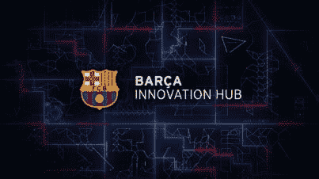
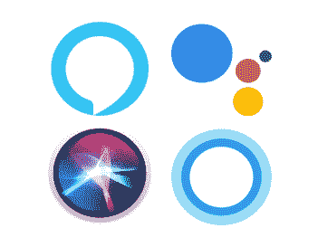
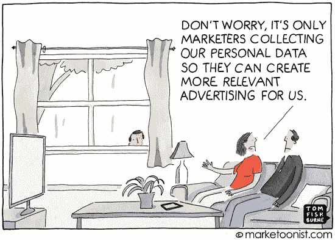
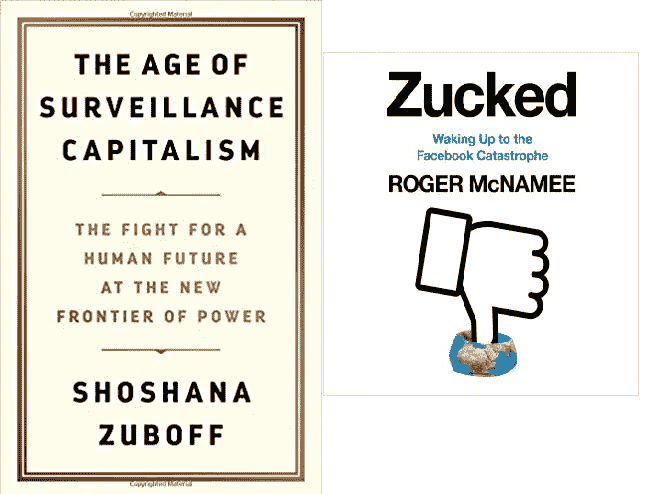

# 罗纳尔多和哈利波特对抗人工智能机器人还是数据经纪人会让他们成为一个？

> 原文：<https://medium.datadriveninvestor.com/ronaldo-and-harry-potterversus-ai-robots-or-will-data-brokers-make-them-one-26e215f396a4?source=collection_archive---------6----------------------->

可以肯定地说，一百年后，机器人在足球场上的表现也不会超过未来的罗纳尔多。即使未来的机器人中集成了所有超级先进的人工智能也不行。但这是否意味着人工智能不能帮助下一代足球运动员进一步提高他们的天赋和完美？巴塞罗那足球俱乐部的“创新中心”非常重视人工智能。*“体育未来的伟大运动实验室”*，他们在自己的网站上给自己打上了品牌。

这里的顶级运动员比其他任何地方都多——有 2500 人，来自不同的顶级运动领域，年龄在 8 到 30 岁之间。可能世界上没有其他地方能产生和分析更多关于优秀运动员的数据。从运动成绩积分到每个运动者的个性化食量。从行动或受伤后的恢复时间跨度到睡眠习惯。腿筋受伤是一个值得一提的特例。许多足球运动员都会遇到这种情况。这会让他们在令人沮丧的长时间内远离球场。在顶级运动的世界之外，在我们普通人的平凡世界里，腿筋受伤从来没有被仔细研究过。它们根本不是什么大事:我们可以带着这样的伤去办公室工作。然而对于足球运动员来说，这是一个严重的缺点。大概没有一个地方比巴塞罗那创新中心对腿筋有更深入的研究和了解。他们有最终的研究目标群体，产生比其他地方更多的相关数据点。没有什么地方比̶更渴望迅速康复，因此̶获得知识的欲望更强烈。

> *“可能世界上没有其他地方能产生和分析更多关于优秀运动员的数据。”*

当然，这不仅仅是关于中枢的腿筋数据。所有顶级运动员的数据点都被挖掘和彻底分析，以揭示其隐藏的意义。人工智能的算法在这方面发挥了主导作用，并将继续发挥主导作用。它们对于分析是不可或缺的。当然，数据生成和分析一直是顶级运动研究的一部分。自 1990 年以来，传球、射门、进球和铲球的数量被系统地收集和分析。随后是关于场地定位和其他团队动态的数据。在本世纪，GPRS 监控和无人机的使用使得这种数据生成更加广泛和细致——人工智能分析更加复杂。在新世纪，更多的身体-物理信息也被添加到数据的海洋中:速度、加速度、碰撞力、心跳和恢复模式。无论是在运动场上还是在训练课上。随着[物联网](https://www.datadriveninvestor.com/glossary/internet-of-things/)的兴起，结合更复杂的传感器可穿戴设备，对所有相关数据的监控将继续增加。人工智能将成为分析模式的中心。

> 但在将一名有前途的运动员转移到新俱乐部时，这些数据也可以增加统计谈判的力量。

它将伴随着围绕新交易的摩擦。足球运动员必须允许巴塞罗那足球俱乐部创新中心的数据分析师记录他们吃的一切吗？来评估他们的最佳食物摄入量？他们会愿意在自己的卧室里穿着传感器编织的睡衣来监控自己的心率和睡眠模式吗？当然，这一切都是为了进一步优化运动性能。或者，对于那些裸睡的人来说:植入人体芯片会是一种选择吗？或者甚至还有义务？当然，这侵犯了隐私。但在将一名有前途的运动员转移到新俱乐部时，这些数据也可以增加统计谈判的力量。他或她的身体可持续性比率将会更加精确。在这里，我们遇到了，不是第一次，人工智能作为赋权(更好的性能)和人工智能作为令人毛骨悚然的入侵者进入我们生活的脆弱平衡。

从顶级运动员开始的东西，将渗透到其他每个人，循环利用以适应大众的生活。当人工智能算法越来越多地包围我们的生活时，我们都将遇到与 BCN 运动员现在面临的同样的摩擦平衡:更好的表现和服务，与对我们生活隐私的更深入侵。

随着人工智能(通过 GPRS 无人驾驶飞机)栖息在运动场之上……随着人工智能栖息在每次训练中，以及每个顶级运动员的食物摄入量、睡眠模式和心跳中，很明显，巴塞罗那足球俱乐部不仅在体育业务中，而且在数据业务中。是的，运动员们将继续在冠军赛场上大出风头，用他们的行动、收入和转会价格让我们吃惊。但是在它的下面， ***他们所有的数据，经过人工智能的优化分析，也会被出售*** 。首先面向全球其他体育俱乐部，然后面向希望使用巴塞罗那创新中心超级智能性能监控方法的运动员个人。性能增强产品的生产商也会渴望与该中心合作。如果一家公司能推销一种“经过巴塞罗那俱乐部检验”的产品，它将立即变得更可信、更有吸引力，也更昂贵。巴塞罗那创新中心将收取版税。“如果产品是在睡眠或营养领域，精英运动员和普通人有类似的需求，收入可能会很大。”与此同时，作为一个“无用”的副业，巴塞罗那创新中心也将成为肌腱损伤的最终知识和咨询中心。腿筋将永远是一个副业，但这个例子让你知道当一个了不起的足球俱乐部进入数据经纪人行业时，利润丰厚的扩展能力。

巴塞罗那足球俱乐部将继续作为一个优秀的体育中心。同时，它可能演变成一个同样令人印象深刻的数据经纪人:收集数据，分析数据，出售和出租数据，并围绕数据建立咨询服务。许多运动员会变得更好。许多正常的地球人将有机会以更定制的方式变得更健康。数据经纪增强了。一个专注于足球的精英组织成为大众的玩家。

# **严肃的数据经纪人**

谷歌曾经主要致力于页面搜索。它做了出色的工作，让我们能够在互联网上导航，探索数量激增的网站。谷歌的目标是为我们打开世界上所有的知识。

作为回报，我们感激地开始喜欢这个品牌。但可爱的谷歌有一个不利之处:在所有这些免费搜索的背后，该公司缺乏一个丰富的商业模式。谷歌本可以让我们为每次搜索付费，但这违背了谷歌向所有人开放世界知识的理想主义雄心。因此，谷歌成为了一家寻找商业计划的公司。他们在跟踪我们时发现的。与其他公司不同，谷歌知道我们的意图，因为我们在每次搜索任务中都会输入我们的意图。通过这种方式，我们为谷歌提供了有关我们意图和利益的高级情报，该公司将这些情报出售给所有想出售给我们的公司。谷歌成为有史以来最大、最赚钱的营销传播机构:谷歌的 AdWords。想要购买锤子的用户首先在谷歌上搜索，会得到一组结果，以及销售锤子的供应商的三个 AdWords 广告。搜索需要几毫秒。用户买一个锤子，广告商卖一个，谷歌从广告中获得报酬。每个人都得偿所愿。(引自“[祖克，醒来发现脸书大灾难](https://www.amazon.com/gp/product/0525561358/ref=as_li_tl?ie=UTF8&camp=1789&creative=9325&creativeASIN=0525561358&linkCode=as2&tag=mediumbooksam-20&linkId=78d34964205e2d982f17a0a6eb4caa18)”。作者:罗杰·麦克纳米，出版商:哈珀柯林斯出版社。Pg。67).谷歌仍然是一个搜索机器，但它已经成为一个数据经纪人，跟踪我们的搜索行为，并向广告商出售衍生的情报。

> 就像谷歌一样，几年后，脸书开始追逐真正的大钱，并把自己变成了一台数据跟踪机器

谷歌可能知道并理解我们的意图。但是脸书对我们的社会关系有更深刻的理解，我们喜欢什么，我们的朋友如何欣赏我们喜欢的东西，以及我们如何欣赏朋友喜欢的东西。就像谷歌一样，脸书是一家有着崇高理想的公司:将你与你的朋友和世界联系起来，为更多的人类共享做出贡献。就像谷歌一样，几年后，脸书开始赚大钱，并把自己变成了一台数据跟踪机器，向他们的广告客户出售我们知道谁和我们喜欢什么的衍生知识——我们如此慷慨地向他们透露这些知识——完全精炼。**“脸书(……)收集的元数据使他们能够发现意想不到的模式，例如‘四个收集棒球卡的男人，喜欢查尔斯·狄更斯的小说，午夜后检查脸书，并购买了丰田的某个型号’，创造了一个机会来包装收集棒球卡并喜欢狄更斯的汽车广告的男性夜猫子**”(引自“[扎克，醒来发现脸书大灾难](https://www.amazon.com/Zucked-Waking-Up-Facebook-Catastrophe/dp/0525561358))。作者罗杰·麦克纳米。出版商:HarperCollinsPublishers。第 69 页)。

正如谷歌和脸书通过转型成为严肃的数据经纪人而变得难以想象的富有和强大一样，亚马逊也是如此。谷歌可能最了解我们的意图。脸书关于谁是我们的朋友，我们喜欢什么。但亚马逊可以声称最了解我们实际购买和几乎购买的东西，以及我们犹豫了多久才点击了哪些按钮，以及哪些人喜欢我们购买的东西——(所以亚马逊也可以向他们提供这些信息。)

# **超级数据经纪人的新进展**

今天，谷歌、脸书和亚马逊主要从事跟踪我们的业务，分析我们在“他们的”互联网上留下的丰富的虚拟面包屑。

(也许我们不应该谈论面包屑。小金块是更好的表达方式:它们值很多钱。)通过了解我们的意图、我们的欣赏或我们的销售，这三者都有自己的竞争优势。然而，这些牌并没有永远洗牌。跟踪我们得到越来越多的维度。有了安卓手机，谷歌现在知道你在哪里走动。谷歌地图随时在完善这些知识。谷歌现在可以帮助其广告客户在旅途中以激光般的效率接近你:正确的时间，正确的地点，正确的愿望和意图。还记得口袋妖怪 GO(或者 Ingress/哈利波特:巫师单元)吗？游戏脱胎于谷歌地图。从表面上看,《口袋妖怪 GO》似乎是一款吸引全球年轻人的有趣游戏。从数据经纪人的角度来看,《口袋妖怪 GO》通过出售《口袋妖怪 GO》玩家必须去的地方，如附近的麦当劳等，赚取了巨额利润。

超级经纪人接触我们的另一个途径是移动支付。假设你用 Apple Pay 从花店买了一束花。Apple Pay 可以收集附近所有的鲜花销售数据，并分析在那个确切的时刻什么样的鲜花最受欢迎。然后，Apple Pay 可以将这些相关信息卖给附近出价最高的花店，使他能够提高目前最受欢迎的鲜花的价格。当你用 Apple Pay 支付时，该公司可以收集你的金融交易数据，重新打包，然后卖给出价最高的人。因此，苹果也在从一家手机公司转变为一家银行，但基本上是一家数据经纪商。

更多对我们生活的侵犯即将到来！就拿人脸识别来说。当我们观看 YouTube 电影或在线广告时，我们会经历一系列的情绪。有些情绪只花我们几分之一秒的时间——短得我们无法有意识地识别。网络摄像头可以记录这些微表情。例如，他们“能够捕捉到一个年轻女子在看电影的几帧时，她能想到说的只是‘我喜欢’时，脸上那瞬间的厌恶，然后是一连串快速的愤怒、理解，最后是喜悦。”(引自《[监视资本主义时代》](https://www.amazon.com/gp/product/1610395697/ref=as_li_tl?ie=UTF8&camp=1789&creative=9325&creativeASIN=1610395697&linkCode=as2&tag=mediumbooksam-20&linkId=01e0a4ca18654efd4cfc9d09a2d31ee3)。作者肖莎娜·祖博夫。出版商:简介书。Pg。283)您电脑上的网络摄像头对与远方朋友愉快地用 Skype 聊天非常有帮助，同时也是超级数据经纪人挖掘我们更多数据的强大工具，以便更详细、更确定地预测我们未来的(购买)行为。

除了人脸识别，我们也即将迎来一场语音识别革命。智能电视已经根深蒂固了，在你房间的私密空间里悄悄偷听你说的话。超级数据经纪人邀请我们欢迎进入我们生活的虚拟助手——亚马逊的 Alexa、苹果的 Siri、微软的 Cortona 这是西半球的三大领先公司——正在完善这一新领域，让超级经纪人更好地了解我们想要什么——并预测我们的行为。**“亚马逊的前瞻性专利已经包括开发一种集成在任何设备中的‘语音嗅探算法’，能够对产品和服务报价中的‘已购买’、‘不喜欢’或‘喜欢’等热词做出回应。”**(引自[监视资本主义的时代](https://www.amazon.com/gp/product/1610395697/ref=as_li_tl?ie=UTF8&camp=1789&creative=9325&creativeASIN=1610395697&linkCode=as2&tag=mediumbooksam-20&linkId=01e0a4ca18654efd4cfc9d09a2d31ee3))。作者肖莎娜·祖博夫。出版商:简介书。Pg。269)

## 还有专门的数据经纪人

除了超级数据代理之外，实际上经常与之结盟的是更专业的数据代理。他们收集我们的数据点没有超级公司广泛，但他们做得更深入。这里有三个不同的例子:

*   你知道方便的 Roomba 吸尘器可以为你做无聊的家务吗？他们最新的 iRobot 家庭版本不仅可以通过亚马逊的 Alexa 进行远程控制，还配备了额外的传感器，可以绘制每所房子的内部及其平方米布局。首席执行官科林·安格尔渴望与谷歌等合作伙伴达成数据销售协议。谷歌已经在测量我们房子外面的街道了。了解每栋房子的内部情况是一种知识，可以增加价值，也可以出售给宜家。当然，还有隐私问题。该公司很清楚这一点:你可以随时通过断开你的 iRobot Roomba 与 Wi-Fi 或蓝牙的连接来选择退出，不幸的是，随着升级也被切断，真空吸尘器的功能被大大禁用。如果你不退出呢？那么，分享它收集的信息是你的智能吸尘器的权利。根据 2017 年 7 月 25 日《今日美国》的 Josh Hafner 和 Edward C. Baig 所说:“你的 Roomba 已经为你的家绘制了地图。现在首席执行官正计划出售地图”。
*   不久前还是一名雄心勃勃的苏格兰橄榄球运动员的杰里米·詹斯(Jeremy Jauncey)发现自己真正的抱负是环游世界，同时成为一名成功的企业家。还是千禧一代的 Jauncey，不仅明白一张图片能说的话超过一千个字，还明白如何从中挣钱；实际上是成千上万的欧元。杰斯开创了社会第一的创意机构[Beautifuldestinations.com。【2014 年以来的增长:30.000%。BeautifulDestinations 完全理解 Instagram 的强大。尤其是当你用人工智能分析来丰富它的时候。哪些酒店和旅游目的地的图片最吸引眼球？有哪些图片有阻止力？为了回答这些问题，beautiful destinations(BD)的数据团队构建了自己的参与算法:收集社交媒体上的数千张图片，并分析它们与数百万个参数的相关性。现在你可以在 BD 网站上找到大量这些超级迷人的照片。BD 团队的软件通过预测参与度对图片进行排名。然后，它将这些排名展示给万豪酒店(Marriot hotels)和万事达卡(Mastercard)等客户，并向潜在客户发出诱人的“来参观这个地方”的邀请。美丽目的地现在拥有来自 180 个国家的 1350 多万 Instagram 粉丝，目前仍在申请中。网站上的许多照片在发布后 24 小时内就获得了超过 10 万个赞。BeautifulDestinations 仍然是一个旅游网站，但本质上已经变成了一个专业的数据经纪人。一个数据经纪人发现了自己的商业计划，在旅行中发现了它，同时像其他人一样拥抱社交媒体。(根据凯特·洛克伍德在 2011 年 4 月出版的《企业家》杂志上发表的一篇关于 T2 的文章改编。)](https://www.beautifuldestinations.com/)
*   亚历山德拉·范·豪特(Alexandra van Houtte)最初是一名时尚造型师，她从许多时装秀照片中搜罗，为她的客户——电影制作人、(时尚)广告商、名人——提供最具吸引力的外观。跟随 537 名设计师举办了四场时装秀，一年下来，总共有 35000 场时装秀。截屏、标记和组合所有这些外观非常耗时。因此，亚历山德拉建立了自己独特的数据库，收集了她从时装秀上收集的所有照片和造型。然后，她把所有东西都带到了她的在线平台[tag-walk.com](http://tag-walk.com/)。它已经成为时尚预测、研究和灵感的最复杂的工具。72%的用户是千禧一代。91%是 B2B。订阅平台的商业品牌会问这样的问题:“最常用的搜索词是什么？”、‘什么在上升，什么在下降？’我的品牌最受欢迎的产品是什么？、‘与普通消费者相比，记者在看什么？’Tag-walk.com 算法可以回答这些问题。Tagwalk 似乎是时尚行业的一部分，但更重要的是它是一个(时尚)数据经纪人。订阅该平台的企业可以期待收到上述热门问题的答案，因为 tag-walk 的算法为他们处理所有数据。普通游客可以免费进入站台。越多越好。毕竟，他们的点击和搜索是数字面包屑(或金块)，平台设法将其转化为真正的商业资金。因此，Tag-walk 首先是一个数据代理。

除了超级数据代理和专业数据代理，还有第三类数据代理。这些网站既不像超级网站那么大，也不像 Tag-walk、Beautiful Destinations 或 Roomba 这样的小众网站那么专业。这些数据经纪人不是“偶然”转变成数据经纪人的，而是从第一天开始就成为数据经纪人的。他们从各种不同的来源收集数据点，包括离线数据(因为超级数据经纪人通常专注于在线数据)，而他们的算法根据客户的需求处理所有数据。Amobee.com 的[是一个:“用更好的数据推动更好的结果。使用个人级别的身份框架识别消费者，并在所有屏幕上协调他们的品牌体验，以及明确的线上到线下活动测量。”Experian 是其中之一:“我们以别人无法做到的方式收集、分析和处理数据。”](https://www.amobee.com/) [Acxiom](https://www.acxiom.com/) 是其中之一:“我们多样化的产品组合让成千上万的品牌、平台和合作伙伴能够更好地了解和吸引世界各地的受众。”甲骨文和 Palantir 是其他大公司。

[Marketoonist](https://marketoonist.com/2014/05/personaldat.html)

数据经纪人为我们服务，方便我们的生活。但是他们也深入探究我们生活的隐私，直到他们真正监视我们的程度。我们常常不知道他们对我们生活的影响有多深多远。是的，他们都有自己的“隐私条款”或“使用条款”，但我们和他们都知道我们不会费心去阅读它们。这是合理的，因为光是细读它们就要花上好几天。我们中的许多人都乐于在得到个人服务和被密切监视之间进行权衡——尽管这种快乐也可能是由缺乏知识造成的。然而，集体不安正在逼近。也许在营销和营销传播方面不那么重要，但当数据经纪人也掌握了我们的政治理念和行动时就更重要了。许多民主国家的人认为这是危险的。作为第一家专注于政治领域的数据经纪人，剑桥分析公司成为了一个家喻户晓的名字。它给数据经纪行业带来了一个污点和坏名声。数据经纪行业有能力将我们的民主社会转变成一个彻底的资本主义监控国家吗？**这是我现在研究的课题。以及我即将发表的文章。**

## 最鼓舞人心的书籍:

[《监视资本主义时代》。作者肖莎娜·祖博夫。出版商:简介书。](https://www.amazon.com/gp/product/1610395697/ref=as_li_tl?ie=UTF8&camp=1789&creative=9325&creativeASIN=1610395697&linkCode=as2&tag=mediumbooksam-20&linkId=01e0a4ca18654efd4cfc9d09a2d31ee3)

[‘祖克，觉醒到脸书大灾难’](https://www.amazon.com/gp/product/0525561358/ref=as_li_tl?ie=UTF8&camp=1789&creative=9325&creativeASIN=0525561358&linkCode=as2&tag=mediumbooksam-20&linkId=78d34964205e2d982f17a0a6eb4caa18)。作者罗杰·麦克纳米。出版商:HarperCollinsPublishers。

**关于作者:**
*Carl Rohde 博士教授是一位关于“未来预测&创新”的国际主题演讲人——具有学术深度和实践现实性。在过去的十年中，他与 50 所大学和 10，000 多名学生合作。目标:让所有人都参与到更多的趋势和创新中。罗德在阿姆斯特丹、巴塞罗那和上海都有研究职位。卡尔·罗德还领导着 www.scienceofthetime.com，这是一个全球市场和趋势研究人员的虚拟网络。*

作为一个教育知识机构(大学、理工学院或其他),你有兴趣参与国际酷城搜索并想了解更多吗？[请点击这里](https://scienceofthetime.com/service-title-2/)。

在推特上关注[卡尔·罗德](https://twitter.com/CarlRohde)，在媒体上关注。

*原载于 2019 年 7 月 3 日*[*https://www.datadriveninvestor.com*](https://www.datadriveninvestor.com/2019/07/02/ronaldo-versus-ai-robots-or-will-data-brokers-make-them-one/)*。*