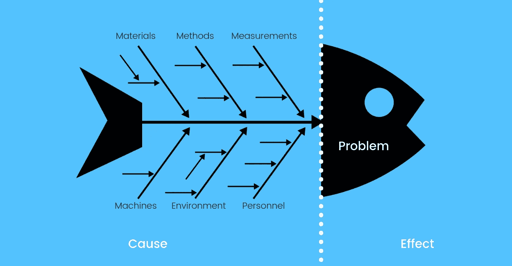
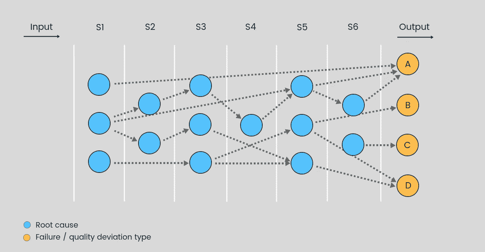

# 工业 4.0 时代的根本原因分析

> 原文：<https://medium.datadriveninvestor.com/root-cause-analysis-in-the-age-of-industry-4-0-9516af5fb1d0?source=collection_archive---------1----------------------->

 [## 制造业 4.0 洞察中的根本原因分析示例

### 在生产车间，根本原因分析(RCA)是识别导致缺陷或质量的因素的过程…

www.seebo.com](https://www.seebo.com/root-cause-analysis-examples-in-manufacturing/) 

# 制造业中的根本原因分析是什么？

在生产车间，根本原因分析(RCA)是识别导致制造产品缺陷或质量偏差的因素的过程。

术语“根本原因”是指生产线质量下降或资产整体设备效率(OEE)降低的最主要原因。

制造业中[根本原因分析的常见例子包括“鱼骨”图和“](https://www.seebo.com/root-cause-analysis-software/) [5 个为什么](https://www.isixsigma.com/tools-templates/cause-effect/determine-root-cause-5-whys/)”等方法。这些方法的简单性也是它们的优势，但是它们在处理当今制造过程的复杂性时有多有效呢？

鉴于工业 4.0 革命，根本原因分析正在经历新的诠释。随着[工业物联网和人工智能](https://www.seebo.com/industrial-ai/)的力量触手可及，制造商自然会发展到更先进的根本原因分析方法。

# 我们为什么要寻找根本原因？

虽然症状和直接原因可能很容易快速解决，但未能检测和处理根本原因很可能会导致问题重复出现。

RCA 面临的挑战是区分症状或中间原因，以及问题的真正根本原因。

# 传统根本原因分析的缺点

许多制造商在进行根本原因分析时，目前使用的一般方法是依靠现场专家知识。

> 经验的确很有价值，但有些生产线非常复杂，要同时了解每个组件和子流程是不可能的。

从 OT 和 IT 系统收集数据的制造商仍然需要能够理解这些数据，以便执行 RCA。这需要时间和各种专业人员来执行，在大多数情况下，需要流程、质量和维护工程师。

即使是专家也会偏向某些观点，这是很自然的。而且，即使粗略地确定了问题的根本原因，对问题的定义也可能不准确，从而很难提出智能和精益的解决方案。

手动根本原因分析的另一个缺点是:

目前，大多数 RCA 信息没有在制造工厂之间共享，使得同一公司的工厂/车间重复彼此的错误，导致本可以避免的计划外停机。

# 自动化根本原因分析的威力

机器学习是人工智能的一个子领域，专注于开发和研究从数据中学习的算法。算法以模型的形式存在，这些模型用历史数据进行训练，允许它们根据新数据进行预测和决策。

由于[机器学习和大数据分析](https://www.seebo.com/machine-learning-ai-manufacturing/)的重大进步，根本原因分析可以使用自动化方法进行。这些方法是公正的，完全基于生产车间的历史和实时数据。

# 异常检测

为了使用机器学习来执行 RCA，我们需要能够检测出某些异常情况，或者换句话说，异常情况的存在。

机器学习模型被训练成在常规“健康”操作条件下分析设备的数据输出。与正常行为相比，异常可以表现为信号的振幅、周期或同步相位的任何偏差模式。

该算法基于异常的当前行为模式形成预测。如果预测值超过在训练阶段确认的阈值，则发送警报。

使用自动化根本原因分析检测到的异常示例包括:

*   元件失效
*   异常过程输入参数(例如不合格的材料成分)
*   损坏的传感器值
*   控制逻辑的改变(例如通过 PLC)
*   环境条件的变化

那么，这是行业专业知识的终结吗？

> *自动化的根本原因分析减少了对专家知识的整体依赖，但并没有降低现场专家的价值，他们在 RCA 流程的监控、验证和管理中至关重要。*

此外，自动根本原因分析由机器学习和概率图形模型提供动力，这些模型需要被训练以便能够执行推断。这使得现场经验成为确保系统考虑所有相关参数的关键。

# 交互信息

另一个适合 RCA 的数学解决方案是被称为互信息的概率策略。在涉及大量数据和参数的制造环境中，这种方法可用于利用复杂的统计知识来搜索模式。

互信息是一种研究工具，旨在描述两个随机变量之间的相互依赖性。当旨在确定因果关系时，如在根本原因分析中，互信息有助于确定可以通过关于一个变量的数据了解关于另一个变量的哪些信息。

# 人工智能在根本原因分析中的作用

人工智能，特别是以机器学习的形式，将根本原因分析推入了资产管理的另一个领域。

关键在于时机:

人工智能制定与机器性能和健康相关的预测，而不是等待灾难降临的能力，带来了一系列影响底线的好处。

制造业自动化根本原因分析的一些直接优势包括:

*   安全问题的早期检测
*   由于对整个生产过程的精确监控，减少了排放
*   识别复杂的过程中断，例如反应器的低效率
*   通过异常检测提高电力消耗效率
*   预测质量偏差并调整流程以防止原材料浪费

如果非要总结机器学习在根本原因分析中的价值，那就是:

花在解决问题上的时间越少，花在解决和预防问题上的时间就越多。

# 制造业中自动化根本原因分析的示例

自动化根本原因分析的一个主要示例是查看如何利用机器学习来推断制造中资产故障和质量偏差的根本原因。

我们可以把制造过程看作由以下几部分组成:

*   投入阶段——在流程制造中，将原材料投入生产线；
*   流程——连续执行的一系列步骤；
*   最终的产品——成品。

对于这个基本示例，我们将通过使用贝叶斯网络来描述自动化根本原因分析系统的框架(参见图 1。)

示例流程由 6 个处理步骤(S1-S6)组成，每个步骤都有多个因果节点(蓝色圆圈)和 4 个故障或质量偏差类型，称为故障节点(橙色圆圈)。

失败是六个处理步骤之一的错误的结果，尽管一些失败可能是多个处理阶段的错误的结果。虚线箭头表示因果关系。

构建如图 1 所示的[贝叶斯网络](https://towardsdatascience.com/introduction-to-bayesian-networks-81031eeed94e)需要相关流程专家的参与，因为所有流程阶段和故障点都需要仔细定义。

包括基于经验的因果关系以及已知因果关系的历史数据的专家知识可以被添加到算法中，该算法可以考虑这种知识，而不受其影响。

一旦模型经过训练，就可以将新数据输入其中，以发现新故障事件的根本原因。只有关于故障节点的数据，机器学习算法可以推断哪些原因节点可能涉及故障。

算法输出的一个示例:

概率(因果节点)A = 0.01
概率(因果节点)B = 0.81
概率(因果节点)C = 0.03

您可能已经注意到，结果加起来不到 1(统计和概率计算的标准)。这是因为该算法考虑到了确切的根本原因可能不会被描述为已经定义的因果节点这一事实。

这种模型的另一个重要元素是所谓的测量节点。测量节点给出与因果节点相关的可观察信息的具体读数，例如在过程的特定步骤中进行的压力或振动测量。

这样，测量节点向模型添加了另一个数据层，允许模型尚未定义的关系影响结果。

# 结果是:

一个数据驱动的自动化 RCA 系统，准确且具有预测性，提供可操作的见解，可在合作设施之间共享。

可以检测到模式和异常，指出通常很难纯粹基于专业知识识别的根本原因。

计划外停机和[质量偏差的根本原因可以预测的事实](https://www.seebo.com/predictive-quality/)使得这些自动化根本原因分析方法非常适合工业 4.0 用例。

关于制造业自动化根本原因分析的深入示例，请务必查看我们的免费案例研究[这里](https://iot.seebo.com/hubfs/PDFs%202018/Root%20Cause%20Analysis%20(2).pdf)。