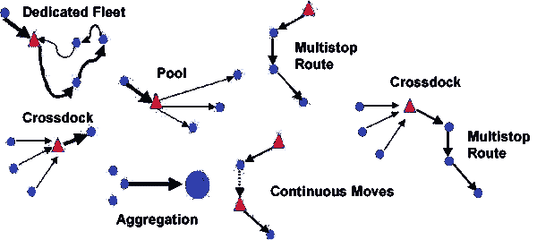

# 建设交通集群:端到端空间的各种入口

> 原文：<https://medium.datadriveninvestor.com/route-clusters-through-road-transportation-an-entrance-into-the-end-to-end-logistics-space-1ac9cd16cbdb?source=collection_archive---------20----------------------->

将进口运动与出口运动直接联系起来的梦想一直是许多人的梦想。航运公司、代运商、码头运营商等已经垂涎于具有这样一种可预测且高效的网络的可能性，在该网络中，进口集装箱可以直接到达最近的出口商所在地，而不必去空的货场，在那里大量的时间被浪费在寻找下一个行程上。

现在，随着能见度的提高和正式的数据收集终于在该部门发生，这个梦想越来越接近成为现实。集装箱从进口商的化学工厂到出口商的快速消费品工厂，同时由中转的集装箱检查员清关正在成为现实！

迈向这一未来的征程始于玩家试图征服某些他们拥有可见性和控制权的集群。因此，在这个早期采用阶段，各种利益相关者都在以不同的方式进入这个领域，争夺相同的结果:通过在一个单一的直接链中连接进口和出口，扩大他们可以直接迎合货主的空间。

在一个 85%以上的长途货运通过公路运输的国家，延伸物流部分的第一层自然延伸是公路物流。如今的道路物流正转向高效的道路优化，卡车可以得到优化，同时满足预测的时间表。

因此，各利益相关方希望在他们熟悉的路线上建立自己的车道群，在这些路线上，他们拥有强大的网络和运营控制。运营控制和物流网络是运营一个成功的端到端物流项目的关键，在该项目中，可以处理额外的货物而不会显著增加成本。

利益相关者将赢得这些航线群的支持，他们开始控制主要航线上来自海港/陆港的进出货物流。通过运营控制和车道群的可见性，提供商可以通过提高效率提供更高的利润，从而增加提供给客户的价值。在另一个参与者获得对路线的控制和可见性以提供更好的效率之前，其他人将无法以相同的价格参与，因此托运人与单一提供商合作的可能性将开始从纯价值角度而非关系角度增长。

该领域的不同利益相关者基于之前的核心运营优势，有自己进入该领域的方法。但是，他们都在寻找建立自己的公路运输集群:一些突出的前利基球员建立自己的网络的例子如下:

航运公司——航运公司正试图在他们有业务和舒适的某些航线上提供门到门服务。他们提议将一个箱子从迪拜运到印度西海岸的一家进口商那里，运输路线他们很熟悉。这种门到门服务是可以预测的。但是，他们不只是结束 E2E 过程，而是自己进行集装箱三角测量，以便集装箱立即被重新定位到最近的出口商/空园区位置。在某些西海岸航线上，航线以这样一种方式建立了它们的集群，即它们能够立即将集装箱直接从进口商的工厂重新定位到出口商的工厂(不需要去

从而节省了寻找另一个需要集装箱的顾客的大量时间和燃料。

试图将集装箱从进口商的工厂直接运送到出口商的工厂的生产线需要极大的可视性和对路线的控制，因此生产线只关注那些对进口和出口都有足够的需求可视性的路线。

运输代理——一些大型运输代理开始通过干租赁的方式进入印度运输市场，在那里他们不断寻找货物以确保有利可图的车辆利用率。除非有直接的批量承诺，否则租赁模式往往是风险最大的。因此，需要对某些集群上的货物流动有深入的了解。只有当运营商知道以下情况时，租赁模式才真正有效:

*   路线上地点的每月移动频率
*   装运量
*   平均周转时间
*   目的地

这种模式的好处是能够为利益相关者提供对运输商的强有力的控制，从而减少了卡车可用性的问题。如果希望在集群上快速扩张，这种模式可以成功，因为对卡车的控制允许利益相关者在卡车中重新定位到出口商。

实际上，这种模型可以允许对关键航线群进行完全的进出运动控制，甚至可以允许潜在的货物从其他港口分流，因为可以控制 100%利用率的航线。

码头运营商——码头运营商希望通过建立连接到单个航线集群的货运社区网络来扩大他们的业务范围。这些贸易社区网络与港口社区系统合作，在港口社区系统中，生态系统可以相互作用并共享信息。这一过程使得提交清单更加容易。这一集成系统还帮助位于主要路线的客户在单一窗口获得服务。

例如，本地治里集群就在钦奈港口信托公司附近。从门户网站，本地治里的客户可以接受报价，并可以在货运社区网络上申请清关。除了运输之外，本地终端运营商提供的这种额外服务减轻了本地客户的工作负担，并有助于在选择服务时增加选择，因为可以在与本地 PCS 连接的贸易网络上对运输商、CHA 和其他服务提供商进行交叉比较。

自 1947 年集装箱运输开始以来，供应商一直在谈论门到门服务，即托运人可以预订集装箱，由单一的利益相关者无缝安排和提供所有服务。服务提供商越来越接近这一未来，因为他们是物流链中的强大公司，拥有强大的全球影响力。

建设重要的运输集群是实现这一未来的开端。只是，现在随着交通可见性和机器学习可预测性的不断增长，这样的模型才成为可能。在核心路线上匹配进口和出口一直是关于在连接线对中有选择。

这些连接对的灵活选项至关重要，因为可预测的车辆周转时间对于减少不确定性和使该模型工作至关重要。通过连接对中的选项，可以将前往大型进口商所在地的行程连接到小型出口商 A、小型出口商 B 或小型出口商 c。历史数据的强大功能还可以根据之前的周转时间和卡车性能提供“最佳出口商/进口商选择”。这个最佳选择模型是成功的关键。

因此，就像优步或 airbnb 在他们的空间中有非常精确的算法一样，在其路线上具有最深可见性的物流公司将全部拥有并成为唯一的服务提供商，在那里他们直接连接进口货主和出口货主。