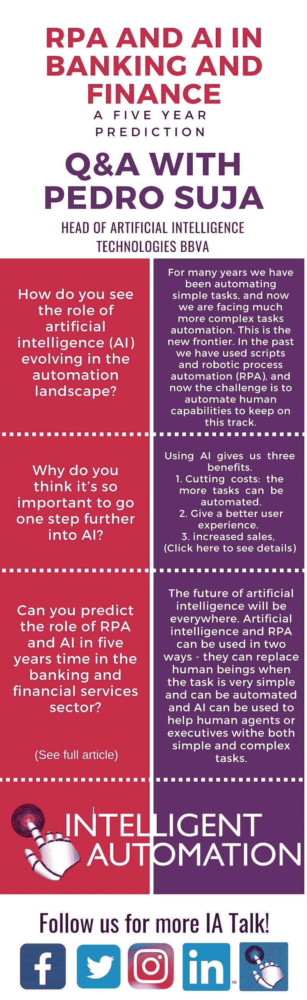

# 银行和金融中的 RPA 和 AI:五年预测

> 原文：<https://medium.datadriveninvestor.com/rpa-and-ai-in-banking-and-finance-a-five-year-prediction-7481aed21619?source=collection_archive---------44----------------------->

人工智能现在是银行、保险和金融机构的关键竞争优势。BBVA 人工智能技术负责人 Pedro Suja 分享了他对该公司智能自动化之旅的见解，并表达了它如何在他们的 it 基础设施中发挥关键作用。

## 查看完整的 [Q & A](https://intelligentautomationbfsi.iqpc.com/landing/rpa-and-artificial-intelligence-in-banking-and-finance-a-five-year-prediction?utm_source=5yearprediction&utm_medium=ad&utm_campaign=10000.002-external-ad&utm_term=5yearsprediction&utm_content=image&mac=medium_aguis&disc=medium_aguis) 和[报告！](https://intelligentautomationbfsi.iqpc.com/downloads/rpa-and-ai-in-banking-and-finance-a-five-year-prediction-1?-ty-m&utm_source=5yearprediction&utm_medium=ad&utm_campaign=10000.002-external-ad&utm_term=5yearsprediction&utm_content=image&mac=medium_aguis&disc=medium_aguis)

## [要了解更多信息，请查看 IA BFSI 的完整报告！](https://intelligentautomationbfsi.iqpc.com/landing/intelligent-automation-for-banking-financial-services-and-insurance-agenda?utm_source=5yearprediction&utm_medium=ad&utm_campaign=10000.002-external-ad&utm_term=5yearsprediction&utm_content=image&mac=medium_aguis&disc=medium_aguis)