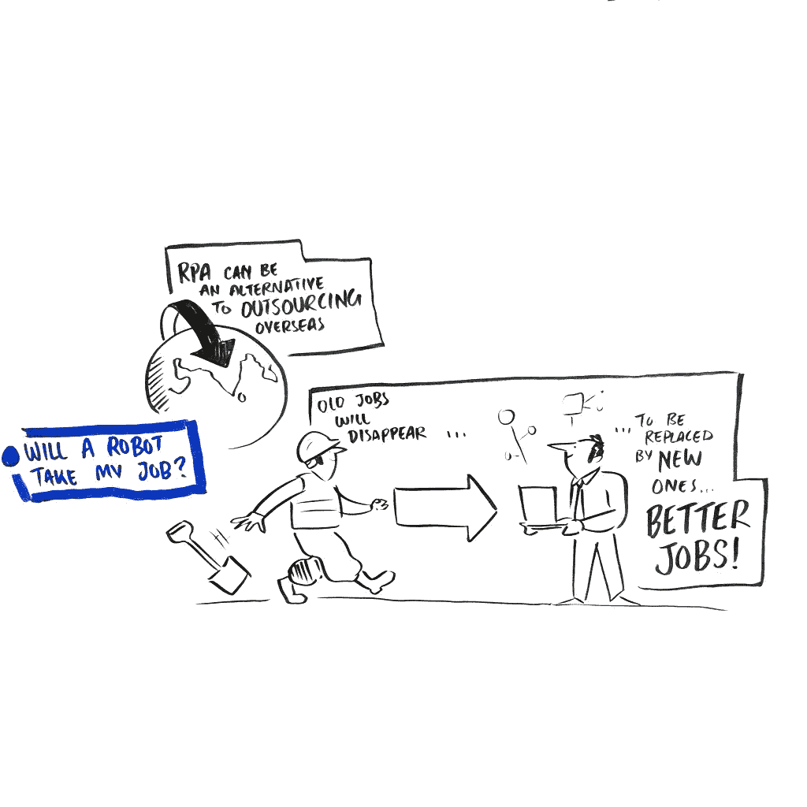

# RPA 和工作的未来

> 原文：<https://medium.datadriveninvestor.com/rpa-and-the-future-of-work-77ffb21df08f?source=collection_archive---------21----------------------->

围绕 RPA 对人和工作的影响，似乎存在矛盾。一方面，解决方案提供商声称工作岗位没有流失，而其他行业评论员则声称不流失工作岗位就无法获得收益。情况的真相是什么？他们可能都是正确的吗？

有没有可能两种情况实际上都是正确的，而且并不完全矛盾？

让我们从乐观的观点开始，自动化只是消除了平凡的任务，并为更具创造性、更复杂和更具挑战性的新机会提供了机会。这明确地描述了工作的性质将会改变。这不是什么新鲜事，以我的经验来看，在我的整个职业生涯中，技术的进步一直在改变我的工作。

此外，在美国和英国，目前的失业率是几十年来最低的。日本面临着更具挑战性的形势，人口正在下降，因此，随着工人退休，填补现有职位是一项不可能的任务。

在发展的早期阶段，证据表明 RPA 对失业没有显著影响。这并不是说在这个等式中没有赢家和输家，因为一些行业显然发现自己的生存取决于削减成本；员工和建筑是最大的两个节约机会。

让我们来看看悲观的观点，即数百万个工作岗位将因自动化而流失。这些预测通常用两个重要的警告来限定他们的陈述:第一个是它们是现有的工作；第二，这些预测的时间跨度很长。接受这两个警告，这些陈述——就任何对未来的预测而言——很可能也是正确的。

> 伦敦智库中心警告称，在未来 20 年内，伦敦近三分之一的工作很有可能被机器取代

中间几年发生的事情很有趣。由于大多数预测都是在 15 年的时间框架内进行的，让我们回顾一下自 2004 年以来工作发生了怎样的变化:

**脸书**刚刚向几个大学生推出。到 2017 年，它的收入已经达到 400 亿美元。更不用说社交媒体现在普遍拥有 30 亿活跃用户。

**iPod** 是拥有的小玩意。这是一种全新的音乐消费方式的开始，这种方式已经发展到了流媒体。音乐流媒体现在占音乐产业收入的 75%，价值近 40 亿美元。

**手机**创新是翻盖手机。iPhone 和 Android 以及智能手机革命还有几年的时间。今天，智能手机市场被认为价值 3550 亿美元！此外，谷歌和苹果应用商店的支出据信在 400 亿美元左右。

网飞的用户已经达到 100 万，但距离推出流媒体服务还有几年时间。如今，它拥有 1.37 亿用户，收入 110 亿美元。

这些例子的目的只是为了展示 15 年后会发生什么，虽然旧的工作肯定会减少，但新的工作会被创造出来。关于 RPA 影响的悲观和乐观的说法都是真的，中间我们只能猜测的新工作会出现。

我个人的观点是乐观的，自动化的净影响不会导致工作岗位的减少，但我们将看到工作岗位的广度会像我们在过去 15 年中经历的那样发生根本性的变化。

Rob King, Author of Digital Workforce, co-Founder of Wzard Innovation, VP Education at the RPA Academy.