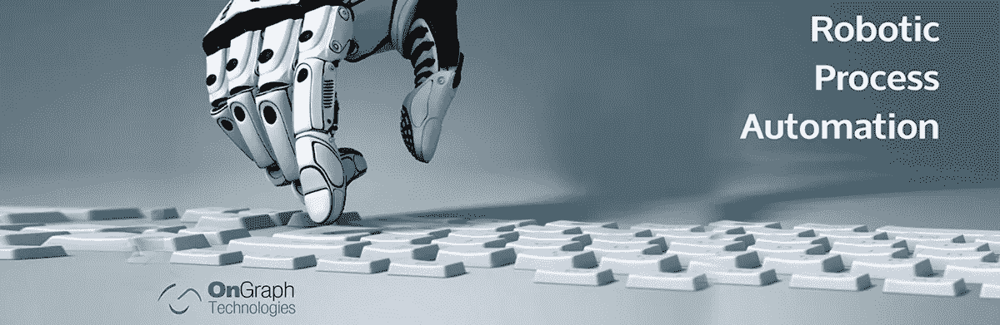
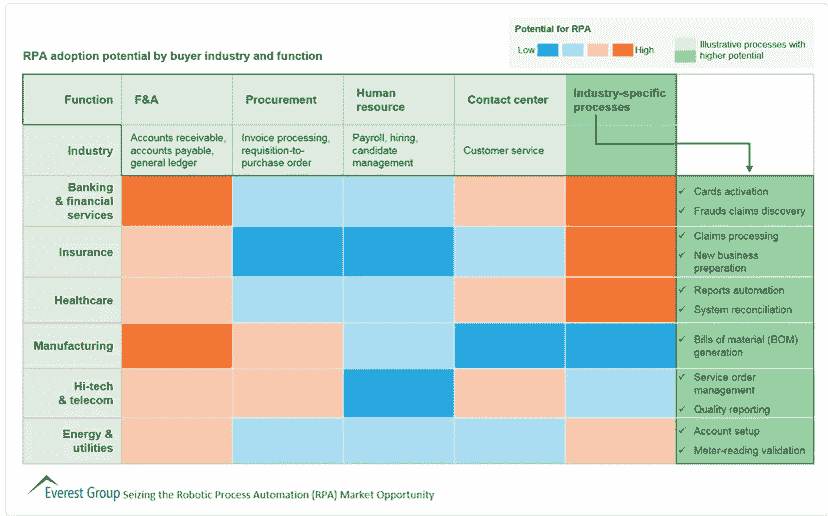

# RPA 技术-自动化之路

> 原文：<https://medium.datadriveninvestor.com/rpa-technology-and-the-road-to-automation-2d68360092?source=collection_archive---------3----------------------->

Source : Google

机器人流程自动化已经成为当今市场上领先的流程简化技术之一。RPA 专家声称预见 RPA 跨行业整合。

**为什么行业需要 RPA？**

工业需要一个系统来简化和加速管理过程。目前，几乎每个垂直业务都集成了 BPM(业务流程管理)和 ERP(企业资源规划)系统，以实现所需的核心系统和流程的精简。BPM 和 ERP 是最全面的解决方案，但也有缺陷。BPM 集成要求更换核心流程和系统，这导致了成本高昂的多层、高度破坏性的实施流程。不出所料，BPM 未能交付计划的 ROI。

随着 RPA 的稳步上升，BPM 不再是自动化可用的唯一解决方案。我们对数字数字和趋势的感知越多，我们就越认为 RPA 和它背后的人工智能是不同业务领域自动化的真正驱动力。

**为什么是 RPA？**

使用当前的企业软件，员工每天花费无数的时间在日常和令人疲惫的任务上，如客户订单处理、数据传输、呼叫中心操作、工资单处理等。RPA 作为一种软件工具，有可能使几乎每个行业和跨部门(从财务到人力资源到 IT 运营)的日常工作流程实现自动化。

**什么是 RPA？**

RPA 代表机器人流程自动化，用软件代替重复性工作。RPA 软件涵盖了具有人工智能(AI)和机器学习功能的软件的广泛使用，使其能够自动化其他软件，这些软件完全取代了许多企业中仍然由人类执行的手动、例行且往往容易出错的数字处理工作。

source

*带人工智能的 RPA 可确保认知或智能自动化。*

让我们看一下客户服务和支持服务台的一个使用案例。这个特殊的业务部门使用许多不同的系统和应用程序。此外，员工执行大量低复杂度的重复性任务。当用户呼叫服务中心时，服务代理必须同时导航不同的应用程序，调节它们在与客户的呼叫中的合作。

如果用户通过电子邮件或消息系统联系服务代理，服务代理需要从不同的应用程序中搜索不同的信息，并将其翻译成执行所需动作的信息。但是必须在系统和屏幕之间来回切换是不准确的，并且增加了服务时间。在实时通话中，呼叫者的注意力转移是常见的事情。

作为一个没有经历过被同一个呼叫中心多次询问相同身份验证问题的用户？除此之外，呼叫后跟进(如手动更新记录和录音)花费的时间几乎与呼叫本身一样多，这会对代理的工作效率产生负面影响。

这里的 RPA 可以自动执行客户服务或支持中心的多项手动任务，从计费查询、用户管理到更新记录，从而带来诸多好处。RPA 系统可确保任务在醒着和睡觉的时候都能完美、一致地运行，并自行处理和解决问题。

source

***这里 RPA 的作用*** *:在 RPA 系统中，当被请求时，文件进入服务器，机器人收集它，运行同样的小程序来识别它是有效还是无效，然后处理有效的。如果发现任何不完整的地方，机器人会自动访问后端系统，或者从外部寻找正确的数据，并在内部进行纠正。*

因此，客户服务和支持中心的 RPA 系统可以在一个控制台中关联不同的系统和应用程序。它将建立一个统一的知识库，实时提供相关数据，并自动设置和运行流程。它使服务代理从重复的手动任务中解脱出来，专注于发展他们以客户为中心的技能。

**寻找正确的 RPA 目标**

source

具有人工智能和机器学习功能的 RPA 可作为重要系统集成工作的替代品，有时也是权宜之计。正如 Gartner 的 Cathy Tornbohm 所说，考虑不同业务垂直领域和周围领域的机器人过程自动化技术的关键问题至关重要:

评估 RPA 的四个问题

1.  你的流程效率如何？
2.  你的过程有多有效？
3.  还有哪些通用技术或业务选项可用于处理此活动？

这些问题是采用 RPA 时必须考虑的。如图所示，企业 RPA 采用并不是大型组织的趋势，但在当今几乎所有领先企业中，行业特定流程的潜力更大。

**我们了解这股浪潮吗？**

如果我们相信[德勤全球 RPA 调查](https://www2.deloitte.com/bg/en/pages/technology/articles/deloitte-global-rpa-survey-2018.html#)，RPA 成为 AI 实施的关键方式之一。调查的其他主要结果包括:

1.  53%的受访者已经开始了他们的 RPA 之旅。在未来两年内，采用率可以提高到 72%。
2.  RPA 保持在多个方面达到并超过预期，同时促进提高合规性(92%)、提高质量/准确性(90%)、提高生产率(86%)、降低成本(59%)。
3.  已经转向 RPA 的人中，78%的人预计在未来三年内将在 RPA 上投入更多资金。

机器人过程自动化是自动化企业的未来，但在采用它之前，企业应该与潜在供应商讨论用例，以从这一突破性技术中获取价值。