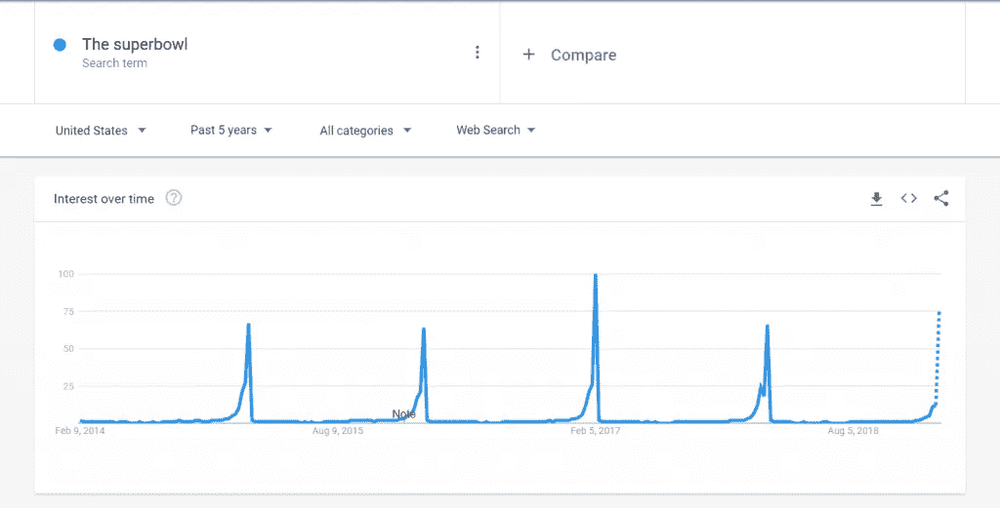
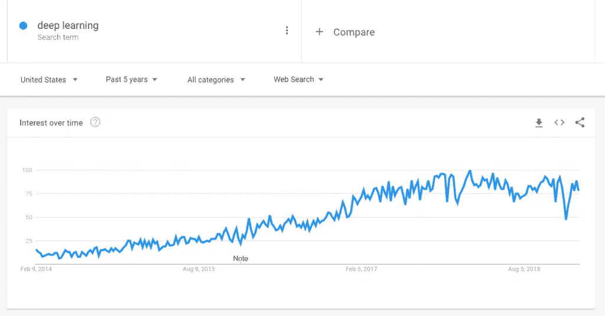

# 艾去世的传言被大大夸大了

> 原文：<https://medium.datadriveninvestor.com/rumors-of-ais-demise-are-greatly-exaggerated-d517d3c591bf?source=collection_archive---------20----------------------->

最近的一篇麻省理工科技评论文章暗示深度学习的时代即将结束。根据这篇文章:

> *我们对 25 年人工智能研究的研究表明，深度学习的时代可能会结束。*

是这样吗？我们说…呃。大概不会。

这篇评论提出了一些可靠的观点，但我们不能完全肯定我们会得出同样的结论。数字是数字，但正如深度学习、机器学习和人工智能经常出现的情况一样；数据本身不一定重要；它也不一定指导从中得出的结论。

那么，我们去哪里找？

# 什么是深度学习？

深度学习是一个宽泛的概念。像 AI、ML、DevOps 和许多其他技术术语一样，不一定有一个普遍认可的应用或定义。

就其本身而言，这使得定义深度学习是否“即将结束”变得困难。这到底是什么意思？我们会结束专注于学习数据表示而不是基于任务或特定任务的算法的机器学习算法吗？

不，可能不会。

# 那么结局是什么？

我们不认为深度学习是“终结”。我们认为我们正在改变感知和应用它的方式。我们的意思是。

# 这个概念是可靠的

深度学习作为一个概念(即与面向任务的模型相对的学习模型)不会有任何进展。这个概念是可靠的，我们已经基本上理解了运行这些程序的核心必要性。更重要的是，他们工作。

# 公众的兴趣可能正在减弱，但这是意料之中的

和任何“新”概念一样，它风靡一时。这不仅是普通大众的兴趣所在，也是那些利用“闪亮新物件”的专业技术人员的兴趣所在。

因此，兴趣激增是正常的。如果它在减弱，那也是正常的。兴趣可能是周期性的，但它的涨落往往是有原因的。例如，如果我们在过去五年后在 Google trends 上对“超级碗”进行简单搜索，我们会得到以下结果:

毫不奇怪。人们对超级碗的兴趣每年都会激增。同样，如果我们看看过去 5 年中“深度学习”的趋势，我们会发现:

我们认为没有人会认为对美式足球或超级碗的兴趣即将结束。更确切地说，兴趣遵循一种并非意想不到的模式，即当超级碗不播放时，人们对超级碗不感兴趣。

同样，上述深度学习的趋势也并不出人意料。在过去的五年里，它稳步上升；最大的峰值似乎出现在 2016 年至 2017 年之间。这一趋势似乎遵循一个上升和下降的模式，同时总体上经历了一个稳定的倾斜。过去一年左右似乎相对稳定。

这是否意味着深度学习即将结束(至少根据谷歌趋势是这样的？).我们假设一个不同的结论，那就是随着兴趣和采用的增长，稳步增长是正常的。随着事物回归到更为正常的分布状态，停滞甚至下降都是正常的。

# 语言可能在进化

如前所述，某些技术术语经历了多次应用和反复。亚马逊的“Alexa”真的是“人工智能”吗？我们会说不。然而，这个标签经常被贴上，我们几乎无法阻止它。

为此，深度学习或人工智能在多大程度上“接近尾声”，以及在多大程度上是一个标记 v.s .实际进展的问题？推动兴趣和采用率上升的概念仍然存在；它们只是被称为不同的东西。

# 正常的生长阶段

我们认为深度学习已经度过了它的第一个成长阶段。创新者和早期采用者已经完成了他们的工作，我们现在正在寻找更广泛的采用和实施。

为什么我们不应该看到这个呢？实验、实施和采用比以往任何时候都更容易，成本也更低。在它出去的路上？当然，在早期采用阶段。

公平地说，就所涉及的技术而言，深度学习可能不会比现在“更深入”。然而，它肯定会将一张更大的网撒向更多的行业和应用。几乎可以肯定，下一阶段更多的是新的采用和实施，而不是技术创新。

# 我们还不知道获胜者是谁

麻省理工学院的研究很好地展示了我们的现状。尽管我们从数据中得出不同的结论，但它很好地提醒了我们一些事情。

1.  科技发展很快。突飞猛进。
2.  与程序、方法和算法的数量相比，更多的是关于存在的类别的数量。
3.  我们还不知道“下一件大事”是什么。事实上，总会有下一件值得兴奋的大事。
4.  AI 领域很可能会有一个“赢家”，ML。从这一切中涌现出来的真正创新和新的“事物”(或几个事物)是什么？新的流程、应用程序或算法？我们正在推动哪些新功能？这对整个社会和社区意味着什么？

这些新兴功能的独特组合的构建模块已经到位，可以协同工作以推动成果。归根结底，这不正是我们都想从技术中得到的吗？推动现实世界的实施和创新？

协同是一个经常使用的时髦词，通常被定义为“整体的价值大于部分的总和。”无论人工智能或人工智能的下一次迭代是什么，都会推动市场并带来新的能力；围绕它的技术集群几乎肯定会创造出远大于其组成部分总和的东西。

*原载于 2019 年 2 月 11 日*[*【introspectdata.com】*](https://introspectdata.com/rumors-of-ais-demise-are-greatly-exaggerated/)*。*

# DDI 特色数据科学课程:

*   [**用于数据科学的 Python**](http://go.datadriveninvestor.com/intro-python/mb)
*   [**深度学习**](http://go.datadriveninvestor.com/deeplearningpython/mb)
*   [**数据可视化**](http://go.datadriveninvestor.com/datavisualization/mb)

**DDI 可能会从这些链接中收取会员佣金。我们感谢你一直以来的支持。*