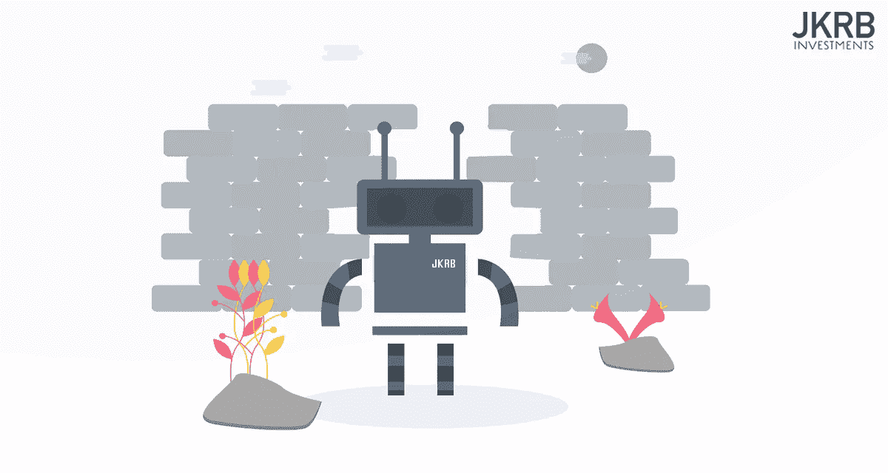

# Running from robots? The future of the workplace

> 原文：<https://medium.datadriveninvestor.com/running-from-robots-the-future-of-the-workplace-33837110dfcc?source=collection_archive---------6----------------------->

# Automation — one word that could reshape the workplace as we know it.

It is speculated that by 2033, up to 47% of current jobs could be eliminated from the US economy. Through robots, software or other forms of technology.

The impact will be felt in numerous sectors from telemarketing to sports refereeing to catering, the list goes on and on, with almost every sector experiencing change.

 [## Patterns and Robotics: A Complex Reality - Data Driven Investor

### Hayek's famous work 'The Theory of Complex Phenomena' (Hayek, 1964) delves into the topic of complexity and asserts…

www.datadriveninvestor.com](https://www.datadriveninvestor.com/2019/03/04/patterns-and-robotics-a-complex-reality/) 

In addition, just about every remaining job will be significantly altered by automation, but in turn, a whole range of new jobs will be created, with these new jobs come major economic and societal transformations.

The rise of industrial robots came into fruition in the 1960s, with the introduction of automated factory machines that were capable of manufacturing products without human assistance. Six decades on, the robots still haven’t taken over, and there are still many millions of people working in factories.

Whilst many of these factories are now located in Eastern countries like China, rather than Western countries like the United States. They are still existing, producing daily, through the efforts of humans. So it would be a fair assumption to think that maybe the fears about robots taking our jobs were overblown.

Well that would be an incorrect assumption, even in the East, the number of industrial robots is on the rise, and the number of factory jobs available is decreasing. In China alone, there were 189,000 industrial robots in 2014\. This amount is forecasted to be 726,000 by the end of 2019.

Whilst not quite the last bastion of manual factory work, China is now pioneering fully automated factories. In 2017 a mobile phone factory located in the industrial city of Dongguan replaced 590 of its 650 workers with robots. Alongside that reduction in human staff, the company also released a statement sharing its plans to reduce its staff count to just 20 before a final transition to 0 in the coming years.

In the Chinese press, the factory was hailed as a success story, highlighting the progress of the country’s ‘Made in China’ 2025 economic plan. One of the principal goals of the plan in the words of President Xi Jinping is to achieve a ‘robotic revolution’.

There are 4 factors that are helping fuel that revolution.

The first being, the cost of industrial robots is decreasing over time. Secondly, the cost of Chinese labor is increasing over time.

Thirdly, the productivity of the modern day industrial robot outshines humans, as the robots can work faster with great precision, 365 days a year, 24 hours per day.

最后一个因素考虑到了前 3 个因素，以及中国政府经常为西方企业制造产品的事实。鉴于工业机器人的成本较低，而自动化带来的巨大生产率好处使得中国劳动力成本较高，这些公司现在也想在西方国家建立自己的工厂。这样，他们就能够消除昂贵的国际运输成本。

这四个因素的结合意味着中国工厂有强烈的经济动机来尽可能多地实现运营自动化。这样他们就能降低价格，让客户满意。导致许多工厂在这个过程中失去工作。

世界银行估计，中国多达 77%的工作受到自动化的威胁，而这只是众所周知的自动化冰山一角！

让我们跳过几年，现在我们的企业拥有一支工业机器人大军，每天 24 小时生产产品，消除了生产过程中的大部分制造成本。你仍然面临着一个问题，你如何把这些产品送到你的客户手中？

再一次，机器人来救援了！自动驾驶汽车的引入将彻底改变交通行业。

据推测，到 2025 年，美国 1/3 的卡车将实现自动化。最初，它们将仅限于在高速公路上自动驾驶，但随着时间的推移，司机也不会被要求在更复杂的道路上行驶。目前，美国有 350 万卡车司机，因此许多人会发现自己在寻找新的工作。

传统出租车、优步和 Lyft 司机将加入优步 Eats & Deliveroo 员工的行列，他们发现自己没有工作。而亚马逊、联邦快递、UPS 和 DHL 正在开发包裹递送无人机。

自动化运输的未来正在快速到来，并受到技术快速进步的推动。自动驾驶汽车传感器的复杂程度正在呈指数级增长，使它们能够对意外事件做出更快的反应，就像一只猫在漆黑的夜晚跑过马路一样。

结果，仅从 2015 年到 2016 年，人类工程师需要在试驾中超越自动驾驶汽车的比率从 0.5%下降到仅 0.2%。这一比率达到 0%并非不现实，在这一点上，该技术将完全到位。

随着第二天送货的便利以及更大的节省，我们许多人现在选择网上购物，而不是去实体店。结果，实体店像苍蝇一样不断减少。

随着每一家商店的关闭，许多人失去了工作。当梅西百货关闭了 68 家分店时，1 万人失业了。这些失去的零售工作不会被在线角色取代，对销售人员、收银员、保安和各种其他员工的需求在网上是多余的。

通过与自动化送货无人机结合，产品将比以往任何时候都更快地直接送货上门，这使得零售店更难与在线商店竞争。

那些能够在电子商务冲击中生存下来的商店仍然会受到自动化的严重影响。我们已经看到收银员被自助结账系统取代，而这仅仅是开始。

在像麦当劳这样的餐厅，你会发现触摸屏点餐系统，减少了工作人员接受订单的要求。

在一般情况下，工厂、零售、餐馆和运输都是社会经济阶梯上的低级工作。这并不意味着高端工作将是安全的，虽然它们可能在一定程度上更安全，但现有的角色将发生重大转变。

一般来说，你的工作越是常规化，自动化就越可行。这就是为什么许多低端工作将被淘汰，机器可以像人一样做汉堡，如果不是更好的话。但很多更高端的职业也是如此。

当前由初级律师、律师和法律秘书执行的许多任务都非常公式化。无论是准备租房协议、住房合同、遗嘱还是离婚协议，这些任务通常都涉及优化一份预先存在的法律文件，根据客户的需求对其进行修改，并在空白处填入正确的信息。

在算法软件的帮助下，在线法律平台正在出现，只需向客户提出几个简单的问题，就可以自动完成这项工作。

由于这种自动化，仅在英国就失去了 31，000 个与法律相关的工作，预计在未来二十年内还会有 114，000 个工作岗位消失。

虽然这对从事法律行业的人来说可能是一个令人不安的消息，但对消费者来说却是一个积极的消息，因为以前只有富人才能负担得起法律援助，自动化使低收入者更容易获得援助。

随着如此多的创新医疗技术已经出现，以及更多的即将出现，医疗保健将会被极大地颠覆。目前由人类医生完成的高达 80%的工作可能很快会由自动化系统来完成。

然而，这并不意味着 80%的医生即将失业。与法律职业一样，这只是意味着更多的日常任务——如做基本检查和进行测试——将变得自动化。允许医生做其他更有趣、更有意义的工作。

医务人员将扮演更多的支持角色，本质上是充当病人和诊断他们疾病的各种自动化系统之间的人类调解人。

例如，如果一个系统检测到你在基因上易患某种疾病，有了这种知识，你很可能想知道这种疾病对你健康的潜在影响。你应该对自己患这种病的可能性有多担心？

对于这些相关的问题，一个人类医生必须用更容易理解的语言来解释事情是有用的。因此，这个角色更多的是咨询病人，帮助他们理解自动系统传递的信息。

像这样的机器人辅助角色也将存在于其他行业。例如，技术人员仍然需要检查和修理操作未来自动化工厂的工业机器人的传感器。机械师仍然需要修理自动驾驶车辆或进行升级。人类金融顾问将仍然需要回答更具挑战性的命题，人们可能有关于银行服务。

随着经济中发生的如此多的变化，人们将不得不适应，要么通过新职业的再培训，要么更新他们的技能以适应他们不断变化的工作角色。因此，教育的相关性将比以往任何时候都大。

回想一下你在学校的时候，如果你有问题，你的老师会尽力回答。如果最初的答案不清楚，那么通常他们会尝试重新组织它们，把信息变成你可以理解的形式，不管是通过图表还是类比。

现在想象一下，一个机器人老师将会全天候为你服务，他永远不会厌倦回答问题或提出新的解释来澄清问题。

这将使人类教师摆脱目前单纯传授知识的关注点，更多地专注于培养“软技能”，如同理心、好奇心、毅力、合作精神、主动性、灵活性和道德行为。

随着制造、运输、法律、银行和服务部门的显著重塑，我们每年都会看到和感受到自动化的影响。

新的就业机会将围绕支持机器人和其他取代工人的系统而产生。这也将解放那些在教育、医学和新闻业工作的人，让他们从事更有趣、更有意义的工作。因此，在机器人到来之前，花时间研究自动化如何影响你当前的角色是值得的！