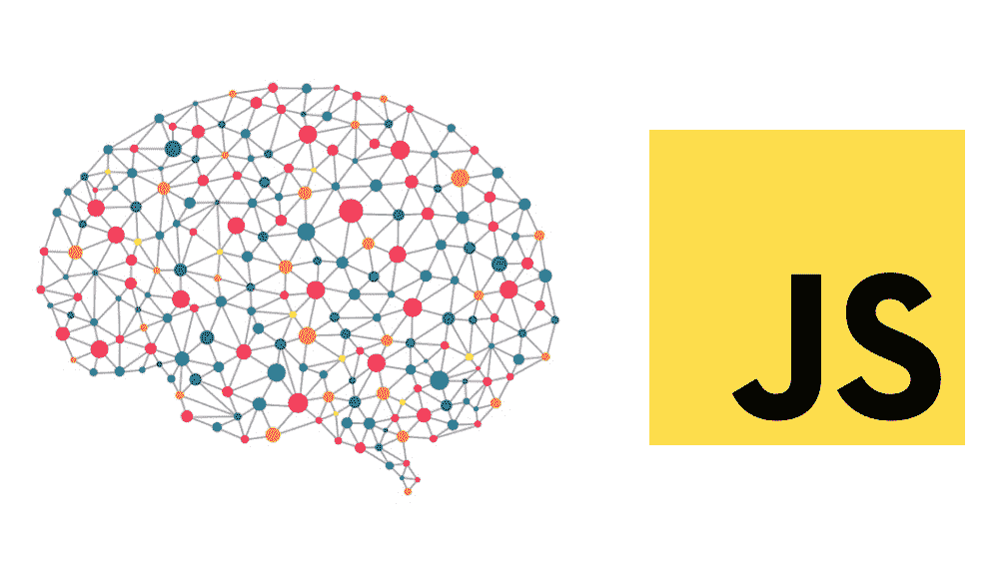
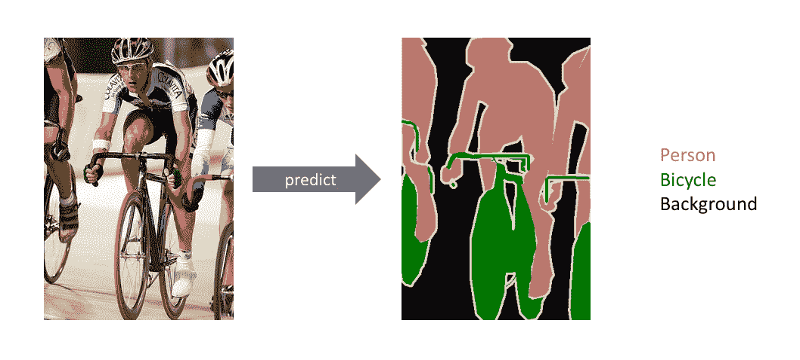
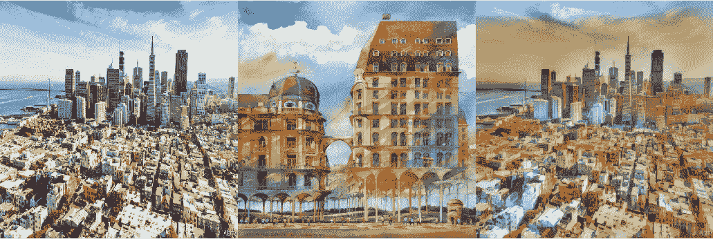
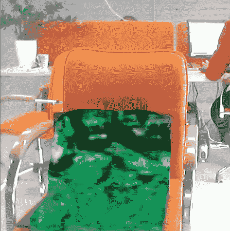
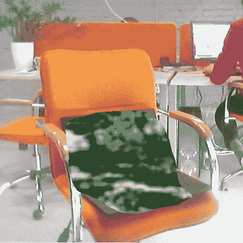

# 使用 Tensorflow.js 和 ONNX.js 在浏览器中运行深度学习模型

> 原文：<https://medium.datadriveninvestor.com/running-your-deep-learning-models-in-a-browser-using-tensorflow-js-and-onnx-js-a35256d3933?source=collection_archive---------0----------------------->



今天我们将讨论如何使用 Tensorflow.js 和 ONNX.js 在您的浏览器中启动语义分割和样式转移模型。

本文的目的是确定相对较大的模型是否可以在您的 PC 和移动设备上的浏览器中使用。

# Tensorflow.js

[TensorFlow.js](https://www.google.com/url?q=https://www.tensorflow.org/js&sa=D&ust=1569924011342000) 是 JavaScript 中用于机器学习的库。它允许我们在浏览器中运行现有模型或训练您自己的模型。Tensorflow.js 的当前版本，1.2.7，支持相当广泛的操作，虽然其中大部分几乎与 Tensorflow 中的相同，但其他如 tf.browser.fromPixels 可以给你创建一个 [tf 的权力。HTML 元素中的张量](https://www.google.com/url?q=https://js.tensorflow.org/api/latest/%23class:Tensor&sa=D&ust=1569924011342000)，非常有用。不幸的是，我不得不使用更低版本的 tf.js — 0.15.1 来导入我的冻结模型(从 1.x tf.js converter 开始不支持将冻结模型转换为 tf.js 格式)。

# ONNX.js

[ONNX.js](https://www.google.com/url?q=https://microsoft.github.io/onnxjs-demo/%23/&sa=D&ust=1569924011343000) 是一个 Javascript 库，用于在浏览器和 Node.js 上运行 ONNX 模型，ONNX 格式(开放神经网络交换)提供了 AI 模型的开源格式，深度学习和传统 ML 都可以。这意味着你应该能够将大多数深度学习模型转换成这种格式。这个功能对于模型的可交换性和可重用性来说是一个极好的机会，但是……有一个问题。ONNX 格式相对较新，仍然没有跟上主流深度学习框架的所有最新变化。由于缺少操作或实现上的差异，这可能会导致不兼容。

# 语义分割

语义分割是一个经典的计算机视觉问题，它涉及将一些原始数据(如 2D 图像)作为输入，并将它们转换成一个带有感兴趣的突出区域的掩模。许多人使用术语全像素语义分割，其中图像中的每个像素根据其所属的感兴趣的对象被分配一个 classID。



[https://www.jeremyjordan.me/semantic-segmentation/](https://www.jeremyjordan.me/semantic-segmentation/)

我选择使用快速 SCNN 架构作为语义分割模型，因为“根据本文的[，它在现代 GPU (Nvidia Titan Xp (Pascal))上以每秒 123.5 帧(fps)的速度产生了 68.0%的平均交集/并集(mIoU)。在如此高的分辨率下 120 fps 是一个惊人的结果，这意味着该网络应该是非常轻量级的，事实证明也确实如此。它使用一些用于创建快速语义分割模型的技术，如](https://www.google.com/url?q=https://arxiv.org/abs/1902.04502%23&sa=D&ust=1569924011344000)[深度方向可分离卷积](https://www.google.com/url?q=https://arxiv.org/abs/1704.04861%23&sa=D&ust=1569924011344000)和[两分支方法](https://www.google.com/url?q=https://arxiv.org/abs/1902.04502&sa=D&ust=1569924011345000)，以提高模型推理时间，同时保持预测准确性。

# 风格转移

让我们将样式转换定义为在保留图像内容的同时修改图像样式的过程。

给定一个输入图像和一个样式图像，我们可以计算出一个具有原始内容和新样式的输出图像。这就是**输入**、**样式**和**输出**图像组合后的样子。



起初，我尝试使用[这种](https://www.google.com/url?q=https://github.com/gnsmrky/pytorch-fast-neural-style-for-web&sa=D&ust=1569924011347000) Pytorch 实现的风格转换，并将其转换为 ONNX 格式。这种样式转换的实现用一系列基本操作替换了一些 Pytorch 操作，如反射填充和插值，因为 ONNX.js 目前不支持这些操作。当我试图在移动浏览器上启动这个模型时出现了问题，但它不起作用，这导致我将这个模型更改为 Tensorflow 实现的[不同风格的传输架构](https://www.google.com/url?q=https://github.com/CompVis/adaptive-style-transfer&sa=D&ust=1569924011347000)并在 tf.js 中运行一切。顺便说一下，tf.js 目前也没有实现反射板，这就是为什么我用 tf.js 支持的常规零板来替换它。

# Tf.js 转换

使用本指南使用 tf.js 版本 0.8.6 在 Python 中转换所有模型[:](https://www.google.com/url?q=https://www.tensorflow.org/js/guide/conversion&sa=D&ust=1569924011348000)

```
tensorflowjs_converter --input_format keras \
                       path/to/my_model.h5 \
                       path/to/tfjs_target_dirtensorflowjs_converter --input_format frozen_model \
                       path/to/my_model.pb \
                       path/to/tfjs_target_dir
```

# 一些代码

在将快速 SCNN 转换为 tf.js 格式并尝试运行它时，我发现应该替换用作 tf.image.resize_images 包装器的 Lambda 层，因为它是原生 Python 实现(这很有意义),并且我用 Javascript 编写了自定义 Lambda 层，它将简单地调用 TF . js resize 双线性方法，如下所示:

让我们来了解一下同时启动这两个模型的主要工作流程。首先，我们应该得到我们的输入:

然后，我们将图像调整到模型的输入大小，归一化、预测并调整回初始图像的大小:

阈值我们的面具:

在语义分割之上运行风格转换的过程与上面描述的非常相似。然而，我们应该根据我们的分段掩码将我们的风格转换输出与源图像数据混合:

最后，我们递归调用我们的函数，来处理来自视频摄像头的下一帧:

# 结果

在这里，我们细分笔记本电脑，并应用风格转移到他们。



# 摘要

如果我们在浏览器中运行我们的模型，我们会得到以下结果:

使用 WebGL 后端的 1.3 fps:141 ms—分段时间(使用完整的前/后处理)，576 ms —一次迭代的风格传输时间(使用完整的前/后处理)，其余时间用于获取图像或将图像放入画布。

希望这篇文章能让您对在浏览器中部署模型的过程有所了解，并且发现在开发过程中可能遇到的困难。

安德烈·涅斯米亚诺维奇
撰稿 [校对*纳迪亚·皮沃瓦尔*](https://www.linkedin.com/in/nadiia-pyvovar/)*[*克莱姆·扬科维奇*](http://www.linkedin.com/in/kyamkovyi)*