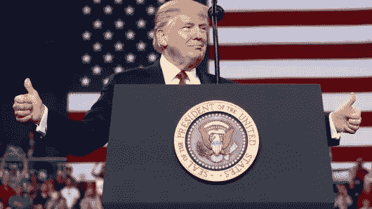

# 标准普尔 500 和道琼斯在选举后有最好的反弹

> 原文：<https://medium.datadriveninvestor.com/s-p-500-and-dow-have-the-best-rally-after-an-election-1305a44eea07?source=collection_archive---------40----------------------->

根据美国消费者新闻与商业频道的观察，美国股市周三收盘普遍走高，此前中期选举结果大致符合预期，解除了笼罩市场的不确定性。

在唐纳德·特朗普总统显示出他愿意与民主党人合作制定有助于经济持续增长的政策的迹象后，主要平均指数达到了最高水平。

道琼斯工业平均指数收盘上涨 2.13%，受联合健康公司和苹果公司上涨带动。标准普尔 500 上涨 2.1%，医疗保健、科技和非必需消费品板块涨幅均超过 2.8%。纳斯达克指数上涨 2.6%，至 7570.75 点。

民主党赢得了众议院的控制权，而共和党保留了对参议院的控制权。中期选举的结果导致了国会的分裂。总体而言，在国会分裂、白宫由共和党控制后，股市表现相对较好。