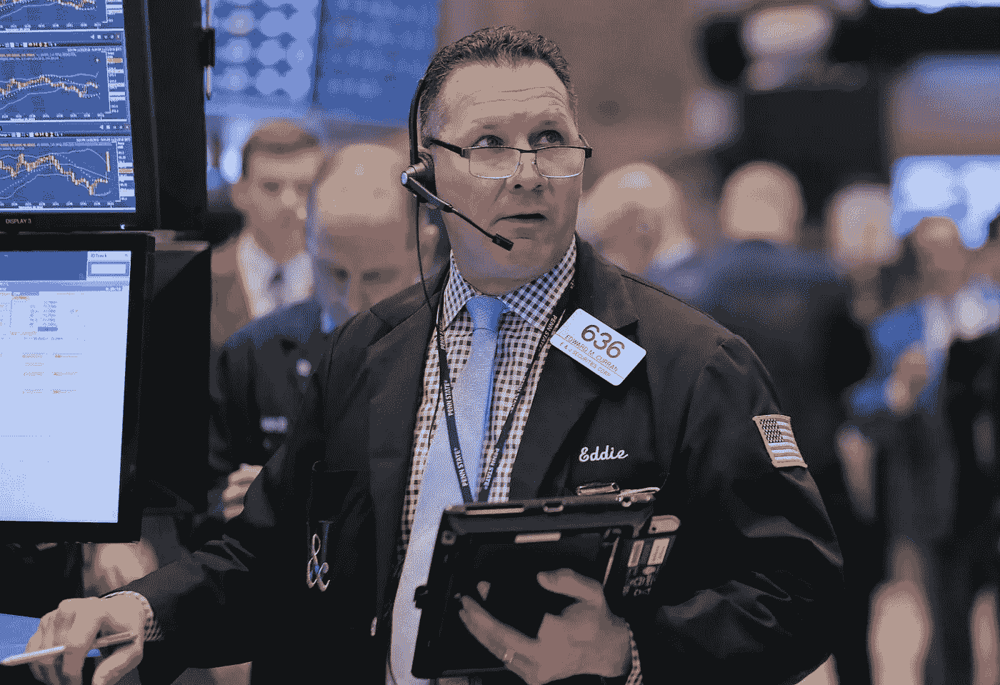

# 标准普尔 500 第四季度表现最差

> 原文：<https://medium.datadriveninvestor.com/s-p-500-having-worst-fourth-quarter-e8aa84c2a186?source=collection_archive---------46----------------------->

道琼斯周三收盘略低于持平线，摆脱了苹果股票未能成功上涨后的 200 点涨幅。道琼斯指数收盘时下跌 0.95 点，收于 24464.69 点，收盘时失去了上涨动力。在当天的高点，它上涨了 204.15 点。苹果公司也放弃了 2.1%的涨幅，收盘时仅下跌 0.1%。

## 股票

标准普尔 500 略低于 24，464.69 点的持平线

纳斯达克指数在 6972.25 点略高于持平线

道琼斯指数略高于持平线，为 2649.93 点

## 货币

欧元上涨 0.1%，至 1 欧元兑 1.139 美元。

日元下跌 0.06%，至 1 美元兑 112.99 日元

英镑上涨 0.04%，每磅 1.287 美元