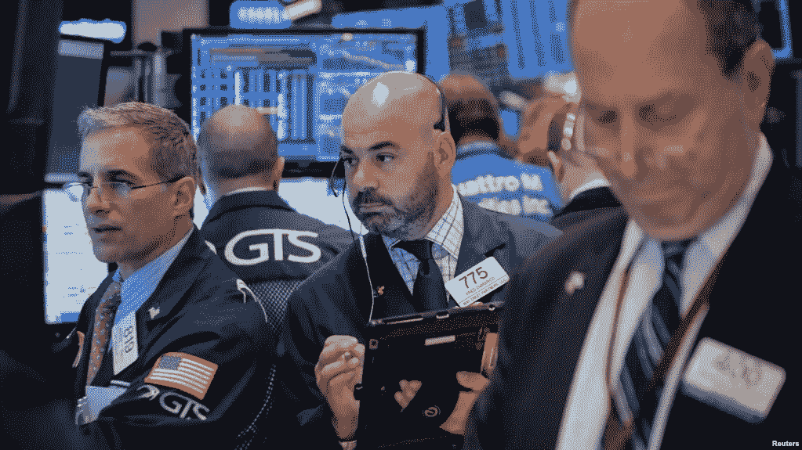

# S&P 股价上涨，伯克希尔哈撒韦公司股价上涨超过 5%

> 原文：<https://medium.datadriveninvestor.com/s-p-rises-as-berkshire-hathaway-gains-more-than-5-c19622e14c11?source=collection_archive---------37----------------------->

据美国消费者新闻与商业频道报道，美国股市上涨，沃伦巴菲特的伯克希尔哈撒韦公司推动标准普尔 500 指数上涨。国债收益率走低。

金融和能源类股上涨，而苹果公司因一份报告称他们不会增加 iPhone 产量而下跌。亚马逊和脸书也下跌了。油价已经连续第六天下跌。

正如过去几周所见，科技股的表现不佳仍在继续，标准普尔 500 指数自 8 月底以来下跌了不到 6%。相比之下，纳斯达克 100 指数下跌了近 10%。就全年而言，科技股指数仍表现较好。

**股票**

标准普尔 500 指数收盘上涨近 0.6%。纳斯达克综合指数下跌 0.4%，道琼斯工业平均指数上涨 0.8%。

**货币**

欧元兑美元上涨 0.2%，至 1.1409 美元。

日元汇率略有变化，为 1 美元兑 113.2 日元。

英镑上涨 0.6%，至 1.3041 美元。

**商品**

彭博商品指数上涨 0.4%，为一周最高。

西德克萨斯中质原油下跌 0.5%，至每桶 62.80 美元。

铜价下跌 1.9%，至每磅 2.755 美元。

黄金下跌 0.2%，至每盎司 1231.04 美元。