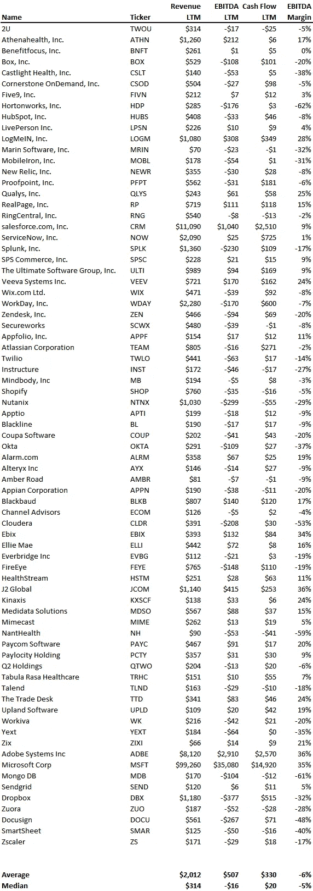

# SaaS 的利润率很糟糕

> 原文：<https://medium.datadriveninvestor.com/saas-margins-are-terrible-29ededa27e55?source=collection_archive---------5----------------------->

我们经常听到“SaaS 有很大的利润空间”，但这不是真的。如下图所示，SaaS 的利润率非常糟糕。表格中有 75 家公开上市的 SaaS 公司，收入中值为 3.14 亿美元，这意味着它们早已过了创业阶段，利润率应该会受益于它们的规模和成熟度。然而，尽管他们已经过了高消耗增长阶段，但平均 EBITDA 利润率为-5%，因为 75 家公司中有 44 家的 EBITDA 不为正。

这些公司为什么要烧钱？因为虽然 SaaS 的可变成本非常低(主机、服务器等)，但固定成本非常高，尤其是对工程人才和开发人员而言。鉴于技术过时的速度，工程/开发人才的招聘永远不会真正结束，因为每个公司都必须不断改进和发展其产品。更糟糕的是，固定成本都是人的才能，这使得削减其他人员的士气、文化和生产力非常痛苦。

那么，SaaS 为什么会成功呢？因为传统上 SaaS 的公司会提前收集订单。换句话说，如果你为你的软件销售一份 1 年的合同，标准是提前 12 个月收取现金，而不是每个月收取合同的 1/12。这就是为什么尽管 75 家公司中有 44 家 EBITDA 为负，但只有 15 家现金流为负。虽然数据集的息税折旧摊销前利润中值为-1600 万美元，但现金流中值为+2000 万美元。尽管现金流远好于息税折旧及摊销前利润，但这并不能改变 SaaS 利润率确实很低的事实。

*在 blossomstreetventures.com 拜访我们*