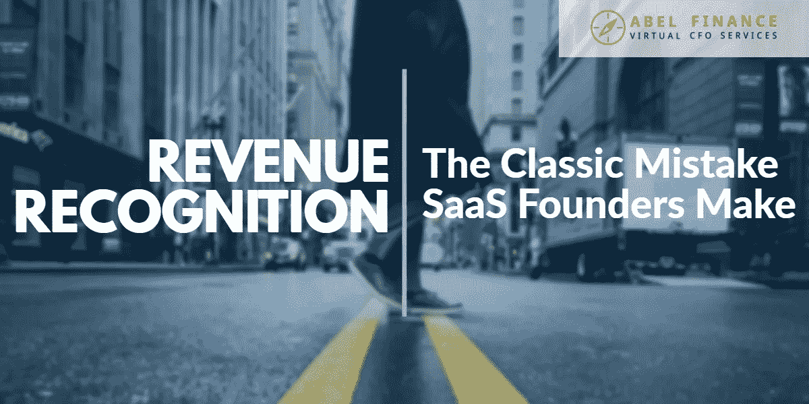
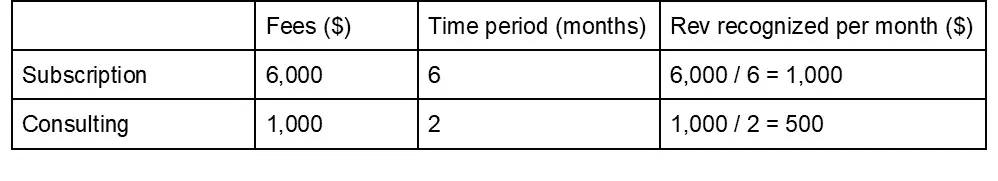

# SaaS 收入确认:SaaS 创始人的经典错误

> 原文：<https://medium.datadriveninvestor.com/saas-revenue-recognition-the-classic-mistake-saas-founders-make-ef3773b70020?source=collection_archive---------36----------------------->

SaaS 公司在解决财务问题时，通常会纠结于一件事，那就是收入确认。

我们最近与一家 SaaS 公司的创始人交谈，她提到她在那个月完成了创纪录的销售。这显然对她的底线很有好处，但她担心能否维持这种销售增长，指出她不想“显示收入下降”。

这是一个典型的 SaaS 收入确认错误——我们看到 SaaS 公司的创始人一次又一次地犯这个错误。在本文中，我们将带您了解如何准确确认您的收入，并讨论 SaaS 收入确认如何影响您的公司。

# 什么是 SaaS 收入确认？

简而言之，SaaS 收入确认是指 SaaS 公司确认其向客户提供服务所赚取的货币价值的过程。

不过，对 SaaS 公司来说，收入确认往往有些复杂。例如:如果你正在销售一种营销工具，而一位客户支付了 6 个月的订阅费，你会将全部金额确认为当月的收入吗？答案是*不*——除非你提供了客户付费的服务，否则现金不会作为收入入账。

在这里，区分预订、收入和账单很重要。收入是您向客户提供服务时所认可的东西。当你与客户签约时，预订是销售的总价值，而账单交易是你从客户那里收到的现金总额。因此，即使你的客户预先支付你 12 个月的订阅计划，你也不能马上把全部金额确认为收入。我们将在下一篇文章中深入探讨收入、预订和账单之间的差异。

如果你想知道:收入确认有特定的[标准](https://www.fasb.org/jsp/FASB/Page/ImageBridgePage&cid=1176169257359)，由财务会计准则委员会(FASB)和国际会计准则委员会(IASB)发布。请继续阅读，了解更多信息！

# 为什么收入确认很重要？

当您进行适当的收入确认时，这使您可以跟踪您的每月经常性收入(MRR)。因为 MRR 和 MRR 的增长是推动 SaaS 公司估值的关键指标，所以确保这个数字尽可能准确是至关重要的。

最重要的是，进行适当的收入确认可以让你更好地了解你的盈利能力。如果你在没有交付产品或服务的情况下就提前确认了你的收入，这将会人为地夸大你的数字，并且可能会让你认为你比实际做得更好。不要忘记，在接下来的几个月里，你的客户随时可以取消他们的计划或要求退款。

最后但同样重要的是，考虑收入确认对你应付税款的影响。更具体地说:如果你的确认收入高于或低于你的实际收入，这将导致你的公司[公布更高或更低的利润](https://abel-finance.com/saas-pl-breakdown-6-crucial-numbers/)，这将反过来影响你必须支付的税款。

底线呢？现金和收入之间有很大的区别，不能互换使用这两个术语。

# 收入确认的基础

让这成为你的口头禅:只有在你完成一个创造收入的过程后，才记录收入。

让我们以之前提到的同一个例子为例，假设您的客户在 1 月份为您的营销工具支付了 6 个月的订阅费，那么您的银行账户中就有 6000 美元的现金。

现在，您可以在 1 月份将全部 6000 美元作为预订(以记录您已经完成了销售)，但您应该只将 1 月至 6 月每个月的 1000 美元作为收入。换句话说:当你记录一月份的销售数字时，你记录的是价值 1000 美元的收入，而你收到的另外 5000 美元被标记为递延收入。我们将在后续文章中更深入地探讨计费、预订和收入之间的区别。

# 如何识别其他收入来源

如果你有其他收入来源，比如咨询、许可、设立成本，那事情就有点复杂了。

这里的一般经验法则是看你的额外收入来源是否是作为一项独立的服务提供的(如果是，它将算作一个单独的收入流)。

例如，在设置成本的情况下:假设这些对于所有注册使用你的产品/服务的新客户是强制性的，并且你不将这些作为独立的服务提供，那么你将它们与你的其余收入一起计算，并且在你的客户计划的整个生命周期中承认它们。

6，000 美元的工具订购+600 美元的安装成本= 6，600 美元。

6，600 美元/ 6 个月=每月确认 1，100 美元的收入。

现在，假设您的客户也注册了您的咨询服务，这是您作为独立项目提供的服务。(即:客户可以选择为你的咨询服务付费，即使他们没有使用你的工具)。在这种情况下，您应该单独确认您的咨询费，而不是将它们与客户的订阅费捆绑在一起。

假设您的咨询会议持续了 2 个月，下面是您的计算结果:

在 1 月和 2 月，您每月总共会获得 1，000 美元+500 美元= 1，500 美元的奖励。

从 3 月到 6 月，你每个月会得到 1000 美元的奖励。

# 关于 SaaS 收入确认的最后一句话

我们已经在指南中介绍了 SaaS 收入确认的基础知识，但是如果您的业务模型更加复杂，您可能会发现很难准确确定何时应该确认每个额外的收入来源。

如果是这样的话，可以考虑和 ABEL 的虚拟 CFO 一起工作，了解和提高你的数字。我们将帮助您整理数据，澄清疑问，以便您准确了解贵公司的财务状况。

[预约免费咨询](https://calendly.com/abel-finance/30-min-call)

*原载于 2019 年 1 月 15 日*[*【abel-finance.com*](https://abel-finance.com/saas-revenue-recognition/)*。*