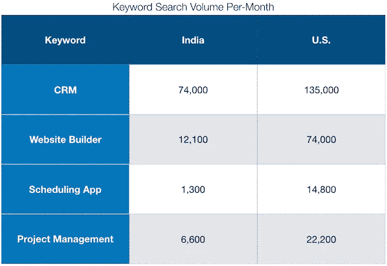
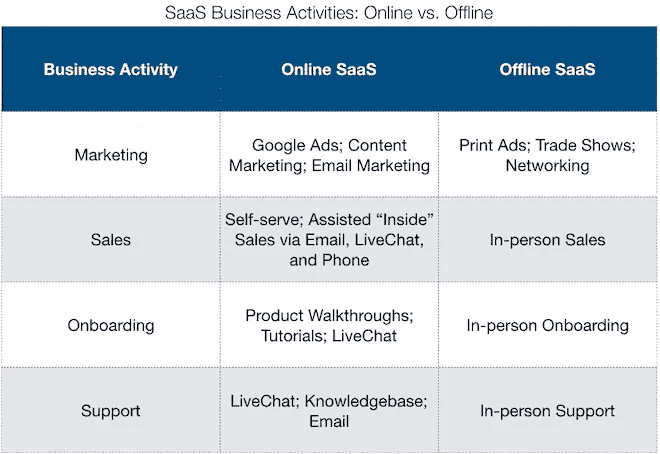

# 针对印度的 SaaS 没有规模，第 1 部分

> 原文：<https://medium.datadriveninvestor.com/saas-that-targets-india-does-not-scale-part-1-the-small-online-market-899031b68ae0?source=collection_archive---------6----------------------->

## 小型在线市场

courtesy of customroadsign.com

> “不可扩展，不可预测，而且还会重复。这是有意为之——没问题。试图这样做而不知道是一种慢性毒药。”——[*维韦克·坎德尔瓦尔*](https://www.linkedin.com/in/khandelwalvivek/)*[*iZooto*](https://www.izooto.com/)创始人*

*你能举出一家通过瞄准印度国内市场，年经常性收入超过 1000 万美元的 SaaS 初创公司吗？我不能。*

***这个 4 集系列将为 SaaS 创始人提供对印度市场的评论，以鼓励他们将销售和营销转向全球市场。***

*我曾经是 SaaS 的创始人，我知道发现一个问题并为你网络中的人建立一个解决方案是多么诱人。但是，不要超出一组测试客户的范围——正如我和我的同行所了解到的那样——向国内市场销售 SaaS 是不可扩展的。*

*创始人阅读，请仔细跟随。话不多说，以下是我认为攀登 SaaS 几乎不可能的四个理由。*

1.  *小型在线市场*
2.  *软件的低感知价值*
3.  *B2B 支付文化*
4.  *B2B 服务文化&定制开发的风险*

# *定义*

*首先，让我澄清几个词汇:*

*   ***规模** —我将规模定义为+1000 万美元(卢比。7 亿)年经常性收入(ARR)*
*   ***软件即服务(SaaS)** —任何基于云的软件产品，其客户和用户是企业，即企业对企业(B2B)*
*   ***以印度国内市场为目标的 SaaS**—任何将超过 50%的销售和营销预算用于获取印度客户的 SaaS 初创公司*
*   ***MSMB / SMB —** 微型、小型和中型企业。例子包括基拉那商店、餐馆、制造商、招聘公司等。*
*   ***在线市场/全球市场—** 为了购买 Adwords 并为 SaaS 初创公司制定上市战略:“在线市场”/“全球市场”与“美国市场”同义*
*   ***线下/现场** —我交替使用这两个词来描述服务印度中小企业所需的商业模式*

***注 1:** 这篇文章只关注针对 MSMB 市场的 SaaS，而非企业市场。我无法明智地谈论印度的企业市场。*

***注 2:** 我将规模定义为超过 1000 万美元 ARR，因为收入的数量表明有大量的客户。*

***注 3:** 我在 SaaS 的定义中排除了支付网关。*

# *小的在线市场和扩展线下业务的障碍*

**谷歌搜索量是市场需求的晴雨表**

*用谷歌关键词搜索任何 SaaS 风格的产品(如“CRM”、“网站建设”、“项目管理”等)。)你会看到其他市场的搜索量与印度相比如何。*

**

*Google Keyword Planner*

*数据说明了一切——如果一家初创公司瞄准了印度市场，那么它瞄准的是一个相对较小的在线市场。*

*”*但是，等等！*”，我听到一位 SaaS 企业家反对，“*考虑一下这个……*”*

*   **“虽然印度的* ***线上*** *市场小，印度的* ***线下*** *市场却是* ***大*** *！”**
*   **“还有，* ***就是*** *足够我在印度建立一个可扩展的在线业务创业公司”**

*我在这里阐述的第一点——仅仅因为一个市场很大并不意味着它是*可扩展的*——第二点我将在以后的文章中阐述。*

## *[1]线下 SaaS 利润率低*

*要描述这个市场的特征，SaaS 企业家会同意，一般的印度中小企业不会利用现代技术来改善其业务运营。此外，根据上述搜索量数据，一般印度中小企业不会通过在线搜索(谷歌)来寻找改善其业务运营的解决方案。*

*要理解为什么企业不在网上搜索，这意味着:*

*   *企业没有意识到他们的业务运营效率低下*

*运筹学*

*   *企业*意识到**他们的业务运营效率低下，**但是**他们通过个人网络寻找解决方案，而不是通过网上搜索**

**对于 SaaS 的创始人来说，这两种情况的问题在于，他们将不得不投入大量资源，亲自与中小企业联系，并教育它们业务运营效率低下。这是一个挑战，因为培养一个市场是缓慢的。教育需要多次会见潜在客户。并且需要经验丰富的销售代表，他们能够清楚地说明客户的问题并销售 SaaS 的解决方案。这是一项昂贵的努力，也是任何 SaaS 初创公司扩大规模的障碍。**

**但是我不是唯一一个这么说的人，[维诺德·穆图克里希南](https://www.linkedin.com/in/vinodmkrishnan)，云雀[的创始人，云雀](https://cloudcherry.com/)是印度发展最快的 SaaS 创业公司之一，他说:**

> **“印度的问题是(ARPU)每用户平均收入很低。假设云成本为 ARR 的 8–10 %,对于一家拥有 80%毛利润的 SaaS 公司，围绕客户成功/支持的所有人员成本和一般及管理(GA)费用不应超过 10–12%。**
> 
> **如果 ARPU 很低，你需要每个月飞去孟买亲自见潜在客户，每天花 3 个小时教育他们并和他们就多种事情聊天，基本上，数学是不合理的。这两个向量都对我们不利——ARPU(低)和服务期望(高)”——[Vinod Muthukrishnan](https://www.linkedin.com/in/vinodmkrishnan),[CloudCherry](https://cloudcherry.com/)的联合创始人**

**正如 Vinod 指出的，由于面对面教育和销售的高成本，SaaS 初创公司的总收入较低。这减少了销售和营销获得客户的资本，使创业公司不可扩展。**

**在下一节中，我将描述在线 SaaS 模型与离线模型的不同和更大的可扩展性。**

## **[2]在线 SaaS 是高利润率**

****

**通过利用技术，你可以看到在线的 SaaS 创业公司如何比线下的 SaaS 创业公司用更少的资源营销、收购、搭载和服务**更多的客户。这使得在线 SaaS 成为一种更具可扩展性的方法。****

## **[3]困难的支点**

**运营线上和线下 SaaS 所需的技能和文化是两个不同的世界。这是有风险的，因为 SaaS 投入资源建立销售和营销文化以获得线下市场的时间越长，转向在线市场就越困难。因此，SaaS 的初创公司可能会因为线下销售而陷入困境。我自己也有过这样的经历，很多同龄人也是。**

# **最后**

**如果你愿意转向全球市场，这条隧道的尽头会有回报。正如 Accel 的合伙人 Shekhar Kirani 曾经说过的:**

> **“我认为，对于印度企业家来说，这是一个绝佳的机会，他们可以纯粹通过专注于提供高质量产品的大型全球企业来建立大规模的 B2B/SaaS 公司。在印度有一个基地，这在需求生成、内部销售和研发的单位经济上是一个巨大的优势。”**

**如果你仍然不相信国内市场的风险，那么请留意下周的帖子“印度软件的低感知价值”。**

**如果你对这篇文章有任何意见或反馈，我很乐意倾听——你认为攀登 SaaS 还有其他挑战吗？或者说，你对我的观点有异议吗？**

**感谢阅读，敬请关注下一篇文章，**

**亚当**