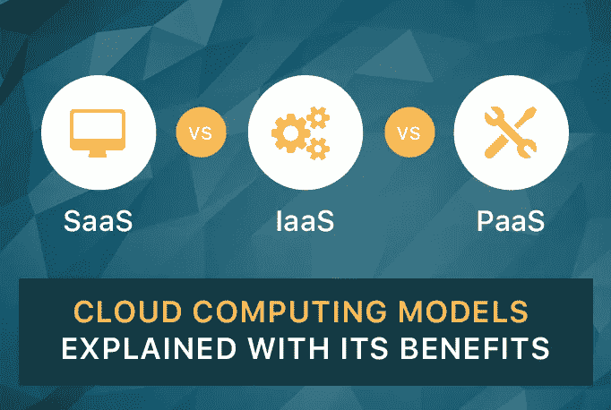

# SaaS vs. IaaS vs. PaaS:云计算模型及其优势

> 原文：<https://medium.datadriveninvestor.com/saas-vs-iaas-vs-paas-cloud-computing-models-explained-with-its-benefits-276298aea66d?source=collection_archive---------2----------------------->

云计算已经成为商业和 IT 行业的热门话题，因为它为数字连接的世界提供了推动业务发展的优势。

云计算在过去的几年里呈指数级增长，并有望以更快的速度发展。如果你作为一名企业家，考虑将你的业务转向云，无论是基础设施部署还是应用程序，请确保你清楚了解各种云服务模式的差异和优势。

 [## 信息图:云之旅|数据驱动的投资者

### 聪明的企业领导者了解利用云的价值。随着数据存储需求的增长，他们已经…

www.datadriveninvestor.com](https://www.datadriveninvestor.com/2018/09/22/infographic-journey-to-the-clouds/) 

***云计算主要集成了三种模式:***

**1。** **软件即服务(SaaS)**

**2。** **基础设施即服务(IaaS)**

**3。平台即服务(PaaS)**

每种模式都提供不同的服务和优势。因此，在为您的企业选择任何模型之前，请确保了解 SaaS、PaaS 和 IaaS 之间的区别。在下面你可以找到每个模型的介绍和他们提供的服务和好处。

***1。软件即服务(SaaS):***

[软件即服务(SaaS)](https://www.goodfirms.co/cloud-computing-companies/saas) 是云计算生态系统的重要元素。它帮助第三方租用或订阅软件应用程序并在线执行，而不是购买、安装和管理它。如今，大多数 IT 部门和企业都在采用 SaaS 应用程序来实现基本的业务技术，如电子邮件、CRM、HRM、销售管理、财务管理计费和协作。领先的 SaaS 提供商包括 Salesforce、Oracle、SAP、Intuit 和 Microsoft。

***SaaS 的好处:***

它减少了安装和配置应用程序所花费的时间，以及软件部署过程中可能遇到的问题。

它的成本效益很高，因为你只需要为你正在使用的东西付费，而不需要支付大量的二手许可费用。

SaaS 功能具有灵活的选项，可以根据需要轻松更改使用计划。它还允许用户从任何地方轻松访问该软件。

它与新的升级兼容，因为用户只需登录已经升级的服务。

**2*2。基础设施即服务(IaaS):***

[基础设施即服务(IaaS)](https://www.goodfirms.co/cloud-computing-companies/iaas) 是一种即时计算基础设施，通过互联网进行供应和管理。许多组织正在投资 IaaS 来访问、监控和管理远程数据中心基础架构。用户可以根据资源需求购买 IaaS，而不是直接购买硬件。

**IaaS 的好处:**

它包括根据客户需求快速扩展和缩减资源的能力。

它经济实惠，成本效益高，因为您只需为您使用的东西付费。

它降低了购买和处理物理服务器的其他费用和复杂性。

它还通过降低成本和提高可管理性，提供了整合的灾难恢复基础架构。

***3。平台即服务(PaaS):***

[平台即服务(PaaS)](https://www.goodfirms.co/cloud-computing-companies/paas) 是第三方为用户提供软硬件工具的云计算模式。许多小型企业依赖 PaaS 提供商提供开发工具包、数据库工具和应用程序管理需求来创建和部署应用程序。PaaS 提供商还处理基础设施，包括网络、服务器、操作系统和存储。

***PaaS 的好处:***

它帮助应用程序开发者以一种简单且经济的方式开发和部署应用程序。

它允许开发人员创建定制的应用程序，而没有任何维护软件的压力。

它通过减少编码量来减轻开发人员的负担。

通过减少不必要的人工配置任务，它有助于简化整个应用程序管理。

**结论:**

每个云模型都有各种特性和功能，适合各种行业需求。在 [GoodFirms](https://www.goodfirms.co/) ，你可以接触到基于各种定性和定量因素评估和列出的云计算服务提供商。

无论您是在搜索基于云的软件来创建创造性的定制应用程序，还是在寻找各种存储选项，或者需要处理您的整个基础架构，您都可以与顶级的 [**云计算公司**](https://www.goodfirms.co/cloud-computing-companies) 联系。选择最适合的模式并迁移到云，以获得更好的业务前景。