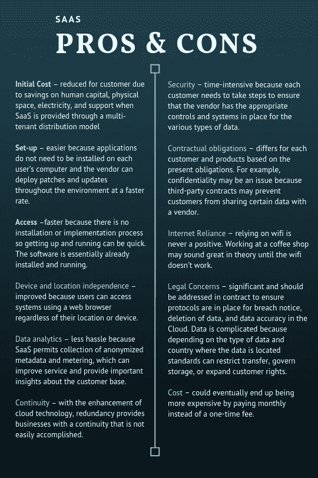

# SaaS——大肆宣传是为了什么？

> 原文：<https://medium.datadriveninvestor.com/saas-whats-all-the-hype-about-73bf9a5689c4?source=collection_archive---------23----------------------->

软件即服务，或 SaaS，是通过浏览器每月在互联网上访问软件解决方案的实践。这是当今时代最现代的购买和访问软件的方式。在 SaaS 之前，企业和消费者会购买软件的实体版本，比如光盘，然后安装到他们的电脑上。

采用 SaaS 无疑对现代企业很有吸引力——它提供了无缝升级、初始低成本、易于采用和集成以及远程工作的能力。但是这种趋势值得大肆宣传吗？

据说，这些趋势通常涉及创新、灵活性和客户至上的思想，其余的都是过时的想法，应该被抛在脑后，但使用这种趋势软件有疑问。

但是 40-60%注册免费试用 SaaS 应用程序的用户会使用一次，然后就再也不回来了。

**云**

SaaS 坐落在被称为“云”的地方，但正式名称是云计算。基本上，云是一种互联网，它让参与公司软件的员工远程工作或在任何有 wifi 的地方工作。

云通过在用户每次登录时自动更新软件版本，而不是每次更新时都需要实际安装最新版本，从而允许轻松采用和升级。

在试图削减成本和实现业务转型的过程中，您可能会很快以更大的规模采用云，这样您就可以更具可扩展性、节省资金、创新和发展。

根据北桥云计算调查，50%的组织现在有“云优先”或“仅云”的政策，而 90%的组织以某种方式使用云。到 2019 年，预计 100 家最大供应商的新软件投资中将有 30%以上从云优先转向纯云。

**安全**

但是云安全吗？据报道，云内部已经出现了重大漏洞，例如，像 Google Drive、LinkedIn 和 Evernote 这样的家喻户晓的大公司都被攻破了。今年夏天，美国最大的无线运营商威瑞森有 600 万客户的账户因“人为错误”导致云服务器上的安全设置配置错误而暴露

网络安全是 SaaS 未来的一个重要方面。在云中存储数据总是存在风险，但高度的担忧已经导致 SaaS 公司采取必要的安全措施。

劳埃德保险公司(Lloyds Insurance)表示，安全应该是所有公司的主要担忧，尤其是当公司平均每月收到 10.9 起内部威胁，全球安全攻击可能造成数十亿美元的损失时。转向混合动力可以让企业更好地掌握安全性和控制力。然而，使用“私有”云进行混合的成本非常高。

**SaaS 的未来**

对云安全的担忧会导致企业转向人工智能(AI)吗？根据哈维纳什 2019 年技术调查，42%的受访者表示，他们通过使用人工智能获利或省钱。然而，52%的人说他们使用云服务。

未来，SaaS 有望根据技术趋势进行调整。随着 SaaS 将人工智能融入他们的工具并改善用户体验，人工智能可能会发挥重要作用。

Salesforce APAC 公司高级副总裁 Lee Hawksley 表示，转向 SaaS 解决方案带来了挑战。

Hawksley 说:“你不能只按一下开关，某一天就有许多后台遗留的内部系统，而第二天就全部在云中启动了。”“转型是一种迁移。在过去的 18 年中，集成已经成为我们客户的一个大问题，随着越来越多的公司迁移到云，他们越来越需要将这些传统的内部系统与多个云系统集成在一起，以将数据整合在一起。”

随着 SaaS 走出趋势热点，进入主流服务，越来越多的公司将采用它。

现在做好准备，SaaS 是一种主流服务——你的工作场所可能会采用它。

[点击此处查看更多关于智能自动化的内容](https://intelligentautomationbfsi.iqpc.com/downloads?utm_source=hypearoundsaas&utm_medium=ad&utm_campaign=10000.002-external-ad&utm_term=hypearoundsaas&utm_content=text&mac=medium_aguis&disc=medium_aguis)

[喜欢谈论智能自动化吗？点击此处查看 IA 的完整议程](https://intelligentautomationbfsi.iqpc.com/landing/intelligent-automation-for-banking-financial-services-and-insurance-agenda?utm_source=hypearoundsaas&utm_medium=ad&utm_campaign=10000.002-external-ad&utm_term=hypearoundsaas&utm_content=text&mac=medium_aguis&disc=medium_aguis)