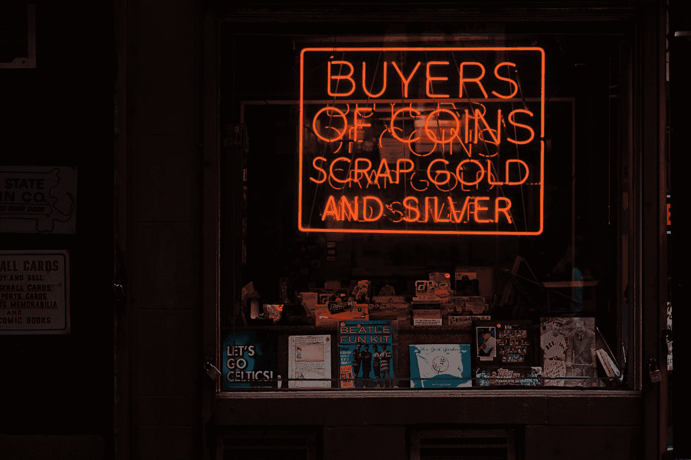

# 销售

> 原文：<https://medium.datadriveninvestor.com/sales-92ff6a4acee5?source=collection_archive---------24----------------------->

## 在拥挤的市场中，复杂的企业如何实现引人注目的销售？

正常的销售故事:你被告知遵循一个经过尝试和测试的销售过程，你可以神奇地完成销售。(你虔诚地坚持到底。)

初次会面。

但是没有后续。

你会发现，与你合作的买家并没有真正做出应有的回应！

你该怎么办？

> *悄悄话*做流氓，不要走主流销售流程。

“person playing chess” by [rawpixel](https://unsplash.com/@rawpixel?utm_source=medium&utm_medium=referral) on [Unsplash](https://unsplash.com?utm_source=medium&utm_medium=referral)

完成销售的策略很简单:

去观察，去思考，去提高。

(真的吗？就这些吗？)

这可能看起来像“钓鱼”。对于旁观者来说，这看起来像是一个简单的任务。而是实际上被分成了细致的步骤。

> 在复杂的销售中，应用灵活的系统效果更好。系统比过程更好。_ Mareo McCracken，收入主管。

“grayscale photography of Public Market neon signage” by [Nathan Dumlao](https://unsplash.com/@nate_dumlao?utm_source=medium&utm_medium=referral) on [Unsplash](https://unsplash.com?utm_source=medium&utm_medium=referral)

# 仅仅因为你的产品可以理解，并不意味着它可以被接受。

光有市场所谓的‘好产品’是不够的。

你必须给人们他们的“为什么”。

人们往往会忽视你，给你提供阻力，而不是关注。但这就是为什么你会得到报酬——将这种抵触或惰性转化为关注，以促成销售。

获取信息，绘制地图，将点连接起来，得出逻辑结论..让买家看到你创造的同样的愿景。

“selective focus photo of vehicles on highway during golden hour” by [Tom Grimbert](https://unsplash.com/@tom_grimbert?utm_source=medium&utm_medium=referral) on [Unsplash](https://unsplash.com?utm_source=medium&utm_medium=referral)

# 购买过程很复杂。

“orange buyers of coins scrap gold and silver neon signage” by [Osman Rana](https://unsplash.com/@osmanrana?utm_source=medium&utm_medium=referral) on [Unsplash](https://unsplash.com?utm_source=medium&utm_medium=referral)

每个买家都有自己的使命和目标。你需要和你的客户交流，理解他们的痛苦和目标。

在销售中，你的工作是帮助每个买家完成他们的使命，告诉他们你的产品或服务有多么不同，以及它如何帮助他们超越他们的使命。

“% sale % sign outside clear glass establishment” by [Benedikt Geyer](https://unsplash.com/@b_g?utm_source=medium&utm_medium=referral) on [Unsplash](https://unsplash.com?utm_source=medium&utm_medium=referral)

让它与个人相关。平衡潜在客户的业务知识和你自己的业务和行业知识。

展示你的产品或服务如何增加收入或降低成本的能力是你的技能。

看买家和他的情况。问问他，他认为要让你的解决方案符合他的需求，必须要做些什么。说到点子上了。

他告诉你的，对你来说是最有价值的。让你的销售方式符合买家的购买意愿。

我的朋友，一小步是销售的开始。