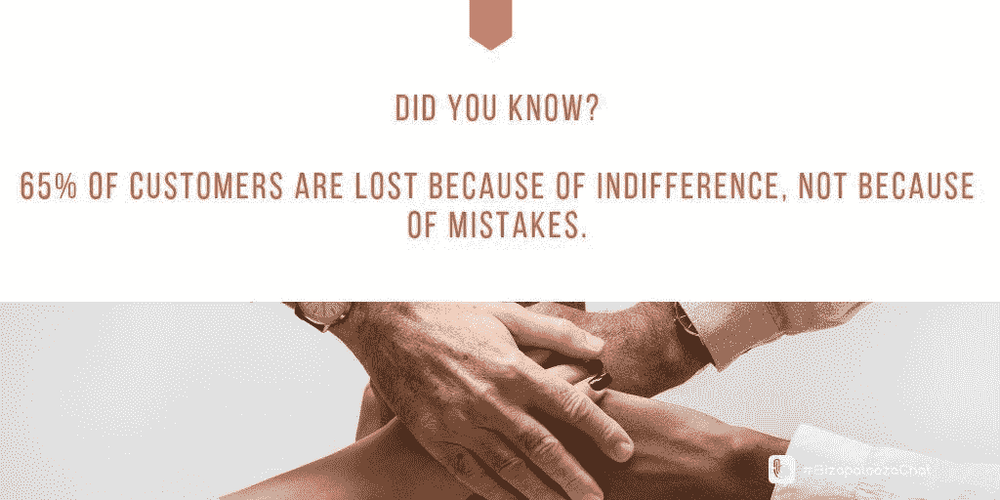
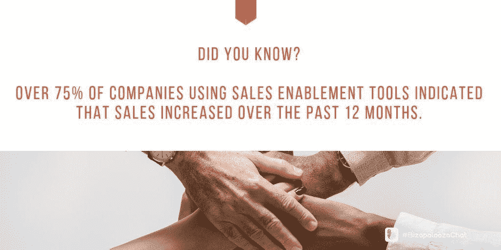
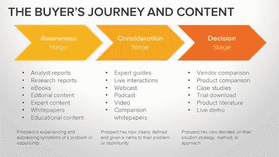
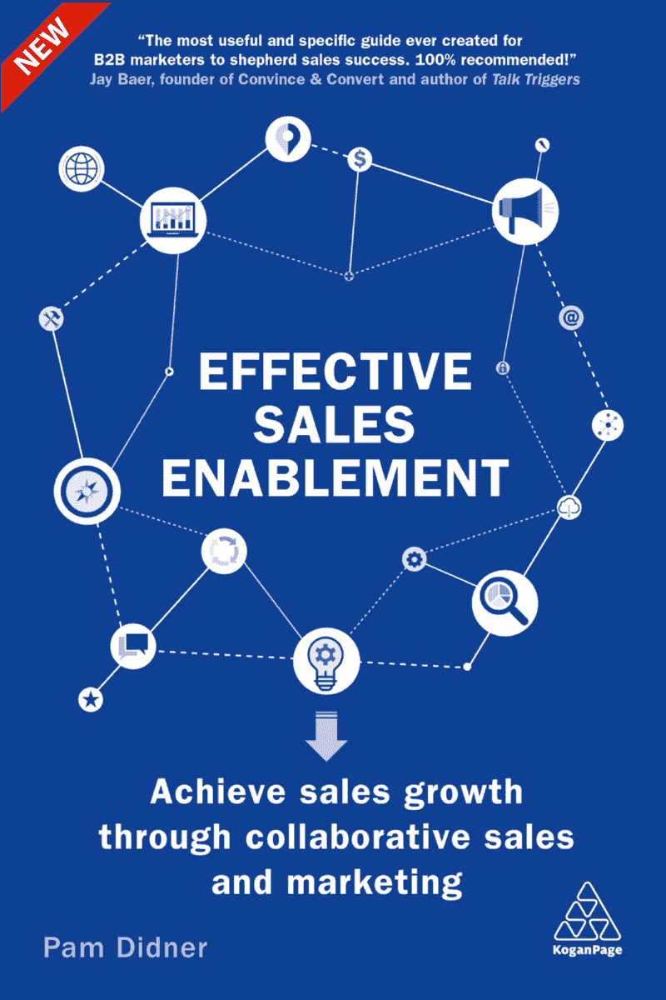

# 销售人员必须了解并关注客户的最大需求

> 原文：<https://medium.datadriveninvestor.com/sales-enablement-balances-data-and-gut-2c8403536997?source=collection_archive---------31----------------------->

## 营销和销售团队合作会更好

如果营销和销售之间有差距，那是因为人们不明白销售对营销来说是至关重要的。

[帕姆·迪德纳](https://twitter.com/PamDidner)接受了这个前提。

“市场营销在某种程度上就是销售，但销售有不同的形式，”她说。“销售人员需要专注于了解客户的挑战并解决它们。"

 [## 数字化转型关乎更好的决策

### 了解你的受众对于发展业务来说是无价的

medium.datadriveninvestor.com](/digital-transformation-is-about-better-decisions-dec29258f473) 

Didner 是一名技术营销顾问、演讲者和作家。企业对企业的营销人员专门从事销售和营销协调。

她与[伊万娜·泰勒](https://twitter.com/DIYMarketers)和[伊万娜·伊格贾托维奇](https://twitter.com/IvaIgnjatovic)讨论了轻松销售的销售支持，以及小企业主如何在他们的公司实施。

Ignjatovic 是一名营销、战略、领导力和商业顾问。她与泰勒密切合作，泰勒拥有 DIYMarketers，一家“致力于帮助小企业主摆脱困境”的公司。

Pam Didner

“销售和营销之间存在差距，因为存在误解，”Ignjatovic 说。“大多数时候，双方都会从能力和业务优先级的角度仔细审视对方。”

她注意到增长机构 Ironpaper 发现 65%的顾客流失是因为冷漠，而不是因为错误。

泰勒说:“在小企业的世界里，在把重点放在哪里、帮助销售还是寻找客户方面存在差距。”"似乎没有足够的资源同时满足这两者."

# 一个人在哪里结束…

Didner 补充了她的差距分析。

“销售和营销有不同的重点，”她说。“人们更关注购买漏斗底部的——完成购买。另一种可能关注从认知到购买的整个购买漏斗——认知、考虑和购买。

“销售的重点是满足每月和每季度的配额，而营销需要专注于品牌建设和需求挖掘，”Didner 说。"不同的关注点将指导他们的策略和执行."

泰勒着眼于营销结束和销售开始之间的界限。

“营销的最终目的是创造有助于销售人员销售的内容，”她说。"销售始于帮助顾客选择和入门."

 [## 管理一个品牌可以让你汇集许多丰富多彩的线索

### 每一个元素增加的力量都大于其组成部分的总和

medium.datadriveninvestor.com](/managing-a-brand-lets-you-bring-together-many-colorful-threads-6b4d406e9c22) 

另一方面，Ignjatovic 认为这个世界已经模糊了营销和销售，因为它们都融入了创造统一的体验。

“营销和销售都在以自己的方式销售，”Didner 说。“过去，更容易看到谁做什么。营销人员通过电视、广播、印刷品和活动进行促销。当人们看到促销并表示感兴趣时，他们就会来到商店或打电话。”

她同意 Ignjatovic 关于模糊的观点。

“电子邮件营销可以由销售和营销双方来完成，”Didner 说。“社交媒体广告也可以由这两家公司经营。界限不太清楚。定义销售和营销之间的角色和职责非常重要。

“这就是为什么营销和销售应该更加紧密地合作，”她说。“销售人员应该将营销视为一种隐性的销售力量。营销应该将销售视为另一种营销渠道。”

# 营销依赖于销售

Didner 补充说，如果营销团队进行基于客户的营销，营销人员将与销售团队呆在一起，直到交易完成。

“当我在销售时，一些最重要的营销是以统计数据、业绩和社会证明的形式出现的，”泰勒说。

根据 Didner 的说法，营销的重要性取决于销售的不同阶段。

“关键是要了解你在和谁说话，做好你的功课，掌握解决他们痛点的信息，并继续跟进，”她说。“这是营销和销售可以合作的事情。

“这是数据和直觉的平衡，”Didner 说。“数据支持你的直觉。归根结底，关键是你如何与客户沟通。”

 [## 当你强调质量胜于数量时，电子邮件最有效

### 人们只是想从他们认识和信任的人那里得到帮助

medium.datadriveninvestor.com](/email-works-best-when-you-stress-quality-over-quantity-beb2edb5bb61) 

与沟通相关，营销人员也应该知道，根据 Adobe 的调查，57%的电子邮件收件人认为如果邮件与他们的需求无关，那就是垃圾邮件。即使他们非常了解供应商，这一点也适用。

“营销的目的是吸引目标客户，让他们更容易选择你的公司，”泰勒说。

Ignjatovic 认为，帮助销售和说服顾客购买是不同的——营销可以做到这两者。

“营销有很多目的，但它存在的原因之一是帮助销售，”Didner 说。“无论营销人员做什么——最终——都应该间接或直接带来销售。

“专注于讲故事、创作视频和在社交媒体上与顾客分享乐趣是可以的，”她说。“这些都很好，但要带着销售和业务增长的心态去做。”

为此，泰勒与集客营销人员 Erika Csorba 合作出版了《 [*如何通过内容营销*](https://diymarketers.com/how-to-increase-sales-with-content-marketing/) 》一书。

“现代销售专业人员实际上不是销售人员，而是帮助人们购买的人，”吉尔·罗利说，他是 Adobe 公司 [Marketo](https://twitter.com/marketo) 的首席增长官。

Ignjatovic 说:“为了准备成功的销售对话，我会寻找未被发现的盲点和潜力。”“总有创新的因素。”

Taylor 设计了潜在客户目标和支持材料，以展示她如何帮助客户实现他们的目标。

“这在谈话之前就开始了，”Didner 说。“当销售人员出去销售时，他们需要加入并接受适当的培训。

“对于技术或复杂的销售来说尤其如此，”她说。"在交谈之前，对你想交谈的人做些调查."

# 进入技术领域

技术也有帮助。根据销售支持平台 [Highspot](https://twitter.com/Highspot) 的数据，超过 75%使用销售支持工具的公司表示销售额在 12 个月内有所增长。

“销售支持通过确保销售人员拥有营销材料和工具来帮助完成销售，使销售变得容易，”Taylor 说。

Didner 认为这个概念是一个组合。

“销售支持传统上被定义为入职和培训，”她说。“我将定义扩展为‘通过协作为销售人员配备知识、技能、流程和工具以提高销售效率，从而提供积极的客户体验。’

“我把‘提供积极的客户体验……’作为定义的一部分，”Didner 说。“这在数字优先的营销环境中至关重要。将客户添加到销售支持定义中很重要。没有客户，就没有销售。”

 [## 挖掘客户的力量

### 小型企业通过个性化客户服务获得优势

medium.datadriveninvestor.com](/tap-into-the-power-of-customers-876388cc8f8f) 

根据营销软件和咨询服务公司 [Kapost](https://twitter.com/kapost) 的调查，65%的销售代表说他们找不到发送给潜在客户的内容。这是销售团队最常提到的抱怨，也是销售支持的另一个要素。

“这很重要，因为销售支持的功能是让销售人员更容易销售，让购买者更容易购买，”泰勒说。

“销售支持就是让销售获得成功，”Didner 说。“如果配备了适当的知识和必要的工具和流程，销售人员可以专注于他们最擅长的事情:销售。”

为了理解销售挑战和将这些点联系起来，Didner 有一本免费的电子书，“ [*，一个快速简单的框架，让营销人员能够实现销售*](https://www.pamdidner.com/enablesales/?utm_medium=social&utm_source=twitter.com&utm_campaign=course) 。”

“你不需要有一个销售团队，”泰勒说。“销售支持需要的是让销售变得轻松的内容。那么购买就容易了。”

# 与聊天机器人聊天

虽然她认为销售支持是一个过程——传统上需要销售人员——Ignjatovic 认为今天的企业可以拥有聊天机器人。

“每个公司做销售支持的方式都不一样，”Didner 说。“有些有团队。有些将作品嵌入不同的小组，如产品营销、业务部门和市场营销。

“你需要根据你公司的结构来改进你的支持模式，”她说。

“销售支持主要由企业组织使用，”Taylor 说。"然而，每个小企业都可以创造有助于销售人员销售的内容."

 [## 重新审视内容

### 及时是所有社交媒体渠道的最佳实践

medium.datadriveninvestor.com](/take-a-fresh-look-at-content-1d08cb6763c) 

采用的部分问题是术语。

Ignjatovic 说:“销售支持听起来很复杂，事实也确实如此，但事实并非如此。"这是一个过程，即使是小企业也可以使用一些客户关系管理工具."

学习是成功的重要组成部分。

“销售支持应该用知识、工具和流程装备销售团队，”Didner 说。“这可以是销售运营、市场营销、人力资源培训，甚至是产品团队。如果你的公司有这些功能中的任何一个——不管公司的规模如何——你都可以实现销售。

“小企业也可以让他们的销售团队更有能力，”她说。“您可以根据自己的预算、流程和组织结构创建自己的版本。最终，每个人都会参与进来，帮助销售团队取得成功。”

在业务中使用销售支持有很多优势。

“最重要的是，这是与潜在客户和潜在客户保持联系的非常有效的方式，”Ignjatovic 说。

Taylor 认为，有了销售支持，销售周期会变得更短。

Didner 列举了销售支持的主要优势:

*   提供积极的客户体验。
*   让你的销售团队成功。
*   发展你的业务。
*   加强不同职能部门之间的协作。
*   整合销售和营销

营销元素可用于推动销售转化、参与和进一步的销售谈判。Didner 的整本书，《有效的销售支持:通过合作销售和营销实现销售增长 》在亚马逊上有售。

**关于作者**

吉姆·卡扎曼是拉戈金融服务公司的经理，曾在空军和联邦政府的公共事务部门工作。你可以在[推特](https://twitter.com/JKatzaman)、[脸书](https://www.facebook.com/jim.katzaman)和 [LinkedIn](https://www.linkedin.com/in/jim-katzaman-33641b21/) 上和他联系。

*原载于 2018 年 11 月 29 日*[*www.datadriveninvestor.com*](http://bit.ly/2AzMOdD)*。*