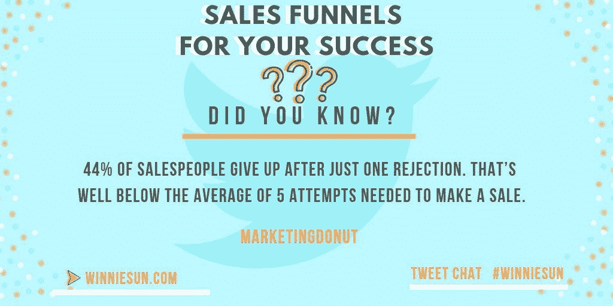

# 销售漏斗的目标是购买，而不是销售

> 原文：<https://medium.datadriveninvestor.com/sales-funnels-aim-for-buys-not-sales-66f052d4b67e?source=collection_archive---------27----------------------->

## 营销渠道是人们直接接触的网络版本

以顾客为中心，啤酒漏斗是促进业务的一个重要途径。根据金融专家 [Winnie Sun](https://twitter.com/winniesun) ，“[营销漏斗](https://blog.markgrowth.com/businesses-live-or-die-through-outreach-f2e646c0e7af)是你的观众购买的机会，而不是你销售的机会。”

孙是《福布斯》、[、](https://twitter.com/CNBC)和[《好日子啦》](https://twitter.com/GDLA)的撰稿人。她是金融行业最受欢迎的专业人士之一。她与营销企业家雷切尔·彼得森和拉蒂莎·斯泰尔斯谈论了漏斗的优点。

彼得森拥有一家营销代理公司和一所在线营销大学。

“我为自己和客户建立了渠道，但我主要是为我的公司建立渠道，”她说。“我们公司的漏斗已经赚了几百万美元。他们超级强大。

“我最喜欢解释漏斗的方式是，它是一系列的登录页面，带人们经历现实生活中销售漏斗的各个阶段，”彼得森说。"这些阶段是品牌，意识，线索生成，销售和追加销售."

斯泰尔斯是一位“热爱漏斗”的演讲者和教练。我帮助我的客户创造高转化率的网上研讨会销售渠道。”

# 营销文本

每个企业家都有自己喜欢的书籍、工具和资源，帮助他们制作营销内容。

“边学边练，”孙说。“我喜欢向那些做得好的人学习。有这么多成功的营销人员，他们乐于分享他们的知识和技能。我喜欢支持他们。”

 [## 知情人需要知道更多

### 继续教育对你事业的成功至关重要

medium.com](https://medium.com/datadriveninvestor/those-in-the-know-need-to-know-more-829d8ab77031) 

斯泰尔斯的导师包括 [ClickFunnels](https://twitter.com/ClickFunnels) 联合创始人[拉塞尔·布伦森](https://twitter.com/russellbrunson)。

“我也非常喜欢营销心理学的书籍，”她说。还有“ [*影响力:心理劝说*](https://www.amazon.com/Influence-Psychology-Persuasion-Robert-Cialdini/dp/006124189X) ”作者[罗伯特·恰尔迪尼](https://twitter.com/RobertCialdini)，“ [*定位:为你的头脑而战*](https://www.amazon.com/Positioning-Battle-Your-Al-Ries/dp/0071373586) ”作者艾尔·崛起。

彼得森更喜欢看书和听播客:

根据斯泰尔斯的说法，营销漏斗是一种建立了解、喜欢和信任因素的方式，超越了统计数据和数字来建立关系。

“简单地说，营销漏斗是传统面对面销售漏斗的在线版本，”彼得森说。“这是一系列的登录页面，引导您的潜在客户经历认知和销售阶段。它提供了追加销售的能力。”

根据 Styles 的说法，营销漏斗的最终目标是使销售过程更容易。

“无论是网络研讨会、社交媒体帖子还是博客，一个好的营销漏斗都会让‘是’变得更容易，”她说。

对孙来说，漏斗营销比挨家挨户推销更有吸引力。

“漏斗营销比购买一系列线索更有效，”她说。“作为一个习惯打电话的人，我知道这个过程是多么低效，对双方来说是多么令人沮丧。”

正如彼得森解释的那样，漏斗营销为企业带来了前景。

“在你跟进之前，它允许人们举手说‘是’。”她说。

# 最佳协作

斯泰尔斯认为成功取决于共同的努力。

“漏斗营销和雇佣销售人员是相辅相成的，”她说。"然而，购买一份清单不如创建你自己的清单强."

战略规划先于建立第一个销售漏斗。彼得森给出了三个需要知道的事情:

*   谁是你的理想客户。
*   你的理想客户*想要什么*。
*   你的理想客户*需要什么*。

 [## 企业的生死取决于拓展

### 销售漏斗从吸引消费者的注意力开始

blog.markgrowth.com](https://blog.markgrowth.com/businesses-live-or-die-through-outreach-f2e646c0e7af) 

“卖给他们他们想要的东西，”她说。“给他们真正需要的东西。它*不同于*产品和服务。不同之处在于广告和内容的预热顺序*先于*——漏斗。

斯泰尔斯建议从一份工作开始，然后从那里开始。

“很多人试图从漏斗的前端开始，在没有清晰的销售路径的情况下，在内容上浪费时间，”她说。“销售产品时，漏斗可能比销售服务时更短。然而，它仍然需要提供价值。”

漏斗可以在不同程度上帮助吸引和邀请目标受众成为客户。

“在我们的金融业务中，每一种关系都始于信任，”孙说。“在网上传达这一信息很重要。”

# 个人接触总是最好的

斯泰尔斯更喜欢用视频邀请客户与她合作，特别是通过她的 YouTube 频道。

“我从不试图说服漏斗中的人，”彼得森说。“如果你还在试图说服他们，那就完了。

“相反，漏斗是关于提出他们所面临问题的解决方案，”她说。“如果它解决了问题，他们就加入了。”

在考虑使用营销渠道之前，一个良好的商业基础应该已经建立起来了。

“你的业务、流程和技能在你推广之前应该达到最高的专业水平，”孙说。“你需要真正擅长你的工作。否则，[再多的营销也帮不了](https://blog.markgrowth.com/marketing-101-brush-up-on-the-basics-2d7dcbb5f4c)。

 [## 简单的销售渠道会产生巨大的效果

### 商业以系统和可预测的方式发展

medium.com](https://medium.com/datadriveninvestor/simple-sales-funnels-yield-big-results-1e5c41fddf55) 

彼得森推荐了这些建立销售漏斗的工具和软件:

*   [专家的秘密:为你的建议买单的群众运动的地下剧本](https://www.amazon.com/Expert-Secrets-Underground-Playbook-Creating/dp/1683504585)
*   切特·沃特金斯(Chet Watkins)的《 [*:终极销售机器:通过不懈地关注 12 个关键战略来提升你的业务*](https://www.thriftbooks.com/w/ultimate-sales-machine_chet-holmes/255823/%22%20%5Cl%20%22isbn=1591842158&idiq=4314550)
*   [*奥美论广告*](https://www.amazon.com/Ogilvy-Advertising-David/dp/039472903X) 大卫·奥格威
*   [*梦的 100 本书*](https://www.dream100book.com/free) 作者[黛娜·德里克斯](https://twitter.com/Dana_Derricks)

“如果你需要更多关于漏斗的帮助，看看我的[四步电子邮件漏斗来指导客户](https://latishastyles.com/email-funnel-get-coaching-clients/)，”斯泰尔斯说。

# 满足需求

在营销服务中，孙更喜欢 Twitter、Instagram、和 LinkedIn 等工具。

“我希望潜在客户访问我们的网站，与我们联系，安排一次试探性的会面，”她说。“这是业务的第一步和核心。

“这一切都是为了了解你的潜在客户在哪里，”孙说。“对于我们的业务，我们了解到我们的受众均匀分布在多个社交媒体渠道上。富有、充满活力、成功的投资者明白，无处不在很重要。”

彼得森向那些擅长吸引注意力的人学习:[泰勒·斯威夫特](https://twitter.com/taylorswift13)，[马里奥](https://twitter.com/ye)，[马歇尔·马瑟斯](https://twitter.com/Eminem)，[哈尔西](https://twitter.com/halsey)，[凯莉·詹娜](https://twitter.com/KylieJenner)和[温迪的](https://twitter.com/Wendys)。

营销漏斗和[搜索引擎优化](https://www.datadriveninvestor.com/2018/12/29/for-seo-the-words-are-key/)可以协同工作，也可以独立工作。

彼得森说:“一个肯定可以在没有另一个的情况下使用。“我不是搜索引擎优化方面的专家，但是把搜索引擎优化放在一个漏斗上从来都不是一件坏事。”

她补充说，他们一起工作，特别是如果是在一个支持可靠的 SEO 策略的平台上创建的话，比如 WordPress。

[自动回复信息](https://blog.markgrowth.com/dont-take-it-personal-if-you-overdo-automation-1f9fc5534f5c)也很好用——但要小心。

“问问自己，是什么让你产生了共鸣？”孙说。“你更喜欢主要是文字吗？我不知道。我更喜欢视频和简单的文本，而不是冗长的文本。”

彼得森提醒营销人员要讲共同语言。

“谈谈你的市场怎么说，”她说。“如果他们使用表情符号，就使用表情符号。如果他们喜欢在一段时间后双倍行距，那就这样做。不要害怕与你的市场基调相匹配。”

**关于作者**

吉姆·卡扎曼是拉戈金融服务公司的经理，曾在空军和联邦政府的公共事务部门工作。你可以在[推特](https://twitter.com/JKatzaman)、[脸书](https://www.facebook.com/jim.katzaman)和 [LinkedIn](https://www.linkedin.com/in/jim-katzaman-33641b21/) 上和他联系。

*原载于 2019 年 1 月 21 日*[*【www.datadriveninvestor.com】*](http://bit.ly/2sC1SUx)*。*