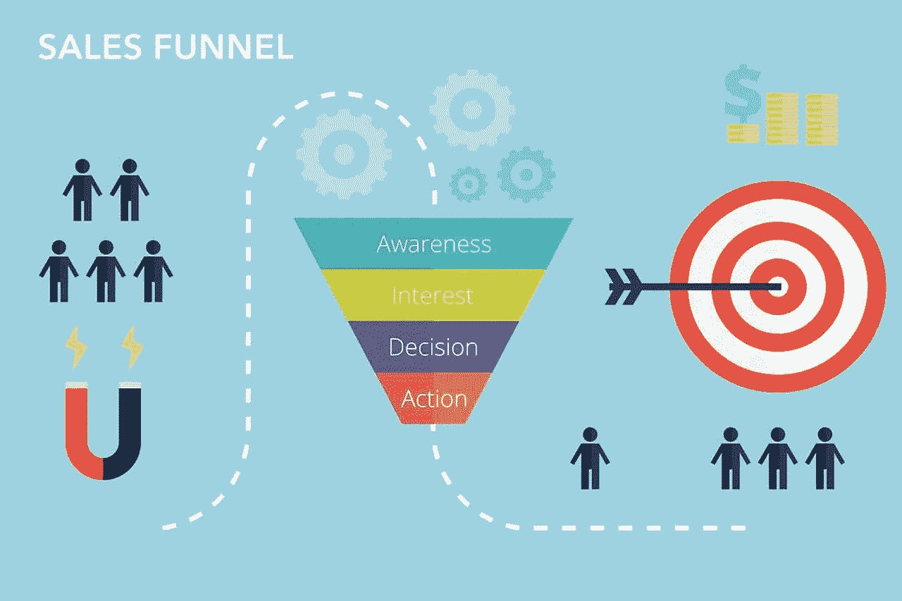

# 销售漏斗:揭示成功的秘密策略

> 原文：<https://medium.datadriveninvestor.com/sales-funnels-revealing-the-secret-strategy-to-success-d4d0e8a993b1?source=collection_archive---------2----------------------->

在今天这个时代，每个人都试图获得最高的市场份额和利润，成功和失败的故事就在你身边。

成功的人是那些即使没有增加，至少能维持收支平衡水平的人。另一方面，失败者是那些不能在短期内掩盖成本，无法在市场竞争中生存下来的人。

在这种背景下，企业家及其战略的有效性是成功商人和普通商人的区别特征。

每一次成功的执行背后，都有一个计划好的策略。为了理解这一点，让我们以一场足球比赛为例。成功的足球队在比赛前至少会制定两种策略。一个用于实施，另一个作为备份。

同样，为了使一个商业步骤有价值，你总是需要一个有效的策略。如果你是一家在这个高度数字化的市场中运营的新企业，一个能让你成功的策略是:销售漏斗。

这个专业术语可能看起来超出了外行人的理解范围，但它并不太复杂而难以理解。销售漏斗可以被认为是为一个成功的企业奠定基础的最初步骤之一，尤其是如果它是一个新的市场。

因此，如果你是一家在竞争激烈的市场中刚刚起步的小企业，看看你如何通过销售漏斗战略让企业蓬勃发展。

**什么是销售漏斗？**
销售漏斗是数字营销的一个基本原则。在这个技术先进的商业环境中，没有有效的数字营销，任何企业都不可能真正繁荣。

让我们通过一个简单的例子来理解销售漏斗，如下所示:

假设你计划去购物中心买一条裤子。购物时，你在几个商店停下来浏览橱窗。你会购买每一件产品吗？

不，这是因为你从来没有打算在商场里买下每一条裤子——你只是想要一条适合你需要的裤子。

无论你在哪里寻找“橱窗购物”,那个特定的商店或品牌最初都会把你视为潜在客户，即使你只是一个访客。

同样，销售漏斗旨在将网站浏览器(根据我们的例子，访问者)转化为潜在买家。然而，这并不像看起来那么简单。从浏览器打算进行在线购买、访问主页到最终进行购买，这是一个由多个阶段组成的漫长过程。

成功的营销人员之所以成功，只是因为他们理解并承认人类心理。他们知道没有浏览器会在第一步点击购买按钮。这就是为什么销售漏斗是一个多模态的过程，因为在各个阶段都有一些建立关系的经验。

让我们经历这些阶段:

**1。树立你的形象**
要将潜在顾客转化为潜在买家，他们需要知道你的品牌。在这种情况下，社交媒体在向大量受众推销你或让潜在客户意识到你的存在方面发挥着至关重要的作用。

以脸书和 YouTube 广告为例。当然，没有人会为了看广告而暂停视频，也不是完全不可能在几秒钟内推销自己。为了确保潜在客户意识到你的存在(如果你使用 YouTube 广告),确保在几秒钟内，你能够给出诱人的提议——他们无法拒绝的提议！

这需要大量的努力，但是如果你的潜在客户进入了漏斗，你的网站回答了他们的一点点问题，你就让他们知道了你的名字。

如果一个潜在客户谷歌你，那么你就处于优势地位。事实上，你正处于漏斗过程的下一步。然而，你始终需要保持联系的是你的目标，将潜在客户转化为买家。

**2。培养兴趣**
如前所述，为了抓住你潜在客户的注意力，你表现得有趣是很重要的。无论是优惠还是多色广告，你展示的任何东西都应该立刻引起他们的兴趣。

另一个有效的策略是在你的广告中讲述一个故事或相关的搭讪语。让我们看一个例子:
你正在经营一家金融机构，你的业务动机是提供贷款。一个大而醒目的标题询问你的潜在客户在某种程度上可以帮你完成这项工作。

你是一个工作努力、有决心的人吗？你经常为未来担忧吗？你在为你的教育费用筹集资金方面面临困难吗？如果是，我们在这里帮助你！！!"

像这样的事情肯定会让那些真正需要经济支持的人参与进来。这样，你就可以将潜在客户转化为客户。然而，这样的实现实际上是相当困难的，因为人们有信任问题，特别是如果它是一个他们不熟悉的组织。因此，你需要非常小心你的标题和用词。

**3。让他们选择你如果你已经让他们加入你的网站，下一步就是让你的潜在客户认真考虑你的提议。这是他们决定是否购买你的产品的时候。**

这表明他们处于困惑状态，这意味着你总能通过正确的工具说服他们。因为你想让潜在客户选择你并继续他们的决定，所以通过积极的客户评价来简化他们的决策过程。

人们在购买产品之前很大程度上依赖于评论，因为它建立了他们的信任，知道以前的客户对某种产品或服务有良好的体验。因此，以下是一些你可以用来帮助他们做出决定的方法:

*   提供视频证明和客户评论
*   脸书和谷歌上的付费内容
*   通过博客和视频博客的付费联盟营销
*   一旦访问者离开网站，就会附上网站广告

除此之外，还有一个额外的曝光因素，如果存在并突出显示，在帮助游客做出决定方面发挥着重要作用，即媒体出版物的报道。

**4。最终执行**
一旦你来到这里，你需要知道你已经走过了漫长的道路。游客的最终行动取决于他们如何通过所有阶段达到这一点。

更重要的是要记住，如果访客没有成为买家，你之前的所有努力都将付之东流。因此，你需要谨慎而聪明地工作。

如前所述，这正是区分聪明的企业家和简单的商人的阶段。

聪明的企业家会考虑访客到顾客的转化率。例如，你邀请了 10 个人到你的网站，这花费了你 100 美元，但是你让两个人以每人 200 美元的价格转换，那么你投资 100 美元就有 400 美元的回报。这正好是投资额的 4 倍。转换率是一门艺术，这是所有关于了解它。

这就是世界上最聪明的企业家扩大企业规模的方式。一个单纯的商人在冒险投资之前会三思而行。另一方面，更聪明的人应该已经在考虑投资回报了。

聪明的营销人员知道什么是转化价值。此外，他们还意识到，一旦访问者进入销售漏斗，他们就处于主导地位。这就是为什么这些企业家会毫不犹豫地投资 1 美元以获得 4 倍的回报。

正如再次提到的，达到阶段 4 并成功结束你已经经历的所有阶段需要付出巨大的努力。但是，安装销售漏斗软件可以简化很多工作，如下所示:

*   写一份
*   实现跟踪像素
*   创建电子邮件序列

**改善销售漏斗战略的技巧**
新企业应对建立身份的挑战，这是一个耗时的过程，会延缓他们参与有效数字营销的能力。

然而，一旦你通读并理解了通过销售漏斗取得业务成功的秘诀，是时候改进你的销售漏斗以获得更高的回报和更大的利润了:

**1。通过几个渠道吸引访客**
数字营销是广阔的。它包含了许多不同的渠道和论坛，你可以用它们来吸引访客，提供诱人的优惠，并将他们转化为潜在客户。从众多的选择中，从事搜索引擎优化营销，点击付费(PPC)广告，联盟营销和电子邮件营销。

**2。评估最有效的论坛**
数据和指标将为您提供您需要的重要信息，以便评估某个渠道或论坛的有效性。一旦你有了分析，投入更多的时间和资源来改善这种特殊的营销方法，以吸引访客并转化他们。

**3。保持活跃的网络形象**
网络世界瞬息万变，你必须跟上潮流，才能获得成功。目前，内容营销的趋势相当流行。因此，请确保通过定期发布内容来保持强大和活跃的在线状态，从而为您的网站带来流量。有帮助的内容会产生流量，吸引访客，转化，并在总体上改善你的销售漏斗。

**4。迎合问题**
收到关于你的产品或服务的问题是你生意的标志；这意味着你正在被你的潜在客户考虑。如果你收到这方面的问题，一定要提供详细、有用和周到的答案来帮助他们。这一点很重要，因为如果你的客户提出了问题，很有可能其他人也会这样做，从而吸引访问者访问你的网站。

**5。使用几个 CTA**和
行动号召是传统的“销售成交”的数字形式。当你作为一名数字营销人员运作时，虽然你提供有用的资源和指南来吸引访问者，但你的目标是将他们转化为潜在客户，这就是为什么你向他们提供优惠。这就是你的行动呼吁(CTA)。

然而，通过这份关于销售漏斗的详细指南，我们了解到顾客的购买有几个阶段。这意味着不是每个顾客都准备好购买；虽然有些是，但其他人只是在权衡他们的选择，寻找最好的选择。

这就是为什么，在你的网站上整合几个 CTA 是很重要的。搜索引擎优化营销或提供免费电子书将更好地为客户谁是在研究过程中，并正在寻找最好的选择。

**6。成为你所在行业中有价值的一部分**
即使在当今高度数字化的世界，如果运用和执行得当，线下营销也能取得成功。为了改善你的销售漏斗，通过专业知识成为你所在行业中有价值的一部分。你可以通过举办研讨会和会议来做到这一点，让你与客户和其他企业接触，指导他们，并为他们的个人或职业生活提供有用的信息。

举行定期会议将有助于你确立自己在行业中的突出地位，而不是寻找潜在客户，潜在客户会寻找你的创业专长。

如果使用得当，销售漏斗可以成为你的成功之路。所以，一定要根据你的受众和行业来学习，并相应地适应！

最初发表于[www.anthonyvallonejr.com](https://www.anthonyvallonejr.com)