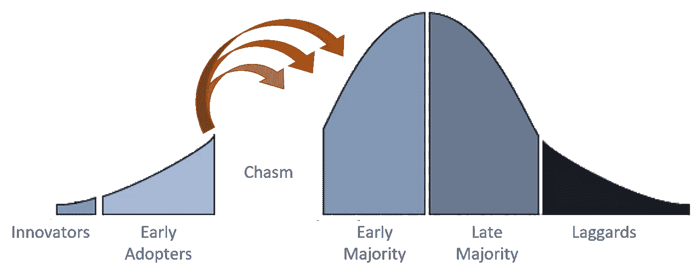

# 销售不是一场战斗

> 原文：<https://medium.datadriveninvestor.com/sales-is-not-a-battle-bd91cba4329d?source=collection_archive---------21----------------------->

Three antidotes for change resistance (source: [PhD research](http://www.businesslab.fi/s/Doctoral-Thesis-Tuominen.pdf))

> 销售不是好与坏的战斗。这是关于新的价值。

Zuora 制作了一个杀手级的销售套牌，展示了如何建立一个强有力的叙事。安迪·拉斯金在他的精彩文章[“我见过的最伟大的销售团队”](https://medium.com/the-mission/the-greatest-sales-deck-ive-ever-seen-4f4ef3391ba0)中，将这一点生动地展现在我们眼前。

奇妙的甲板和伟大的分析！然而，我认为他们都错过了[蓝海战略](https://www.blueoceanstrategy.com/)。

伟大的战略不是赢得竞争。而是让你的竞争变得无关紧要。

有了这样的策略，你就不需要在新旧之间建立矛盾。也不需要养成反派。你只需展示你如何为你的客户创造附加值(以一种别人无法做到的方式)。

你可能会说，西红柿，番茄。但是有很大的不同。当你的销售信息在好与坏之间制造了一场战争，你就迫使你的客户选择了一方。组织中总有人会站在另一边，保护旧的。你刚刚建立了一个销售壁垒。

有了伟大的战略(和销售平台),就不应该有任何一方。应该只有新的独特的客户价值。这是您希望与客户进行的讨论。

尤其是对于颠覆性技术，你的客户会害怕新的和未知的东西。他们担心新技术会破坏所有旧的安全结构。

你能做的最糟糕的事情就是把你的故事描绘成一场有赢家和输家的战争。不要试图去赢得一场战斗，试着展示你正在建立一些有价值的东西，而不一定需要摧毁旧的东西(即使在现实中会)。

不要把你的客户的思维引向战场，试着去激发创造价值的独特(但安全)方式的想法。