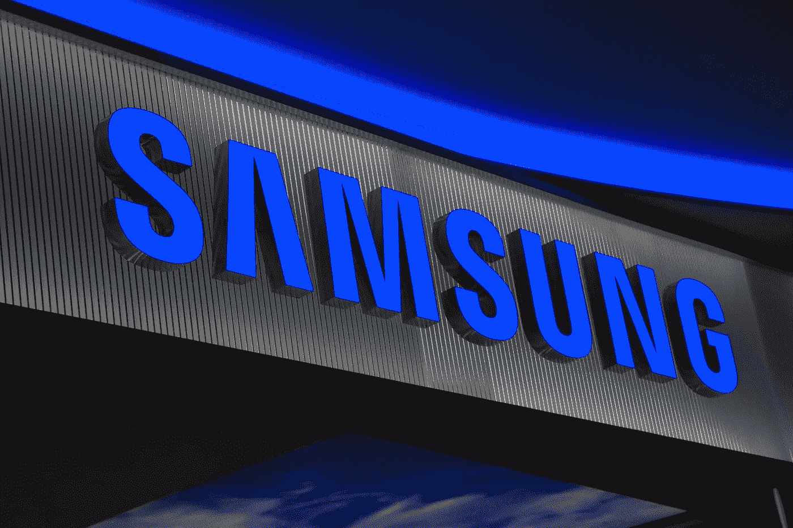

# 三星开放创新金融平台

> 原文：<https://medium.datadriveninvestor.com/samsung-opens-an-innovative-financial-platform-d2d95ef31181?source=collection_archive---------8----------------------->

韩国公司三星 SDS 推出了 **Nexfinance** 平台，该平台结合了区块链技术、人工智能和大数据分析。发起人认为，这一新的发射将加速创新，并使“第四次工业革命”更近一步。

三星财务总监 Kim Yang-Kwon 认为，随着新技术的出现，金融公司很难实施创新，但没有足够的技术人员。

> “只有当不同的技术和功能汇集在一个系统中，公司才能加速数字创新，”*专家说。*

Nexfinance 为其客户提供五项服务:

*   **“金融管家”**将帮助 AI(人工智能)和智能过程自动化(AIP)分析师分析金融服务用户的行为模式，并推荐其中值得信赖的用户。
*   **“数字个性”服务**旨在使存储用户数据的系统更加安全。
*   KI-Secretary 使用聊天机器人自动完成保险登记工作。
*   **“自动保险**赔偿**”**加速了定损和支付保险金额的过程。
*   服务**“数字支付”**简化了客户之间的交易流程。

三星 SDS 是三星集团公司的一部分，为合作伙伴开发创新产品。2017 年，三星 SDS 开发了一个通过区块链识别用户的系统。目前，该公司参与了韩国银行协会的一个项目。该倡议的目的是开发一个国家公民身份识别系统。

Nexfinance 是另一个三星 SDS 平台的修改版。2017 年，该公司已经开发了其前身 Nexledger，这是一个用于跟踪全球商品的区块链系统。该项目还引入了用户的数字身份，并促进了金融交易。

## Marko Vidrih @cryptomarks

 [## 密码(@VidrihMarko) | Twitter

### 来自@cryptomarks (@VidrihMarko)的最新推文。加密货币交易商、研究人员、投资者和加密爱好者…

twitter.com](https://twitter.com/VidrihMarko)  [## 斯蒂米特

### 来自 Marko Vidrih 的最新帖子。请关注@cryptomarks。密码，比特币，区块链

steemit.com](https://steemit.com/@cryptomarks) 

*图片经由*[*bigstockphoto.com*](https://www.bigstockphoto.com/de/image-78198656/stock-foto-samsung-korean-electronics)