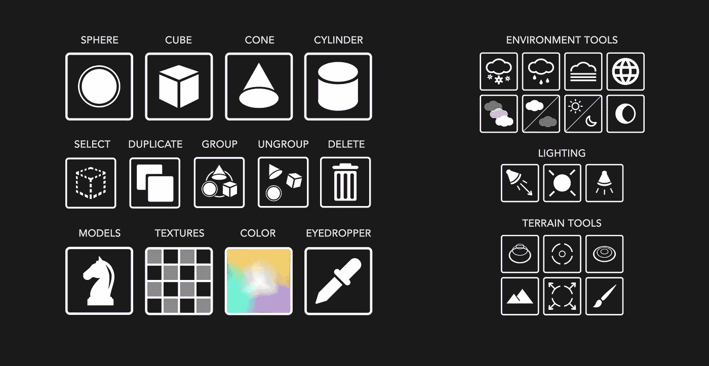
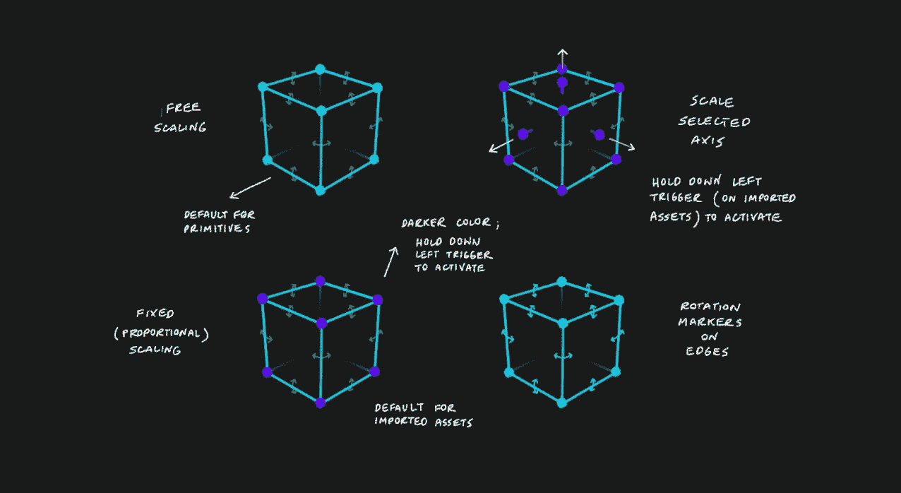
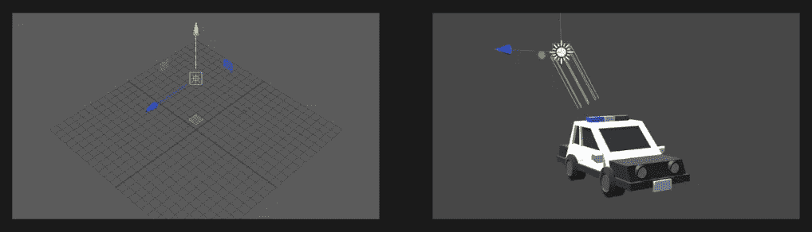
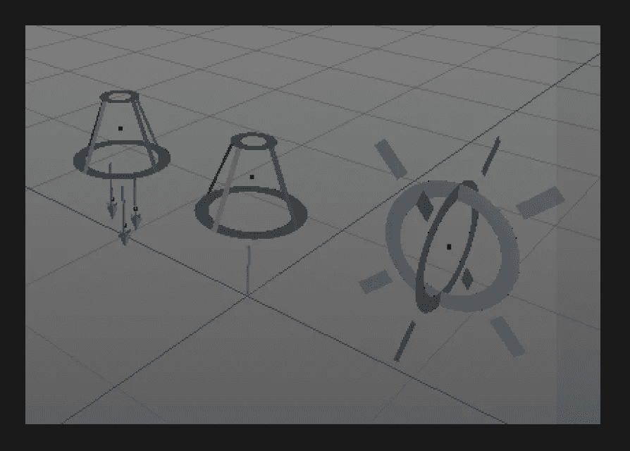
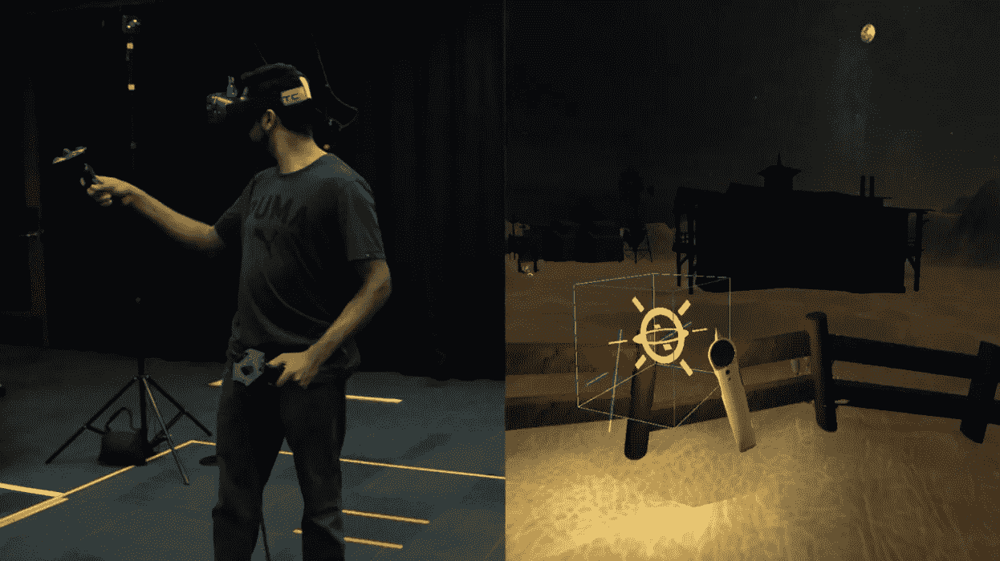
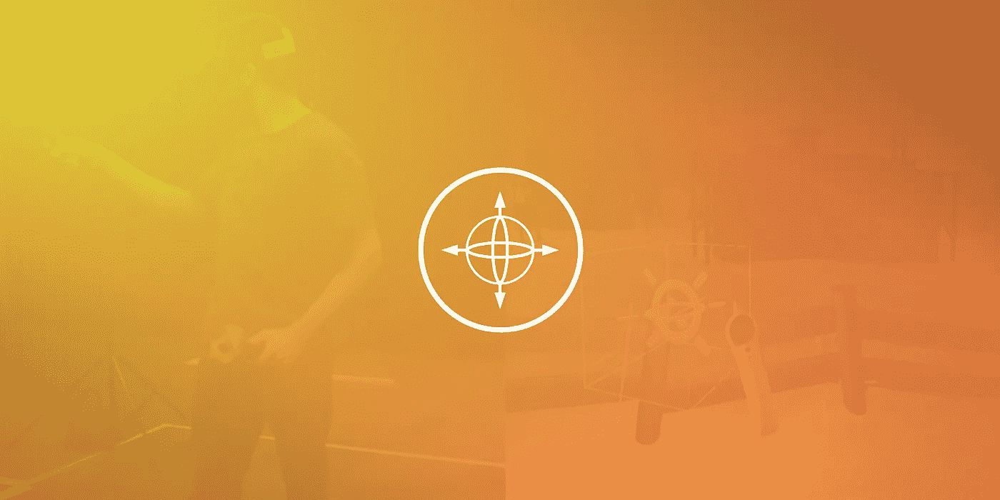

# 沙盒虚拟现实

> 原文：<https://medium.datadriveninvestor.com/sandbox-vr-317b0d88bd5a?source=collection_archive---------12----------------------->

## 为 VR 而建，在 VR 里。

沙盒虚拟现实是一个构建世界的解决方案，使任何人都可以在虚拟现实中为虚拟现实而构建。使用导入的模型、纹理、照明设备等等，用户可以从头开始构建复杂的场景。查看我们在 2016 年初发布的演示:

沙盒 VR 可以被个人或团队用于电影制作、游戏开发、城市规划等等。为了探索可能的用例，我们录制了一系列面向艺术家、游戏开发者和架构师的演示。这里有一个最近的演示，我们从头开始探索了一个狂野西部场景(电影或游戏)的原型:

Fig. 1\. Set Design in Sandbox VR.

在项目开发的过程中，我们想了很多关于当前 3D 建模/编辑软件的优缺点，似乎在其他 VR 应用程序中工作的交互模式，以及我们希望 Sandbox 完成的事情。我们希望使用此文档来分享更多关于我们流程的信息。

# 问题是

在为房间尺度的 VR 开发时，你很难理解场景会是什么样子，直到你通过 HMD 看到它；因此，在我们亲自尝试之前，我们不知道一个物体相对于玩家来说有多大/多小。在我们的计算机和 HMD 之间来回移动，对场景中的基本转换(位置、旋转、缩放)进行小的更改，效率非常低，这就是沙盒 VR 的发展。

我们想让任何人在虚拟现实中从头开始构建场景变得尽可能简单。如果你可以从一张空白的画布开始，不脱下你的 HMD 就构建出一个完整的世界，会怎么样？

# **我们的流程**

为了让沙盒虚拟现实对虚拟现实新手有用，我们想了很多关于现有应用程序(虚拟现实和非虚拟现实)如何处理我们知道会遇到的 UX 问题。以下是我们对应用中交互模式的看法:

**工具包导航**

*   在我们开始为 Vive 开发沙盒 VR 的时候，Tiltbrush 越来越受欢迎，并引入了我们真正喜欢的功能。在南加州大学的 MxR 工作室，我们通常会向刚接触 VR 的人演示 Tiltbrush，他们大多数人都知道如何在最少/没有事先指导的情况下选择不同的工具和画笔。虽然我们尝试了其他选项，但我们决定在沙盒 VR 中实现类似的主菜单布局。
*   我们的工具分为七个主要面板，位于左侧控制器:形状、动作、导入、材质、照明、环境和地形。每个面板都有一组按钮，用户可以通过右侧控制器上的触发器来访问这些按钮。

Fig. 2 - Sandbox VR’s default tools, which comes with everything you need to start building your own scene.

*   受谷歌材料设计指南的启发，这些按钮有一种“磁性”的感觉，当悬停/选中时，它们会拉近与用户的距离。

Fig. 3 — Button states animated in AE

**基本选择和操作**

*   为了使改变对象的位置、比例和旋转的过程标准化，我们合并了一个选择框，它出现在场景中任何选定的项目周围，具有对比例和旋转的控制。当控制器在对象的边界内时，可以通过点击右边的触发器来选择对象。用户可以通过在移动控制器的同时单击并按住对象来调整对象的位置。选择框是根据对象的长度和宽度生成的(加上一些缓冲空间的单位)，让用户在移动项目时有更多的空间可以抓住。
*   为了选择多个项目，用户可以按住右触发器并拖动所需的资产。从那里，可以对模型进行分组、删除或复制。
*   虽然刻度标记背后的推理相当简单(大多数人习惯于在 Microsoft Office、Adobe CC 等中看到类似的控件。)，在最近的演示和文档中出现的旋转标记在我们最初的几次迭代中并不存在。相反，我们让对象的旋转对应于控制器的旋转(就像对象的位置对应于控制器的位置一样)。然而，在看到 playtesters 在旋转和准确放置他们的资产方面有困难后，我们在选择框的边缘加入了弯曲的旋转标记。现在，用户可以很容易地一次调整一个轴的旋转。

**自由缩放与比例缩放**

Fig. 4 — Different selection boxes, activated based on object or interaction with left-hand trigger

*   沙盒早期测试的一些主要观察结果:A-当对象是图元时，用户更可能扭曲/篡改对象的缩放(将默认立方体更改为更宽的矩形棱柱)，不太可能对导入的资源这样做。b-对于选择的导入资产，用户倾向于仅在一个轴上调整比例(例如，使树稍微高一点，使山稍微宽一点，等等。)
*   基于这些观察，我们决定为所有导入的对象引入一些默认选择框的变体:当基本模型(球体，立方体，圆锥体，圆柱体)加载到场景中时，默认情况下，模型位于自由缩放的选择框中。因为新用户倾向于从导入原语开始，自由缩放选项鼓励探索(参见图 4 左上角的图示)
*   通过在选择图元对象时按住左触发器，用户可以切换固定比例选择框来按比例放大或缩小他们的对象(参见图 4 左下方的图示)
*   当自定义资产被加载到场景中时，它们被容纳在固定比例的选择框中，以便保留原始模型的尺寸(参见图 4 左下方的插图)
*   通过在选择定制资产时按住左触发器，用户可以切换附加的缩放旋钮，这有助于在所选轴上放大或缩小对象(参见图 4 右上方的图示)

**照明选项**

*   虽然我们的照明解决方案相当标准，但我们的主要问题是在编辑器中很好地表现灯光。在 Maya 和 Unity 中，灯光以二维表示，与场景中的其他 3D 对象区分开来(参见图 5)。虽然我们最初使用[变换实现了一个类似的解决方案。看](https://docs.unity3d.com/ScriptReference/Transform.LookAt.html)旋转精灵使其始终面向用户，我们发现用户不知道精灵在 3D 空间中的位置，这使得选择/操作变得困难。

Fig. 5 — Examples of how lights are represented in Maya and Unity (left to right)

*   目标是设计照明设备，用户可以轻松地从场景中的其他 3D 对象中区分出来，同时保持常规资源的可访问性。我们的解决方案是模拟介于 2D 和 3D 之间的光线，用极薄的多边形制作，但以允许用户从任何角度看到光线的方式构建(见图 6)

Fig. 6 — Models built in Maya for the directional light, spotlight, and point light rigs (left to right)

Fig. 7 — Point light model shown in use

**新功能&互动**

*   除了允许用户导入、操作和构建自定义模型的基本功能之外，我们还添加了其他我们认为有助于世界构建过程的交互功能:
*   世界缩放-通过同时按住两个控制器上的手柄按钮，用户可以抓住他们周围的空间四处移动，或者通过增加/减少两个控制器之间的距离来放大/缩小。你可以把它看作是虚拟现实的“缩放”。这种解决方案允许用户对他们在空间中的运动有更多的控制，并且允许用户在四处走动或坐下时导航世界(参见图 8)

Fig. 8 — Our most recent screencap (with some minor changes to the look of the selection box)

*   对象捕捉-当用户在场景中移动对象时，它会自动捕捉到相对于周围对象或地面的位置。此外，如果用户在旋转对象时按住左触发器，对象将以 15 度的增量旋转，而不是沿着轴自由旋转。如果用户希望多个对象具有相同的方向，这种解决方案尤其有用。
*   地形雕刻——我们创建了一个完整的工具集，允许用户通过挤压/拉平网格来雕刻地形，而不是导入丘陵和山脉的模型。用户可以通过在左侧控制器的触控板上向右或向左滑动来轻松切换画笔大小，从而更容易塑造不同宽度、深度和高度的山丘和山脉。

暂时就这样吧！感谢阅读。

