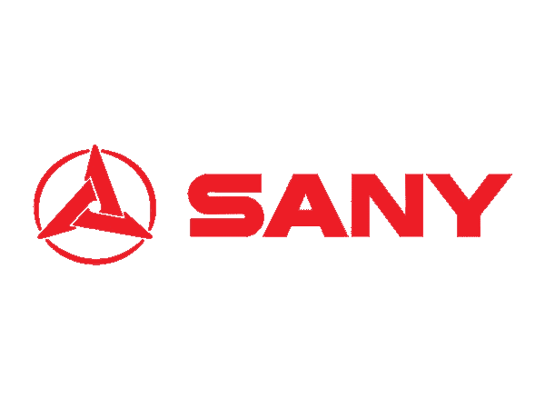
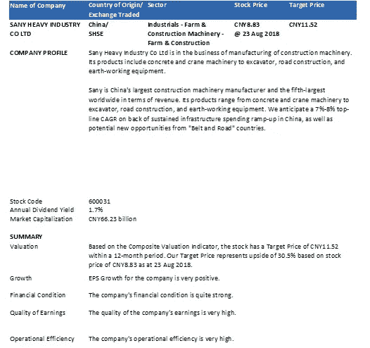
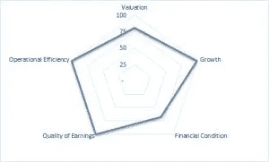
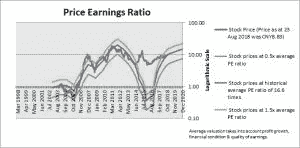
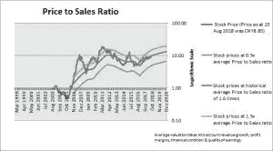
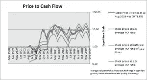
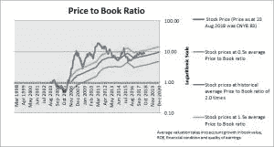
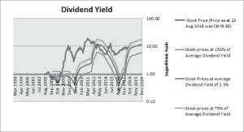
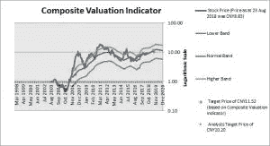

# 三一重工——中国强劲基建支出的受益者

> 原文：<https://medium.datadriveninvestor.com/sany-heavy-industry-beneficiary-of-chinas-strong-infrastructure-spending-60c0999780e7?source=collection_archive---------1----------------------->

# 大意

*   三一重工是建筑设备的主要生产商。预计 2018 年挖掘机的全球销量将首次超过卡特彼勒。
*   三一重工约 70%的销售额在中国，因此将受益于强劲的基础设施支出。从中长期来看，中国建筑业有望实现强劲增长。
*   由于只有大约 30%的销售额是国际销售额，并且分布在几个地区，该公司没有受到美国贸易制裁的严重影响。事实上，贸易战可能会刺激中国公司从三一重工购买，而不是从卡特彼勒等美国制造商那里购买。
*   该公司正在扩大其在印度等国家的国际影响力，计划在这些国家投资超过 90 亿美元。
*   股票的交易价值很高，潜在上涨空间高达 30%。

公司名称原产国/交易所交易行业股票价格目标价 SANY 重工股份有限公司中国/
上海工业—农场&工程机械—农场&工程设备 CNY 8.83 CNY 11.52 @ 2018 年 8 月 23 日公司简介

三一重工股份有限公司从事工程机械制造。其产品包括混凝土和起重机机械、挖掘机、道路建设和土方工程设备。

三一重工是中国最大的工程机械制造商，收入排名全球第五。其产品范围从混凝土和起重机机械到挖掘机、道路建设和土方工程设备。我们预计，由于中国基础设施支出的持续增长，以及来自“一带一路”国家的潜在新机遇，CAGR 将达到 7%-8%。

估价普洛特林克认为，应该综合运用各种估价方法，对股票进行适当的估价。这是因为虽然每种估价方法都有其优点，但也有其缺点。当公司的收益或现金流为负数时，市盈率和现金流比率就没有意义了。价格销售比更稳定，因为销售从来不是负数。然而，这并没有告诉我们该公司是否能够盈利销售。市净率为我们提供了一个指标，表明我们为公司的资产支付了多少，但资产与公司的盈利能力没有直接关系。虽然根据多个指标对股票进行估值很重要，但它们有时会导致对估值的不同看法。一个指标可能告诉你一只股票被高估，而另一个指标告诉你它被低估。这就是为什么我们使用我们专有的综合估值指标，它根据不同指标的最佳组合给出一个结论，告诉你一只股票是被低估了还是被高估了。图形格式允许您确定综合估值是否准确地对股票进行了估值，并让您有信心根据决策采取行动。此外，我们追溯到 20 年前(或尽可能多的可用信息),给你一个有意义的“平均”估值，该公司经历了 dot.com 泡沫和全球金融危机的极端时期。没有这么长的一段时间，你不会知道极端的高点和低点，因此也就无法确定正常水平。

来源:www.ProThinker.com

市盈率是股票最常用的估值指标。但是，有时这个比率不能使用，例如，当公司报告亏损或盈利很少，导致市盈率异常高时。或者税后净利润可能不稳定，最好使用息税前利润(EBIT)来评估公司价值。我们使用 PE 波段或价格/EBIT 波段来显示一只股票是否基于其历史估值被高估或低估。以 2018 年 8 月 23 日 8.83 元人民币的价格计算，三一重工股份有限公司的市盈率为 18.8 倍。这比其 16.6 倍的历史平均市盈率溢价 13.0%。(红线表示基于公司历史平均 PE 的价格。)

价格销售比是另一个常用的股票估值指标。它克服了市盈率的一些局限性，因为它甚至可以在公司不盈利或盈利很少时使用。然而，它不应该被单独使用，因为一个公司可能正在实现销售而不是利润。以 2018 年 8 月 23 日 8.83 元人民币的价格计算，三一重工股份有限公司的市销率为过去 12 个月销售额的 1.5 倍。这比其 1.6 倍的历史平均价格销售比低了 8.0%。

现金流价格是评估股票价值的另一种方法。这是因为会计利润可能受到操纵。因此，一些投资者更喜欢根据公司经营活动产生的现金流来对公司进行估值。它还可以对市盈率和销售价格等估值指标进行现实检验。如果一家公司产生高利润和销售额，但没有经营性现金流，它可能会遇到麻烦，因为是现金支付运营费用。然而，大多数公司的价格与现金流比率是不稳定的，不应该孤立地用来确定股票的估值。以 2018 年 8 月 23 日 8.83 元人民币的价格计算，三一重工股份有限公司的股价与现金流之比为过去 12 个月现金流的 12.5 倍。

市盈率、销售价格比和现金流价格比都是根据一家公司的产出(即利润、销售额或现金流)来对其进行估值的。市净率的不同之处在于，它根据公司拥有的资产(即净资产)来对公司进行估值。对于经常重估其资产和负债的金融机构或拥有庞大资产基础的公司(如公用事业公司)，这通常是一个合适的估价指标。以 2018 年 8 月 23 日 8.83 元人民币的价格计算，三一重工股份有限公司的市净率为当前账面价值的 2.4 倍。这比其 2.0 倍的历史平均市净率溢价 24%。

对于有支付有意义股息历史的股票，股价通常取决于公司支付多少股息。以 2018 年 8 月 23 日 8.83 元人民币的价格计算，三一重工股份有限公司的股息率为 1.7%。这比其 2.5%的历史平均股息收益率溢价 31.7%。(注:股息率越低/越高，股票越贵/越便宜。)

综合估值指标是使用我们的专有方法得出的，将所有估值指标以一种最能解释股价的方式进行排列。它认识到，只看单一指标是危险和不充分的。它还克服了不同指标给出不同信号的困难，以及如果你没有综合估值就难以采取行动的困难。我们的综合估值指标并不假设估值在平均水平保持不变。如果公司增长放缓，它将下调估值，以反映增长放缓。但是，请注意，综合估值指标并没有考虑到由于预期的收购或其他特殊事件，市场愿意为股票支付更高价格的情况。还有一种可能是，投资者现在认为该股估值较低，因为该股或该行业的长期前景不佳。根据综合估值指标，该股 12 个月内的目标价为 11.52 元人民币。以 2018 年 8 月 23 日的股价 8.83 元计算，我们的目标价有 30.5%的溢价。我们建议投资者从 20%开始获利。目标价考虑了公司的适当估值和分析师对利润、销售、现金流、账面价值、股息等的估计。以及其他因素，如财务状况、增长前景和净资产收益率。

# 其他考虑

当然，在决定一只股票是否有吸引力时，不仅仅是决定它的估值和未来的基本面。我们需要考虑股票的其他方面，如增长、财务状况、运营优势、现金流、技术等。很难找到一只价值有吸引力的股票，而且还能成功通过投资者的每一项标准。有时，我们需要做出某些取舍。要进行全面的定量分析，你可以参考[这篇报道](https://prothinker.com/wp-content/uploads/2018/08/Sany-Heavy-Industry.pdf)。

数据来源:图表来自 ProThinker 股票报告。公司描述、历史财务报表数据和价格数据均来自 gurufocus.com。估计来自 gurufocus 和/或 4-traders.com-汤森路透。

免责声明:本报告仅供参考，不应被视为买卖任何证券的邀约。ProThinker 或任何其他方均不保证其准确性，也不保证其使用结果。未经 ProThinker 的明确书面同意，禁止再分发。版权所有(c) 2018。保留所有权利。